# Liquid Books: Author Psychometric Profiling System

## Product Requirements Document (PRD)

**Version:** 1.0
**Date:** November 29, 2024
**Author:** Liquid Books Development Team
**Status:** Draft

---

## Table of Contents

1. [Executive Summary](#1-executive-summary)
2. [Problem Statement & Goals](#2-problem-statement--goals)
3. [Data Collection Overview](#3-data-collection-overview)
4. [Questionnaire-Based Data Points (Categories 1-12)](#4-questionnaire-based-data-points-categories-1-12)
5. [Conversation-Based Data Points (Categories 13-22)](#5-conversation-based-data-points-categories-13-22)
6. [Confidence Assessment & Research Validation](#6-confidence-assessment--research-validation)
7. [Psychometrics-to-Writing-Style Mapping](#7-psychometrics-to-writing-style-mapping)
8. [Conversation System Design](#8-conversation-system-design)
9. [Database Schema (Supabase)](#9-database-schema-supabase)
10. [API Design](#10-api-design)
11. [Architecture & System Diagrams](#11-architecture--system-diagrams)
12. [Prompt Generation for AI Writing](#12-prompt-generation-for-ai-writing)
13. [Implementation Phases](#13-implementation-phases)
14. [Research Sources & References](#14-research-sources--references)
15. [Appendix](#15-appendix)

---

## 1. Executive Summary

### Vision

Liquid Books aims to capture an author's complete psychological profile through a combination of scientifically-validated psychometric assessments and AI-guided conversational interviews. This profile will enable AI-generated chapters that authentically mirror the author's:

- **Thinking patterns** - How they process and organize information
- **Reasoning style** - How they build arguments and reach conclusions
- **Emotional landscape** - Their emotional depth, triggers, and expression
- **Voice characteristics** - Their unique linguistic fingerprint
- **Thematic preferences** - What topics and themes resonate with them
- **Worldview** - Their philosophical grounding and beliefs

### Key Metrics

| Metric | Tests Only | Tests + Conversation |
|--------|------------|---------------------|
| **Total Data Points** | 164 | **299** |
| **Captures Personality** | Yes | Yes |
| **Captures Thought Patterns** | Yes | Yes (deeper) |
| **Captures Unique Voice** | Partially | **Yes** |
| **Captures Lived Experience** | No | **Yes** |
| **Captures Emotional Authenticity** | Partially | **Yes** |
| **Captures Quirks & Distinctiveness** | No | **Yes** |

### Technology Stack

- **Frontend:** React/Next.js (existing Liquid Books application)
- **Backend:** Supabase (PostgreSQL)
- **Voice Transcription:** OpenAI Whisper API
- **Conversation AI:** GPT-4 / Claude API for guided interviews
- **Text Analysis:** Custom LIWC-style analysis + OpenAI embeddings
- **AI Writing Engine:** GPT-4 / Claude with personality-informed prompts

---

## 2. Problem Statement & Goals

### Problem Statement

Current AI writing tools generate generic content that lacks the unique voice, perspective, and thinking patterns of individual authors. When users create interactive books, the AI-generated chapters feel disconnected from the author's authentic style, making the content feel impersonal and inauthentic.

### Goals

1. **Capture Complete Psychological Profile**
   - Collect 299 data points across 22 categories
   - Combine validated psychometric tests with conversational depth
   - Store profiles persistently for ongoing use

2. **Enable Authentic AI Writing**
   - Generate chapters that "think like" the author
   - Match the author's reasoning patterns and voice
   - Reflect their values, beliefs, and emotional landscape

3. **Create Seamless User Experience**
   - 15-20 minute total assessment time
   - Engaging, not tedious questionnaire flow
   - Natural 5-10 minute AI-guided conversation

4. **Build Reusable Infrastructure**
   - Profiles can be reused across multiple books
   - Profiles can evolve over time with updates
   - Data supports multiple AI writing scenarios

### Success Criteria

| Goal | Success Metric |
|------|----------------|
| Profile Completion | >80% of users complete full assessment |
| Author Satisfaction | >85% rate AI writing as "sounds like me" |
| Voice Distinctiveness | Blind test: >70% can identify their own AI-generated content |
| Time to Value | First AI-generated chapter within 30 minutes of starting |

---

## 3. Data Collection Overview

### 3.1 Data Point Summary by Category

| # | Category | Data Points | Collection Method | Time Estimate |
|---|----------|-------------|-------------------|---------------|
| 1 | Big Five Personality (OCEAN) | 30 | Questionnaire | 5-7 min |
| 2 | Cognitive Style | 12 | Questionnaire | 2-3 min |
| 3 | Emotional Intelligence (EQ) | 15 | Questionnaire | 3-4 min |
| 4 | Communication Style (DISC) | 8 | Questionnaire | 2 min |
| 5 | Values & Motivations | 12 | Questionnaire | 2-3 min |
| 6 | Character Strengths (VIA) | 24 | Questionnaire | 4-5 min |
| 7 | Enneagram Profile | 6 | Questionnaire | 2 min |
| 8 | Creativity Profile | 8 | Questionnaire | 2 min |
| 9 | Thinking Style | 10 | Questionnaire | 2 min |
| 10 | Writing Preferences | 25 | Questionnaire | 3-4 min |
| 11 | LIWC Metrics | 8 | Sample Analysis | Automated |
| 12 | Reasoning Patterns | 6 | Questionnaire | 1-2 min |
| | **Subtotal (Tests)** | **164** | | **~28-34 min** |
| 13 | Life Experience & Background | 20 | Conversation | 2 min |
| 14 | Intellectual Influences | 15 | Conversation | 1.5 min |
| 15 | Emotional Landscape (Deep) | 18 | Conversation | 1.5 min |
| 16 | Relationship Patterns | 12 | Conversation | 1 min |
| 17 | Worldview & Beliefs | 15 | Conversation | 1.5 min |
| 18 | Sensory & Aesthetic Preferences | 12 | Conversation | 1 min |
| 19 | Humor & Play Profile | 8 | Conversation | 0.5 min |
| 20 | Communication Quirks | 10 | Conversation | 0.5 min |
| 21 | Creative Process | 10 | Conversation | 0.5 min |
| 22 | Sample Writing Analysis | 15 | Automated | Automated |
| | **Subtotal (Conversation)** | **135** | | **~10 min** |
| | **GRAND TOTAL** | **299** | | **~38-44 min** |

### 3.2 Optimized User Journey

To avoid assessment fatigue, we recommend a phased approach:

```
Phase 1: Quick Start (10-15 min)
├── Big Five (abbreviated 50-item version) - 5 min
├── Writing Preferences - 3 min
├── DISC Communication Style - 2 min
└── Writing Sample Upload - 2 min (automated analysis)

Phase 2: Deep Dive (optional, 10-15 min)
├── Full Big Five (remaining facets) - 3 min
├── Cognitive Style - 3 min
├── Emotional Intelligence - 4 min
└── Values & Motivations - 3 min

Phase 3: Conversation (5-10 min)
├── AI-guided voice interview
├── Covers categories 13-21
└── Transcribed via OpenAI Whisper

Phase 4: Enrichment (ongoing)
├── VIA Character Strengths
├── Enneagram deep dive
├── Creativity assessment
└── Profile refinements over time
```

---

## 4. Questionnaire-Based Data Points (Categories 1-12)

### Category 1: Big Five Personality (OCEAN) - 30 Data Points

The Big Five is the most scientifically validated personality model, used as the basis for the vast majority of personality research. Each trait has 6 facets, providing granular insight into the author's personality structure.

**Source:** [International Personality Item Pool (IPIP)](https://ipip.ori.org/) - Open source questionnaire items
**Open Source Implementation:** [bigfive-test.com](https://bigfive-test.com/)

#### 1.1 Openness to Experience (6 facets)

| Data Point | Field Name | Scale | Question Example | What It Captures |
|------------|------------|-------|------------------|------------------|
| Fantasy | `openness_fantasy` | 0-100 | "I have a vivid imagination" | Imaginative richness in prose |
| Aesthetics | `openness_aesthetics` | 0-100 | "I am deeply moved by art and beauty" | Descriptive beauty, sensory detail |
| Feelings | `openness_feelings` | 0-100 | "I experience a wide range of emotions" | Emotional vocabulary range |
| Actions | `openness_actions` | 0-100 | "I prefer variety over routine" | Narrative experimentation |
| Ideas | `openness_ideas` | 0-100 | "I enjoy thinking about abstract concepts" | Philosophical depth |
| Values | `openness_values` | 0-100 | "I question traditional beliefs" | Willingness to challenge norms |

**Writing Style Correlation:** High Openness correlates with elaborate vocabulary, complex metaphors, abstract concepts, and willingness to explore unconventional narrative structures.

#### 1.2 Conscientiousness (6 facets)

| Data Point | Field Name | Scale | Question Example | What It Captures |
|------------|------------|-------|------------------|------------------|
| Competence | `consc_competence` | 0-100 | "I complete tasks successfully" | Confidence in explanations |
| Order | `consc_order` | 0-100 | "I keep things organized" | Structural clarity in writing |
| Dutifulness | `consc_dutifulness` | 0-100 | "I follow through on commitments" | Narrative follow-through |
| Achievement-Striving | `consc_achievement` | 0-100 | "I work hard to accomplish goals" | Goal-oriented narratives |
| Self-Discipline | `consc_self_discipline` | 0-100 | "I stay focused on tasks" | Prose discipline, editing rigor |
| Deliberation | `consc_deliberation` | 0-100 | "I think before acting" | Careful word choice, planning |

**Writing Style Correlation:** High Conscientiousness correlates with organized structure, thorough research, fewer errors, clear logical flow, and detailed explanations.

#### 1.3 Extraversion (6 facets)

| Data Point | Field Name | Scale | Question Example | What It Captures |
|------------|------------|-------|------------------|------------------|
| Warmth | `extra_warmth` | 0-100 | "I make friends easily" | Warm, inviting tone |
| Gregariousness | `extra_gregariousness` | 0-100 | "I love large gatherings" | Social scene authenticity |
| Assertiveness | `extra_assertiveness` | 0-100 | "I take charge in groups" | Authoritative voice |
| Activity | `extra_activity` | 0-100 | "I am always on the go" | Pacing, action density |
| Excitement-Seeking | `extra_excitement` | 0-100 | "I crave excitement" | Thrill, tension building |
| Positive Emotions | `extra_positive_emotions` | 0-100 | "I radiate joy" | Optimistic undertone |

**Writing Style Correlation:** High Extraversion correlates with action verbs, social references, positive emotions, exclamation marks, direct engagement with readers.

#### 1.4 Agreeableness (6 facets)

| Data Point | Field Name | Scale | Question Example | What It Captures |
|------------|------------|-------|------------------|------------------|
| Trust | `agree_trust` | 0-100 | "I believe people are basically good" | Character moral baselines |
| Straightforwardness | `agree_straightforward` | 0-100 | "I am honest and direct" | Narrative transparency |
| Altruism | `agree_altruism` | 0-100 | "I go out of my way to help others" | Prosocial themes |
| Compliance | `agree_compliance` | 0-100 | "I avoid conflicts" | Conflict handling in narrative |
| Modesty | `agree_modesty` | 0-100 | "I don't like to brag" | Narrator humility |
| Tender-Mindedness | `agree_tender_minded` | 0-100 | "I feel sympathy for those less fortunate" | Empathetic character portrayals |

**Writing Style Correlation:** High Agreeableness correlates with inclusive pronouns ("we"), polite language, collaborative tone, empathetic character development.

#### 1.5 Neuroticism (6 facets)

| Data Point | Field Name | Scale | Question Example | What It Captures |
|------------|------------|-------|------------------|------------------|
| Anxiety | `neuro_anxiety` | 0-100 | "I worry about things" | Tension, internal conflict |
| Angry Hostility | `neuro_anger` | 0-100 | "I get irritated easily" | Anger authenticity |
| Depression | `neuro_depression` | 0-100 | "I often feel sad" | Melancholy voice |
| Self-Consciousness | `neuro_self_conscious` | 0-100 | "I am easily embarrassed" | Character vulnerability |
| Impulsiveness | `neuro_impulsiveness` | 0-100 | "I have difficulty resisting temptation" | Character flaws, tension |
| Vulnerability | `neuro_vulnerability` | 0-100 | "I feel overwhelmed by stress" | High-stakes emotional scenes |

**Writing Style Correlation:** High Neuroticism correlates with first-person singular ("I"), negative emotion words, introspection, vulnerability, emotional depth.

---

### Category 2: Cognitive Style - 12 Data Points

Cognitive style measures HOW individuals process, organize, and represent information. This directly impacts narrative structure, explanation approach, and reasoning patterns.

**Source:** [Cognitive Style Index](https://www.cognitivestyleindex.com/), Riding's Cognitive Style Analysis

| Data Point | Field Name | Scale | Question Type | What It Captures |
|------------|------------|-------|---------------|------------------|
| Intuition vs Analysis | `cog_intuition_analysis` | -50 to +50 | Preference pairs | Gut feelings vs systematic reasoning |
| Wholist vs Analytic | `cog_wholist_analytic` | -50 to +50 | Preference pairs | Big picture vs component parts |
| Verbal vs Imagery | `cog_verbal_imagery` | -50 to +50 | Preference pairs | Words vs mental pictures |
| Convergent vs Divergent | `cog_convergent_divergent` | -50 to +50 | Preference pairs | Narrow to one vs explore many |
| Reflective vs Impulsive | `cog_reflective_impulsive` | -50 to +50 | Preference pairs | Deliberate vs quick decisions |
| Field Dependent vs Independent | `cog_field_dependence` | -50 to +50 | Embedded figures | Context-influenced vs focused |
| Sequential vs Random | `cog_sequential_random` | -50 to +50 | Preference pairs | Step-by-step vs non-linear |
| Concrete vs Abstract | `cog_concrete_abstract` | -50 to +50 | Preference pairs | Specific examples vs principles |
| Active vs Reflective | `cog_active_reflective` | -50 to +50 | Preference pairs | Learn by doing vs thinking |
| Sensing vs Intuitive | `cog_sensing_intuitive` | -50 to +50 | Preference pairs | Facts vs possibilities |
| Visual vs Auditory vs Kinesthetic | `cog_learning_modality` | Categorical | Self-report | Primary learning channel |
| Processing Speed | `cog_processing_speed` | 0-100 | Timed tasks | Quick vs deliberate processing |

**Writing Style Impact:**
- **Intuitive thinkers:** More metaphorical, pattern-seeking prose
- **Analytical thinkers:** More logical, step-by-step explanations
- **Wholists:** Start with the big picture, then details
- **Analytics:** Build from parts to whole
- **Verbal processors:** Rich dialogue, internal monologue
- **Imagery processors:** Vivid visual descriptions

---

### Category 3: Emotional Intelligence (EQ) - 15 Data Points

Emotional Intelligence measures the capacity to recognize, understand, and manage emotions in oneself and others. This directly impacts character emotional depth, relationship authenticity, and reader connection.

**Source:** [EQ-i 2.0 Model](https://storefront.mhs.com/collections/eq-i-2-0), [Psychology Today EQ Test](https://www.psychologytoday.com/us/tests/personality/emotional-intelligence-test)

#### 3.1 Self-Perception (3 facets)

| Data Point | Field Name | Scale | Question Type | What It Captures |
|------------|------------|-------|---------------|------------------|
| Self-Regard | `eq_self_regard` | 0-100 | Self-report | Confidence in narrator voice |
| Self-Actualization | `eq_self_actualization` | 0-100 | Self-report | Growth-oriented narratives |
| Emotional Self-Awareness | `eq_emotional_awareness` | 0-100 | Self-report | Accurate emotional descriptions |

#### 3.2 Self-Expression (3 facets)

| Data Point | Field Name | Scale | Question Type | What It Captures |
|------------|------------|-------|---------------|------------------|
| Emotional Expression | `eq_emotional_expression` | 0-100 | Self-report | Show vs tell emotional content |
| Assertiveness | `eq_assertiveness` | 0-100 | Self-report | Direct vs hedging language |
| Independence | `eq_independence` | 0-100 | Self-report | Unique voice vs following trends |

#### 3.3 Interpersonal (3 facets)

| Data Point | Field Name | Scale | Question Type | What It Captures |
|------------|------------|-------|---------------|------------------|
| Interpersonal Relationships | `eq_relationships` | 0-100 | Self-report | Relationship complexity in stories |
| Empathy | `eq_empathy` | 0-100 | Self-report | Character perspective-taking |
| Social Responsibility | `eq_social_responsibility` | 0-100 | Self-report | Social themes, moral weight |

#### 3.4 Decision Making (3 facets)

| Data Point | Field Name | Scale | Question Type | What It Captures |
|------------|------------|-------|---------------|------------------|
| Problem Solving | `eq_problem_solving` | 0-100 | Self-report | Plot logic, resolution quality |
| Reality Testing | `eq_reality_testing` | 0-100 | Self-report | Grounded vs fantastical approach |
| Impulse Control | `eq_impulse_control` | 0-100 | Self-report | Pacing, tension management |

#### 3.5 Stress Management (3 facets)

| Data Point | Field Name | Scale | Question Type | What It Captures |
|------------|------------|-------|---------------|------------------|
| Flexibility | `eq_flexibility` | 0-100 | Self-report | Narrative adaptability |
| Stress Tolerance | `eq_stress_tolerance` | 0-100 | Self-report | High-stakes scene comfort |
| Optimism | `eq_optimism` | 0-100 | Self-report | Narrative arc tendency (hopeful vs dark) |

---

### Category 4: Communication Style (DISC) - 8 Data Points

DISC measures natural communication preferences and how people interact with others. This directly maps to writing tone, dialogue style, and reader engagement approach.

**Source:** [DiSC Profile](https://www.discprofile.com/disc-styles)

| Data Point | Field Name | Scale | Question Type | What It Captures |
|------------|------------|-------|---------------|------------------|
| Dominance (Natural) | `disc_d_natural` | 0-100 | Preference pairs | Assertiveness, directness |
| Dominance (Adapted) | `disc_d_adapted` | 0-100 | Situational | How they adjust in formal contexts |
| Influence (Natural) | `disc_i_natural` | 0-100 | Preference pairs | Enthusiasm, storytelling |
| Influence (Adapted) | `disc_i_adapted` | 0-100 | Situational | Persuasion in different contexts |
| Steadiness (Natural) | `disc_s_natural` | 0-100 | Preference pairs | Patience, supportive tone |
| Steadiness (Adapted) | `disc_s_adapted` | 0-100 | Situational | Consistency under pressure |
| Conscientiousness (Natural) | `disc_c_natural` | 0-100 | Preference pairs | Precision, accuracy |
| Conscientiousness (Adapted) | `disc_c_adapted` | 0-100 | Situational | Detail orientation in formal writing |

**DISC to Writing Style Mapping:**

| DISC Type | Writing Characteristics |
|-----------|------------------------|
| **High D (Dominance)** | Bullet points, commands, action words, direct statements, "cut to the chase" |
| **High I (Influence)** | Warm openers, enthusiasm, anecdotes, storytelling, exclamation marks |
| **High S (Steadiness)** | Step-by-step, gentle pacing, inclusive language, patient explanations |
| **High C (Conscientiousness)** | Data-driven, thorough context, citations, logical flow, precise language |

---

### Category 5: Values & Motivations - 12 Data Points

Values assessments measure what drives and energizes an individual, revealing WHY they write what they write and what themes naturally resonate with them.

**Source:** [Hogan MVPI](https://www.hoganassessments.com/assessment/motives-values-preferences-inventory/), Spranger/Allport Values Research

| Data Point | Field Name | Scale | Question Type | What It Captures |
|------------|------------|-------|---------------|------------------|
| Aesthetic | `values_aesthetic` | 0-100 | Ranking/rating | Drive for beauty, harmony, form |
| Economic | `values_economic` | 0-100 | Ranking/rating | Drive for practical returns, efficiency |
| Individualistic | `values_individualistic` | 0-100 | Ranking/rating | Drive for uniqueness, standing out |
| Political | `values_political` | 0-100 | Ranking/rating | Drive for influence, control, power |
| Social | `values_social` | 0-100 | Ranking/rating | Drive to help others, serve |
| Theoretical | `values_theoretical` | 0-100 | Ranking/rating | Drive for knowledge, truth, understanding |
| Traditional | `values_traditional` | 0-100 | Ranking/rating | Drive for established systems, order |
| Hedonistic | `values_hedonistic` | 0-100 | Ranking/rating | Drive for pleasure, enjoyment |
| Security | `values_security` | 0-100 | Ranking/rating | Drive for safety, predictability |
| Recognition | `values_recognition` | 0-100 | Ranking/rating | Drive for status, acknowledgment |
| Altruistic | `values_altruistic` | 0-100 | Ranking/rating | Drive to sacrifice for others |
| Autonomy | `values_autonomy` | 0-100 | Ranking/rating | Drive for independence, freedom |

**Values to Theme Mapping:**

| Dominant Value | Likely Themes |
|----------------|---------------|
| Aesthetic | Beauty, art, sensory richness, design, harmony |
| Theoretical | Discovery, learning, truth-seeking, intellectual puzzles |
| Social | Community, sacrifice, helping, relationships |
| Individualistic | Self-expression, uniqueness, standing out |
| Political | Power dynamics, leadership, influence, competition |
| Economic | Practicality, efficiency, results, resource management |

---

### Category 6: Character Strengths (VIA) - 24 Data Points

The VIA Character Strengths Survey identifies an individual's signature strengths across 24 character traits grouped into 6 virtues. This reveals the moral framework and values that will naturally appear in their writing.

**Source:** [VIA Institute on Character](https://www.viacharacter.org/), Peterson & Seligman's Character Strengths and Virtues

#### 6.1 Wisdom & Knowledge (5 strengths)

| Data Point | Field Name | Scale | What It Captures |
|------------|------------|-------|------------------|
| Creativity | `via_creativity` | 0-100 | Novel approaches, inventive solutions |
| Curiosity | `via_curiosity` | 0-100 | Exploration, wonder, investigation |
| Judgment/Open-Mindedness | `via_judgment` | 0-100 | Critical thinking, weighing evidence |
| Love of Learning | `via_love_learning` | 0-100 | Knowledge acquisition, expertise depth |
| Perspective/Wisdom | `via_perspective` | 0-100 | Big picture view, wise counsel |

#### 6.2 Courage (4 strengths)

| Data Point | Field Name | Scale | What It Captures |
|------------|------------|-------|------------------|
| Bravery | `via_bravery` | 0-100 | Facing fears, moral courage |
| Perseverance | `via_perseverance` | 0-100 | Persistence, finishing what's started |
| Honesty/Authenticity | `via_honesty` | 0-100 | Truthfulness, genuine voice |
| Zest/Enthusiasm | `via_zest` | 0-100 | Energy, vitality, excitement |

#### 6.3 Humanity (3 strengths)

| Data Point | Field Name | Scale | What It Captures |
|------------|------------|-------|------------------|
| Love | `via_love` | 0-100 | Deep connection, attachment |
| Kindness | `via_kindness` | 0-100 | Generosity, nurturing, care |
| Social Intelligence | `via_social_intel` | 0-100 | Reading people, social dynamics |

#### 6.4 Justice (3 strengths)

| Data Point | Field Name | Scale | What It Captures |
|------------|------------|-------|------------------|
| Teamwork | `via_teamwork` | 0-100 | Collaboration, loyalty |
| Fairness | `via_fairness` | 0-100 | Equity, justice, moral reasoning |
| Leadership | `via_leadership` | 0-100 | Guiding others, taking charge |

#### 6.5 Temperance (4 strengths)

| Data Point | Field Name | Scale | What It Captures |
|------------|------------|-------|------------------|
| Forgiveness | `via_forgiveness` | 0-100 | Mercy, second chances |
| Humility | `via_humility` | 0-100 | Modesty, letting work speak |
| Prudence | `via_prudence` | 0-100 | Careful choices, foresight |
| Self-Regulation | `via_self_regulation` | 0-100 | Discipline, control |

#### 6.6 Transcendence (5 strengths)

| Data Point | Field Name | Scale | What It Captures |
|------------|------------|-------|------------------|
| Appreciation of Beauty | `via_beauty` | 0-100 | Awe, wonder, aesthetic sensitivity |
| Gratitude | `via_gratitude` | 0-100 | Thankfulness, appreciation |
| Hope/Optimism | `via_hope` | 0-100 | Future orientation, positive expectation |
| Humor | `via_humor` | 0-100 | Playfulness, finding the funny |
| Spirituality | `via_spirituality` | 0-100 | Meaning, purpose, transcendence |

**Top 5 Signature Strengths:** The assessment identifies the user's top 5 strengths, which become primary themes and values in their writing voice.

---

### Category 7: Enneagram Profile - 6 Data Points

The Enneagram captures core motivations, fears, and desires at a deeper level than behavioral traits. It reveals the fundamental "why" behind an author's choices and the internal conflicts that drive authentic character development.

**Source:** [Enneagram Institute](https://www.enneagraminstitute.com/type-descriptions/), [Truity Enneagram Test](https://www.truity.com/test/enneagram-personality-test)

| Data Point | Field Name | Scale/Type | Question Type | What It Captures |
|------------|------------|------------|---------------|------------------|
| Core Type | `enneagram_type` | 1-9 | Full assessment | Primary motivation and fear pattern |
| Wing | `enneagram_wing` | Adjacent number | Assessment | Secondary influence on core type |
| Stress Direction | `enneagram_stress` | Disintegration point | Situational | How they write under pressure |
| Growth Direction | `enneagram_growth` | Integration point | Aspirational | Aspirational voice, character arcs |
| Instinctual Variant | `enneagram_instinct` | SP/SO/SX | Preference ranking | Self-preservation, Social, or Sexual focus |
| Integration Level | `enneagram_health` | 1-9 | Self-assessment | Healthy to unhealthy expression |

**Enneagram Types and Writing Tendencies:**

| Type | Core Motivation | Core Fear | Writing Tendency |
|------|-----------------|-----------|------------------|
| **1 - Reformer** | To be good, have integrity | Being corrupt, defective | Principled, structured, detailed, moralistic |
| **2 - Helper** | To be loved, needed | Being unwanted, unloved | Warm, people-focused, emotionally rich |
| **3 - Achiever** | To be valuable, successful | Being worthless, failing | Goal-driven, polished, success-oriented |
| **4 - Individualist** | To be unique, authentic | Having no identity | Expressive, emotional, artistic, dramatic |
| **5 - Investigator** | To be capable, competent | Being useless, helpless | Research-heavy, analytical, insightful |
| **6 - Loyalist** | To have security, support | Being without guidance | Reliable, anticipates problems, thorough |
| **7 - Enthusiast** | To be satisfied, fulfilled | Being deprived, in pain | Inspirational, warm, action-oriented, optimistic |
| **8 - Challenger** | To be self-reliant, strong | Being controlled, violated | Provocative, direct, confrontational, powerful |
| **9 - Peacemaker** | To have peace, harmony | Loss, fragmentation | Gentle, inclusive, balanced, meditative |

---

### Category 8: Creativity Profile - 8 Data Points

Creativity assessments measure divergent thinking capacity, originality, and comfort with experimentation. This directly impacts narrative innovation, fresh perspectives, and willingness to break conventions.

**Source:** [Torrance Tests of Creative Thinking](https://en.wikipedia.org/wiki/Torrance_Tests_of_Creative_Thinking), [Divergent Association Task](https://www.datcreativity.com/)

| Data Point | Field Name | Scale | Assessment Method | What It Captures |
|------------|------------|-------|-------------------|------------------|
| Fluency | `creativity_fluency` | 0-100 | Alternative uses task | How many ideas they generate |
| Flexibility | `creativity_flexibility` | 0-100 | Category counting | Range across idea categories |
| Originality | `creativity_originality` | 0-100 | Statistical rarity | Uniqueness of ideas |
| Elaboration | `creativity_elaboration` | 0-100 | Detail scoring | Richness of detail |
| Abstractness | `creativity_abstractness` | 0-100 | Concrete-abstract rating | Conceptual vs concrete thinking |
| Resistance to Closure | `creativity_openness` | 0-100 | Ambiguity tolerance | Comfort with open-endedness |
| Risk-Taking | `creativity_risk` | 0-100 | Self-report | Willingness to experiment |
| Imagination | `creativity_imagination` | 0-100 | Fantasy proneness scale | Capacity for speculation |

**Creativity to Writing Style Mapping:**

| Creativity Dimension | Writing Impact |
|---------------------|----------------|
| High Fluency | Prolific content generation, multiple drafts |
| High Flexibility | Genre versatility, multi-perspective narratives |
| High Originality | Fresh perspectives, unexpected plot turns |
| High Elaboration | Rich descriptions, layered detail |
| High Abstractness | Philosophical themes, symbolic content |
| High Resistance to Closure | Open endings, ambiguous conclusions |
| High Risk-Taking | Experimental structures, taboo topics |
| High Imagination | Fantasy elements, speculative scenarios |

---

### Category 9: Thinking Style - 10 Data Points

Thinking style assessments measure how individuals structure their reasoning, organize information, and approach problem-solving. This directly impacts argument construction, explanation approach, and narrative logic.

**Source:** [Comprehensive Thinking Styles Questionnaire](https://www.researchgate.net/publication/350293423_The_Comprehensive_Thinking_Styles_Questionnaire_A_novel_measure_of_intuitive-analytic_thinking_styles)

| Data Point | Field Name | Scale | Question Type | What It Captures |
|------------|------------|-------|---------------|------------------|
| Analytical | `thinking_analytical` | 0-100 | Self-report | Logical, data-driven reasoning |
| Conceptual | `thinking_conceptual` | 0-100 | Self-report | Big-picture, theoretical thinking |
| Directive | `thinking_directive` | 0-100 | Self-report | Practical, results-focused |
| Behavioral | `thinking_behavioral` | 0-100 | Self-report | People-oriented, relationship-focused |
| Sequential | `thinking_sequential` | 0-100 | Self-report | Step-by-step, linear |
| Global | `thinking_global` | 0-100 | Self-report | Holistic, pattern-seeking |
| Abstract | `thinking_abstract` | 0-100 | Self-report | Theoretical, principle-based |
| Concrete | `thinking_concrete` | 0-100 | Self-report | Specific, example-based |
| Random | `thinking_random` | 0-100 | Self-report | Non-linear, spontaneous |
| Methodical | `thinking_methodical` | 0-100 | Self-report | Systematic, procedural |

**Thinking Style to Prose Structure:**

| Thinking Style | Prose Characteristics |
|----------------|----------------------|
| Analytical | Logical connectors, evidence-based claims, structured arguments |
| Conceptual | Thematic overviews, abstract frameworks, theoretical underpinning |
| Directive | Action-oriented, clear conclusions, practical takeaways |
| Behavioral | Dialogue-heavy, relationship dynamics, emotional subtext |
| Sequential | Chronological order, step-by-step progression, clear transitions |
| Global | Thematic weaving, pattern callbacks, interconnected elements |

---

### Category 10: Writing Preferences - 25 Data Points

Writing preferences capture the stylistic fingerprint that makes an author's voice distinctive. These are directly actionable parameters for AI prompt generation.

| Data Point | Field Name | Scale/Options | Question Type | What It Captures |
|------------|------------|---------------|---------------|------------------|
| Point of View | `pref_pov` | 1st/2nd/3rd-limited/3rd-omni/Multiple | Preference | Narrative perspective |
| Tense | `pref_tense` | Past/Present/Future | Preference | Temporal orientation |
| Tone Formality | `pref_formality` | 0-100 | Slider | Casual to academic |
| Sentence Length Avg | `pref_sentence_length` | Short/Medium/Long | Preference | Rhythm signature |
| Sentence Variety | `pref_sentence_variety` | Low/Medium/High | Self-report | Rhythmic variation |
| Paragraph Length | `pref_paragraph_length` | Short/Medium/Long | Preference | Information chunking |
| Vocabulary Level | `pref_vocabulary` | Simple/Moderate/Complex/Technical | Preference | Lexical complexity |
| Pacing | `pref_pacing` | Slow/Moderate/Fast/Variable | Preference | Narrative speed |
| Emotional Intensity | `pref_emotional_intensity` | 0-100 | Slider | Understated to dramatic |
| Humor Usage | `pref_humor` | None/Subtle/Moderate/Frequent | Preference | Comedy frequency |
| Dialogue Density | `pref_dialogue` | Minimal/Balanced/Heavy | Preference | Conversation ratio |
| Description Density | `pref_description` | Sparse/Moderate/Rich | Preference | Sensory detail level |
| Action vs Reflection | `pref_action_reflection` | -50 to +50 | Slider | External vs internal focus |
| Metaphor Usage | `pref_metaphor` | Rare/Occasional/Frequent | Preference | Figurative language |
| Chapter Length | `pref_chapter_length` | Short/Medium/Long | Preference | Content chunking |
| Cliffhanger Tendency | `pref_cliffhangers` | 0-100 | Slider | Tension at breaks |
| Foreshadowing | `pref_foreshadowing` | Subtle/Moderate/Obvious | Preference | Hint dropping style |
| Backstory Integration | `pref_backstory` | Minimal/Woven/Front-loaded | Preference | History revelation |
| Show vs Tell | `pref_show_tell` | -50 to +50 | Slider | Demonstration vs exposition |
| Narrator Reliability | `pref_narrator_reliable` | Fully/Mostly/Questionable/Unreliable | Preference | Truth in narration |
| Reader Address | `pref_reader_address` | Never/Rare/Occasional/Frequent | Preference | Breaking fourth wall |
| Genre Affinity Primary | `pref_genre_primary` | Dropdown | Selection | Main genre |
| Genre Affinity Secondary | `pref_genre_secondary` | Dropdown | Selection | Secondary genre |
| Ending Preference | `pref_ending` | Happy/Bittersweet/Tragic/Ambiguous | Preference | Resolution style |
| Violence Comfort | `pref_violence` | None/Implied/Moderate/Graphic | Preference | Action scene intensity |

---

### Category 11: LIWC Metrics - 8 Data Points (Automated Analysis)

LIWC (Linguistic Inquiry and Word Count) metrics are extracted automatically from writing samples provided by the author. These reveal actual linguistic patterns rather than self-reported preferences.

**Source:** [LIWC Analysis](https://www.liwc.app/help/liwc), [Tausczik & Pennebaker Research](https://journals.sagepub.com/doi/10.1177/0261927X09351676)

| Data Point | Field Name | Scale | Extraction Method | What It Captures |
|------------|------------|-------|-------------------|------------------|
| Analytical Thinking | `liwc_analytical` | 0-100 | Algorithm | Logical, formal, hierarchical thinking |
| Clout | `liwc_clout` | 0-100 | Algorithm | Confidence, leadership, social status |
| Authenticity | `liwc_authenticity` | 0-100 | Algorithm | Honest, personal, disclosing |
| Emotional Tone | `liwc_tone` | 0-100 | Algorithm | Positive vs negative affect |
| Pronoun Patterns (I/We/You) | `liwc_pronouns` | Ratios | Word count | Personal vs collective focus |
| Cognitive Complexity | `liwc_cognitive` | 0-100 | Causal/insight words | Reasoning sophistication |
| Temporal Focus | `liwc_temporal` | Past/Present/Future | Verb tense analysis | Time orientation in narrative |
| Social Orientation | `liwc_social` | 0-100 | Social word frequency | People and relationship focus |

**LIWC to Personality Correlations (Research-Backed):**

| LIWC Metric | Personality Correlation |
|-------------|------------------------|
| High Analytical | Low Neuroticism, High Conscientiousness |
| High Clout | High Extraversion, Low Neuroticism |
| High Authenticity | High Openness, genuine voice |
| Positive Tone | High Extraversion, Low Neuroticism |
| High "I" usage | High Neuroticism, introspective focus |
| High "We" usage | High Agreeableness, collaborative |
| High Cognitive Complexity | High Openness, sophisticated reasoning |

---

### Category 12: Reasoning Patterns - 6 Data Points

Reasoning patterns capture how authors build arguments, structure logic, and reach conclusions. This directly impacts how AI-generated content constructs persuasive or explanatory passages.

| Data Point | Field Name | Scale/Options | Question Type | What It Captures |
|------------|------------|---------------|---------------|------------------|
| Inductive vs Deductive | `reasoning_inductive_deductive` | -50 to +50 | Preference pairs | Build from examples or from principles |
| Evidence Preference | `reasoning_evidence` | Data/Anecdotes/Authority/Logic | Ranking | What counts as convincing |
| Argument Structure | `reasoning_structure` | Linear/Circular/Dialectical/Narrative | Preference | How arguments are organized |
| Certainty Level | `reasoning_certainty` | 0-100 | Self-report | Definitive statements vs hedging |
| Counter-argument Handling | `reasoning_counter` | Ignore/Acknowledge/Integrate/Steelman | Preference | How objections are addressed |
| Conclusion Style | `reasoning_conclusion` | Open-ended/Definitive/Call-to-action/Synthesis | Preference | How arguments are wrapped up |

**Reasoning to Writing Impact:**

| Reasoning Pattern | Writing Manifestation |
|-------------------|----------------------|
| Inductive | Starts with examples, builds to principle |
| Deductive | States principle, supports with examples |
| High Certainty | "This is true" vs "This might be true" |
| Data-Preferring | Statistics, research citations, numbers |
| Anecdote-Preferring | Stories, case studies, personal examples |
| Dialectical | Thesis-antithesis-synthesis structure |

---

## 5. Conversation-Based Data Points (Categories 13-22)

The following categories are collected through a 5-10 minute AI-guided voice conversation using Vapi.ai. These data points capture the unique, personal elements that psychometric tests alone cannot measure.

### Why Conversation Matters

| Aspect | Tests Alone | With Conversation |
|--------|-------------|-------------------|
| **Authenticity** | Generic trait scores | Specific personal stories |
| **Uniqueness** | Categorizes into types | Captures individual quirks |
| **Emotional Depth** | Surface emotional tendencies | Specific triggers and experiences |
| **Voice Distinctiveness** | General communication style | Actual phrases, metaphor sources |
| **Thematic Authenticity** | Values and motivations | Real experiences that inform themes |
| **Sensory Richness** | General preferences | Specific sensory memories |
| **Humor Voice** | Humor usage level | Actual humor style and boundaries |
| **Worldview Grounding** | Abstract beliefs | Lived philosophy |

---

### Category 13: Life Experience & Background - 20 Data Points

Life experiences shape thematic preferences, emotional authenticity, and the settings/situations an author can write about with genuine depth.

| Data Point | Field Name | Question | What It Captures |
|------------|------------|----------|------------------|
| Formative Experience | `life_formative_experience` | "What experience shaped who you are most?" | Core narrative themes they gravitate toward |
| Childhood Environment | `life_childhood_environment` | "Did you grow up urban, suburban, or rural?" | Setting preferences, environmental descriptions |
| Cultural Background | `life_cultural_background` | "What cultures influenced your upbringing?" | Cultural perspectives, diversity in worldview |
| Education Path | `life_education` | "Formal education or self-taught in key areas?" | How they explain complex topics |
| Career History | `life_career` | "What work have you done?" | Domain expertise, professional voice |
| Travel Experiences | `life_travel` | "Places that changed your perspective?" | Geographic authenticity, worldliness |
| Languages Spoken | `life_languages` | "What languages do you know?" | Linguistic patterns, code-switching |
| Generational Identity | `life_generation` | "What generation do you identify with?" | Cultural references, temporal anchoring |
| Socioeconomic Background | `life_socioeconomic` | "How did finances shape your worldview?" | Class perspective, economic themes |
| Family Structure | `life_family_structure` | "What were your family dynamics growing up?" | Relationship archetypes they understand |
| Religious/Spiritual Journey | `life_spiritual` | "What spiritual influences shaped you?" | Moral framework, transcendent themes |
| Political Evolution | `life_political` | "How have your political views changed?" | Ideological nuance, ability to show growth |
| Pivotal Failures | `life_failures` | "A failure that taught you something important?" | How they handle adversity in narrative |
| Greatest Achievements | `life_achievements` | "What are you most proud of?" | Success archetypes, aspirational themes |
| Regrets | `life_regrets` | "What would you do differently?" | Reflective depth, wisdom voice |
| Mentors | `life_mentors` | "Who shaped your thinking most?" | Authority figures, teaching voice |
| Adversaries | `life_adversaries` | "Who challenged you most?" | Conflict understanding, antagonist depth |
| Health Experiences | `life_health` | "Health challenges that changed you?" | Vulnerability, body awareness |
| Loss Experiences | `life_loss` | "Significant losses you've experienced?" | Grief voice, emotional depth |
| Transformation Moments | `life_transformation` | "When did you fundamentally change as a person?" | Character arc understanding |

---

### Category 14: Intellectual Influences - 15 Data Points

Intellectual influences shape an author's explanation style, citation patterns, and the depth of ideas they explore.

| Data Point | Field Name | Question | What It Captures |
|------------|------------|----------|------------------|
| Favorite Authors | `intel_authors` | "Which writers influenced you most?" | Style models, voice aspirations |
| Formative Books | `intel_books` | "Books that changed how you think?" | Intellectual DNA |
| Philosophical Leanings | `intel_philosophy` | "Are you more existentialist, pragmatist, stoic...?" | Underlying worldview |
| Scientific Interests | `intel_science` | "What fascinates you about science?" | Technical comfort, explanation style |
| Historical Periods | `intel_history` | "Historical eras that captivate you?" | Setting preferences, temporal voice |
| Art/Music Influences | `intel_art` | "Artists or musicians that move you?" | Aesthetic sensibility |
| Film/TV Influences | `intel_film` | "Visual storytelling you admire?" | Pacing, scene construction |
| Podcast/Media Consumption | `intel_media` | "How do you consume ideas?" | Information processing preferences |
| Debate Style | `intel_debate` | "How do you engage with opposing views?" | Dialectical approach |
| Learning Method | `intel_learning` | "How do you learn best?" | Explanation style for readers |
| Expertise Domains | `intel_expertise` | "What do you know deeply?" | Authenticity zones |
| Curiosity Gaps | `intel_curiosity` | "What do you want to understand better?" | Exploration themes |
| Intellectual Heroes | `intel_heroes` | "Thinkers you admire?" | Reasoning role models |
| Rejected Ideas | `intel_rejected` | "Ideas you once believed but abandoned?" | Intellectual evolution |
| Contrarian Views | `intel_contrarian` | "Where do you disagree with mainstream thinking?" | Unique perspective angles |

---

### Category 15: Emotional Landscape (Deep) - 18 Data Points

Deep emotional data captures the authentic emotional texture that makes writing feel genuine rather than performative.

| Data Point | Field Name | Question | What It Captures |
|------------|------------|----------|------------------|
| Primary Emotional State | `emo_primary` | "What emotion do you feel most often?" | Baseline emotional tone |
| Emotional Triggers | `emo_triggers` | "What makes you angry, sad, or joyful?" | Authentic emotional reactions |
| Coping Mechanisms | `emo_coping` | "How do you handle stress?" | Character coping patterns |
| Vulnerability Comfort | `emo_vulnerability` | "How comfortable are you being vulnerable?" | Emotional exposure level |
| Emotional Expression Style | `emo_expression` | "Do you show or hide your emotions?" | Show vs. tell preference |
| Relationship to Anger | `emo_anger` | "How do you experience and express anger?" | Conflict emotional authenticity |
| Relationship to Fear | `emo_fear` | "What genuinely scares you?" | Tension and stakes understanding |
| Relationship to Joy | `emo_joy` | "What brings you pure joy?" | Positive emotional authenticity |
| Relationship to Sadness | `emo_sadness` | "How do you experience grief and sadness?" | Melancholy voice |
| Relationship to Love | `emo_love` | "How do you experience love?" | Romance/connection authenticity |
| Emotional Blind Spots | `emo_blind_spots` | "Emotions you tend to avoid?" | What they won't write about |
| Emotional Strengths | `emo_strengths` | "Emotions you handle well?" | Where they'll excel |
| Crying Triggers | `emo_crying` | "What makes you cry?" | Deep emotional resonance |
| Laughter Triggers | `emo_laughter` | "What makes you laugh hard?" | Humor authenticity |
| Shame Experiences | `emo_shame` | "What makes you feel ashamed?" | Vulnerability depth |
| Pride Experiences | `emo_pride` | "What makes you feel proud?" | Achievement voice |
| Nostalgia Patterns | `emo_nostalgia` | "What do you feel nostalgic about?" | Temporal emotional coloring |
| Hope/Despair Balance | `emo_hope_despair` | "Are you fundamentally hopeful or pessimistic?" | Narrative arc tendency |

---

### Category 16: Relationship Patterns - 12 Data Points

Relationship patterns inform how an author writes character dynamics, dialogue authenticity, and interpersonal conflict.

| Data Point | Field Name | Question | What It Captures |
|------------|------------|----------|------------------|
| Attachment Style | `rel_attachment` | "Would you say you're secure, anxious, or avoidant in relationships?" | Relationship dynamics they understand |
| Friendship Patterns | `rel_friendships` | "Do you prefer few deep friendships or many casual ones?" | Social network portrayal |
| Romantic History | `rel_romantic` | "What patterns have you noticed in your relationships?" | Love story authenticity |
| Conflict Style | `rel_conflict` | "Do you fight, flee, freeze, or fawn in conflict?" | How characters handle conflict |
| Trust Building | `rel_trust` | "How do you build trust with someone?" | Relationship development pacing |
| Betrayal Response | `rel_betrayal` | "How do you handle betrayal?" | Trust violation narratives |
| Forgiveness Capacity | `rel_forgiveness` | "How easily do you forgive?" | Redemption arc capability |
| Intimacy Comfort | `rel_intimacy` | "How comfortable are you with physical and emotional intimacy?" | Scene intimacy level |
| Power Dynamics | `rel_power` | "Are you more comfortable leading or following?" | Authority relationships |
| Family Relationships | `rel_family` | "How close are you to your family now?" | Family dynamic authenticity |
| Professional Relationships | `rel_professional` | "Do you work better collaboratively or independently?" | Workplace dynamics |
| Stranger Interactions | `rel_strangers` | "How do you typically engage with strangers?" | Meet-cute, first encounter style |

---

### Category 17: Worldview & Beliefs - 15 Data Points

Worldview captures the philosophical grounding that informs all thematic choices, moral frameworks, and the meaning embedded in narratives.

| Data Point | Field Name | Question | What It Captures |
|------------|------------|----------|------------------|
| Nature of Reality | `world_reality` | "Do you see reality as objective or subjective?" | Philosophical grounding |
| Free Will Belief | `world_free_will` | "Do you believe we have free will?" | Agency in narrative |
| Meaning of Life | `world_meaning` | "What do you think is the point of existence?" | Thematic depth |
| Human Nature View | `world_human_nature` | "Are people fundamentally good, bad, or neutral?" | Character moral baseline |
| Justice View | `world_justice` | "What is justice to you?" | Moral framework for conflict |
| Success Definition | `world_success` | "What does success mean to you?" | Character goal authenticity |
| Death Perspective | `world_death` | "How do you think about mortality?" | Stakes, finality, legacy themes |
| Suffering Purpose | `world_suffering` | "Does suffering have meaning?" | Adversity narrative approach |
| Change Belief | `world_change` | "Can people fundamentally change?" | Character arc philosophy |
| Truth View | `world_truth` | "Is there absolute truth or is everything relative?" | Narrator reliability, certainty |
| Beauty Definition | `world_beauty` | "What is beautiful to you?" | Aesthetic descriptions |
| Love Definition | `world_love_def` | "What is love to you?" | Romance authenticity |
| Evil Understanding | `world_evil` | "What makes someone or something evil?" | Villain construction |
| Heroism Definition | `world_heroism` | "What makes someone heroic?" | Protagonist construction |
| Legacy Concern | `world_legacy` | "Do you care about being remembered?" | Character motivation depth |

---

### Category 18: Sensory & Aesthetic Preferences - 12 Data Points

Sensory preferences shape how authors describe environments, create atmosphere, and engage readers' senses.

| Data Point | Field Name | Question | What It Captures |
|------------|------------|----------|------------------|
| Dominant Sense | `sensory_dominant` | "Which of your senses is strongest or most important to you?" | Sensory description emphasis |
| Color Associations | `sensory_colors` | "What colors evoke strong feelings for you?" | Visual description palette |
| Sound Sensitivity | `sensory_sounds` | "Sounds you love or hate?" | Auditory description richness |
| Texture Preferences | `sensory_textures` | "Textures that affect you strongly?" | Tactile description depth |
| Smell Associations | `sensory_smells` | "Scents that trigger memories or emotions?" | Olfactory authenticity |
| Taste Preferences | `sensory_tastes` | "Food experiences that matter to you?" | Gustatory detail |
| Weather Preferences | `sensory_weather` | "Weather that affects your mood?" | Atmospheric setting |
| Time of Day | `sensory_time` | "Are you a morning, afternoon, or evening person?" | Temporal setting preferences |
| Season Preferences | `sensory_seasons` | "Favorite season and why?" | Seasonal metaphors |
| Space Preferences | `sensory_space` | "Do you prefer open spaces or cozy corners?" | Setting claustrophobia/agoraphobia |
| Nature Connection | `sensory_nature` | "How connected do you feel to nature?" | Environmental description depth |
| Urban/Rural Preference | `sensory_urban_rural` | "City energy or countryside peace?" | Setting authenticity |

---

### Category 19: Humor & Play Profile - 8 Data Points

Humor is one of the hardest things to get right in AI writing. This profile captures the specific humor style that feels authentic to the author.

| Data Point | Field Name | Question | What It Captures |
|------------|------------|----------|------------------|
| Humor Style | `humor_style` | "Is your humor dry, slapstick, dark, absurd, or witty?" | Comedy voice |
| Sarcasm Level | `humor_sarcasm` | "How sarcastic are you naturally?" | Irony deployment |
| Self-Deprecation | `humor_self_deprecating` | "Do you joke about yourself often?" | Narrator humility |
| Taboo Comfort | `humor_taboo` | "Topics you won't joke about?" | Humor boundaries |
| Playfulness | `humor_playfulness` | "How playful are you in daily life?" | Lightness capacity |
| Pun Appreciation | `humor_puns` | "Love or hate puns?" | Wordplay usage |
| Reference Style | `humor_references` | "Pop culture references or highbrow allusions?" | Allusion style |
| Timing Instinct | `humor_timing` | "Do you have natural comedic timing?" | Humor pacing |

---

### Category 20: Communication Quirks - 10 Data Points

Communication quirks capture the linguistic fingerprint that makes each author's voice uniquely identifiable.

| Data Point | Field Name | Question | What It Captures |
|------------|------------|----------|------------------|
| Favorite Words | `quirk_favorite_words` | "Words you tend to overuse?" | Vocabulary signature |
| Avoided Words | `quirk_avoided_words` | "Words you never use?" | Vocabulary boundaries |
| Catchphrases | `quirk_catchphrases` | "Phrases you find yourself repeating?" | Linguistic fingerprint |
| Metaphor Domains | `quirk_metaphor_sources` | "Where do your metaphors typically come from? (sports, nature, music...)" | Figurative language source |
| Explanation Style | `quirk_explanation` | "How do you explain complex things to others?" | Pedagogy voice |
| Question Asking | `quirk_questions` | "Do you ask lots of questions in conversation?" | Interrogative patterns |
| Interruption Patterns | `quirk_interruptions` | "Do you interrupt or wait for others to finish?" | Dialogue pacing |
| Silence Comfort | `quirk_silence` | "Are you comfortable with silence in conversation?" | Negative space in prose |
| Tangent Tendency | `quirk_tangents` | "Do you go on tangents often?" | Digression patterns |
| Precision vs Approximation | `quirk_precision` | "Do you say 'exactly 47' or 'about 50'?" | Numerical/factual precision |

---

### Category 21: Creative Process - 10 Data Points

Creative process preferences inform expectations about draft quality and how the AI should approach content generation.

| Data Point | Field Name | Question | What It Captures |
|------------|------------|----------|------------------|
| Idea Generation | `creative_ideas` | "Where do your best ideas come from?" | Inspiration patterns |
| Outliner vs Pantser | `creative_planning` | "Do you plan extensively or discover as you go?" | Structure approach |
| Revision Style | `creative_revision` | "Heavy reviser or one-draft writer?" | Polish level expectation |
| Block Handling | `creative_blocks` | "How do you handle creative blocks?" | Persistence patterns |
| Collaboration Preference | `creative_collaboration` | "Do you prefer working solo or with others?" | Voice consistency |
| Feedback Response | `creative_feedback` | "How do you respond to criticism of your work?" | Iteration approach |
| Research Depth | `creative_research` | "How much research do you do before writing?" | Detail authenticity |
| Drafting Speed | `creative_speed` | "Fast rough drafts or slow careful ones?" | Draft quality baseline |
| Editing Approach | `creative_editing` | "Do you cut ruthlessly or keep everything?" | Prose density |
| Completion Patterns | `creative_completion` | "Do you finish everything you start?" | Arc completion tendency |

---

### Category 22: Sample Writing Analysis - 15 Data Points (Automated)

These metrics are extracted automatically from writing samples provided by the author, revealing actual patterns rather than self-perception.

| Data Point | Field Name | Extraction Method | What It Captures |
|------------|------------|-------------------|------------------|
| Average Sentence Length | `sample_sentence_length` | Word count per sentence | Rhythm signature |
| Sentence Length Variance | `sample_sentence_variance` | Standard deviation | Pacing variation |
| Paragraph Length Average | `sample_paragraph_length` | Sentence count per paragraph | Information chunking |
| Vocabulary Richness (TTR) | `sample_vocabulary_ttr` | Type-token ratio | Lexical diversity |
| Readability Score | `sample_readability` | Flesch-Kincaid | Complexity level |
| Passive Voice Percentage | `sample_passive_voice` | Grammar analysis | Voice activity |
| Adverb Usage Rate | `sample_adverbs` | Part-of-speech tagging | Modification style |
| Dialogue Percentage | `sample_dialogue` | Quote detection | Conversation density |
| Question Frequency | `sample_questions` | Punctuation analysis | Engagement style |
| Exclamation Frequency | `sample_exclamations` | Punctuation analysis | Emphasis patterns |
| Conjunction Patterns | `sample_conjunctions` | And/but/or frequency | Sentence connection style |
| Transition Word Usage | `sample_transitions` | Transition word list | Flow management |
| First Word Patterns | `sample_first_words` | Sentence opener analysis | Sentence opening variety |
| Emotional Word Density | `sample_emotional_words` | Sentiment lexicon | Emotional saturation |
| Concrete vs Abstract Ratio | `sample_concrete_abstract` | Concreteness ratings | Groundedness |

---

### Conversation Data Points Summary

| Category | Data Points | Primary Themes Captured |
|----------|-------------|------------------------|
| 13. Life Experience & Background | 20 | Authenticity, setting expertise, thematic depth |
| 14. Intellectual Influences | 15 | Citation style, explanation approach, philosophical grounding |
| 15. Emotional Landscape (Deep) | 18 | Emotional authenticity, vulnerability, character depth |
| 16. Relationship Patterns | 12 | Interpersonal dynamics, dialogue authenticity |
| 17. Worldview & Beliefs | 15 | Moral framework, thematic meaning, philosophical depth |
| 18. Sensory & Aesthetic Preferences | 12 | Descriptive richness, atmosphere, sensory engagement |
| 19. Humor & Play Profile | 8 | Comedy voice, wit, playfulness |
| 20. Communication Quirks | 10 | Linguistic fingerprint, unique voice markers |
| 21. Creative Process | 10 | Draft expectations, iteration approach |
| 22. Sample Writing Analysis | 15 | Actual measurable patterns |
| **TOTAL CONVERSATION** | **135** | |

---

## 6. Confidence Assessment & Research Validation

### 6.1 Can This Approach Capture How Users Think?

**The Short Answer: Yes, with high confidence.**

Research shows that personality traits correlate with linguistic patterns at statistically significant levels. The combination of multiple psychometric instruments creates a multi-dimensional profile that captures not just *what* someone thinks, but *how* they think.

### 6.2 What We Can Capture - Confidence Assessment

| Aspect | Confidence Level | How It's Captured |
|--------|------------------|-------------------|
| **Personality Structure** | Very High (90%+) | Big Five is the gold standard with decades of validation |
| **Information Processing** | High (85%) | Cognitive Style Index + Thinking Style assessments |
| **Emotional Patterns** | High (85%) | EQ assessment + Neuroticism facets + Deep Emotional Landscape |
| **Communication Preferences** | Very High (90%) | DISC + Writing Preferences directly map to output |
| **Core Motivations** | High (80%) | Enneagram + Values + VIA Character Strengths |
| **Reasoning Approach** | High (80%) | Cognitive Style + Reasoning Patterns questions |
| **Creative Capacity** | Moderate-High (75%) | Creativity Assessment + Openness facets |
| **Writing Voice** | High (85%) | Writing Preferences + LIWC from samples + Communication Quirks |
| **Lived Experience Authenticity** | High (85%) | Conversation-based life experience data |
| **Unique Quirks & Distinctiveness** | High (80%) | Conversation captures individual linguistic fingerprints |

### 6.3 What Creates the "Thinking Like Them" Effect

The combination of multiple assessment dimensions creates a unique psychological signature:

1. **Cognitive Style** tells us HOW they process information
2. **Big Five** tells us their baseline emotional and social orientation
3. **Enneagram + Values** tells us WHY they make the choices they make
4. **Thinking Style** tells us how they structure thoughts
5. **Reasoning Patterns** tells us how they build arguments
6. **Writing Preferences** tells us their stylistic fingerprint
7. **Communication Quirks** tells us their unique linguistic markers
8. **Life Experience** provides authentic thematic grounding

### 6.4 The Combination Creates a Unique Signature

**Example Profile A:**
- High Openness + Intuitive Cognitive Style + High Creativity + Enneagram 4 + Aesthetic Values
- **Result:** Lyrical, metaphorical prose with emotional depth and artistic sensibility

**Example Profile B:**
- High Conscientiousness + Analytical Cognitive Style + Sequential Thinking + Enneagram 1 + Theoretical Values
- **Result:** Structured, logical prose with clear organization and principled arguments

The AI can be prompted to embody these combined traits, resulting in genuinely different writing that "thinks" differently.

### 6.5 Research Evidence

| Finding | Source | Implication |
|---------|--------|-------------|
| **84%+ accuracy** in predicting Openness, Extraversion, and Neuroticism from writing | [Handwriting & Big Five Study](https://jivp-eurasipjournals.springeropen.com/articles/10.1186/s13640-018-0297-3) | Personality manifests in writing patterns |
| **Significant correlations** (r = 0.26-0.30) between Big Five traits and linguistic patterns | [Meta-analysis on Personality & Language](https://www.sciencedirect.com/science/article/pii/S0191886921001938) | Traits predict word choice and style |
| LIWC features predict personality with **high accuracy** in clinical settings | [LIWC & Computerized Text Analysis](https://journals.sagepub.com/doi/10.1177/0261927X09351676) | Automated analysis reveals personality |
| **Role prompting** effectively transfers personas to LLM outputs | [Prompt Engineering Guide](https://www.promptingguide.ai/models/chatgpt) | Detailed profiles can be embodied by AI |
| Personality in **100,000 words** of blogger text shows consistent patterns | [PMC Blogger Study](https://pmc.ncbi.nlm.nih.gov/articles/PMC2885844/) | Extended writing reveals stable traits |

### 6.6 Goal Achievability Assessment

| Goal | Achievability | Notes |
|------|---------------|-------|
| Capture personality structure | **Yes - High confidence** | Big Five is scientifically robust |
| Capture thought patterns | **Yes - High confidence** | Cognitive Style + Thinking Style assessments |
| Capture reasoning style | **Yes - Moderate-High confidence** | Reasoning Patterns + sample analysis |
| Generate text that "thinks like" the author | **Yes - Moderate-High confidence** | Role prompting research supports this |
| Perfect replication of individual voice | **Partial** | Will capture essence, not perfect clone |
| Match emotional authenticity | **Yes - High confidence** | Deep emotional landscape + EQ |
| Reflect unique quirks | **Yes - High confidence** | Conversation-based quirk capture |

### 6.7 Limitations & Honest Assessment

| Limitation | Mitigation |
|------------|------------|
| Self-report bias in questionnaires | Cross-validate with writing sample analysis |
| Tests can't capture everything | Conversation fills gaps with qualitative data |
| AI interpretation may vary | Iterative refinement based on author feedback |
| Cultural context may affect responses | Include cultural background in profile |
| Mood at time of assessment affects results | Allow profile updates over time |

---

## 7. Psychometrics-to-Writing-Style Mapping

### 7.1 Core Mapping Principles

Each psychometric dimension maps to specific writing characteristics that can be instructed to the AI.

### 7.2 Big Five to Writing Style

| Trait | High Score Writing Style | Low Score Writing Style |
|-------|-------------------------|------------------------|
| **Openness** | Elaborate vocabulary, metaphors, abstract concepts, experimental structure | Simple vocabulary, concrete examples, conventional structure |
| **Conscientiousness** | Organized structure, thorough explanations, careful word choice | Looser structure, stream-of-consciousness, spontaneous flow |
| **Extraversion** | Action verbs, social scenes, enthusiastic tone, exclamation marks | Introspective focus, solitary characters, measured tone |
| **Agreeableness** | Inclusive pronouns, warm tone, collaborative themes | Direct/confrontational tone, competitive themes |
| **Neuroticism** | Emotional depth, introspection, vulnerability, tension | Stable emotional baseline, resilient characters |

### 7.3 Cognitive Style to Prose Structure

| Cognitive Dimension | Writing Manifestation |
|--------------------|----------------------|
| **Intuitive** | Metaphorical language, pattern-based arguments, leaps of logic |
| **Analytical** | Step-by-step reasoning, explicit logic, systematic progression |
| **Wholist** | Start with thesis, then elaborate; top-down structure |
| **Analytic** | Build from details to conclusion; bottom-up structure |
| **Verbal** | Rich dialogue, internal monologue, word-focused descriptions |
| **Imagery** | Vivid visual descriptions, sensory detail, scene-painting |

### 7.4 DISC to Communication Tone

| DISC Style | Tone Characteristics | Typical Sentence Patterns |
|------------|---------------------|--------------------------|
| **High D** | Direct, commanding, results-focused | Short sentences, imperatives, action verbs |
| **High I** | Warm, enthusiastic, story-driven | Exclamations, anecdotes, rhetorical questions |
| **High S** | Patient, supportive, inclusive | "We" pronouns, gentle pacing, transitions |
| **High C** | Precise, thorough, analytical | Complex sentences, qualifications, citations |

### 7.5 Values to Theme Selection

| Dominant Value | Theme Tendencies | Character Motivations |
|----------------|-----------------|----------------------|
| **Aesthetic** | Beauty, art, harmony, design | Seeking beauty, creating art |
| **Theoretical** | Truth, knowledge, discovery | Learning, understanding, research |
| **Social** | Community, sacrifice, helping | Serving others, building relationships |
| **Individualistic** | Uniqueness, self-expression | Standing out, being authentic |
| **Political** | Power, influence, leadership | Gaining control, directing others |
| **Economic** | Efficiency, practicality, results | Achieving goals, maximizing outcomes |

### 7.6 Enneagram to Narrative Voice

| Type | Narrator Characteristics | Story Arc Tendency |
|------|-------------------------|-------------------|
| **Type 1** | Principled, critical, improvement-focused | Redemption, reform, justice |
| **Type 2** | Warm, helpful, relationship-centered | Connection, sacrifice, love |
| **Type 3** | Polished, achievement-focused, adaptive | Success, recognition, transformation |
| **Type 4** | Emotional, unique, depth-seeking | Identity, authenticity, meaning |
| **Type 5** | Analytical, observant, knowledge-focused | Discovery, understanding, mystery |
| **Type 6** | Loyal, questioning, security-aware | Trust, belonging, overcoming fear |
| **Type 7** | Optimistic, varied, experience-seeking | Adventure, freedom, possibility |
| **Type 8** | Direct, powerful, truth-telling | Justice, protection, confrontation |
| **Type 9** | Peaceful, inclusive, harmony-seeking | Reconciliation, unity, acceptance |

---

## 8. Conversation System Design

### 8.1 Technology Choice: Vapi.ai

We will use **Vapi.ai** for conducting AI-guided voice conversations to collect the conversation-based data points (Categories 13-22).

**Why Vapi.ai:**
- Purpose-built for voice AI agents
- Real-time speech-to-text transcription
- Integrates with GPT-4/Claude for conversation logic
- Webhook support for data extraction
- Low latency voice interactions
- Supports custom conversation flows

**Documentation:** [docs.vapi.ai](https://docs.vapi.ai)

### 8.2 Conversation Flow Architecture

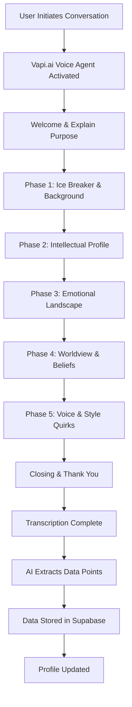

### 8.3 Conversation Flow Timing

| Phase | Duration | Categories Covered | Key Questions |
|-------|----------|-------------------|---------------|
| **Opening** | 30 sec | N/A | Welcome, explain purpose, set expectations |
| **Phase 1: Background** | 2 min | 13 (Life Experience) | Formative experience, cultural background, career |
| **Phase 2: Intellectual** | 1.5 min | 14 (Intellectual Influences) | Favorite authors, learning style, contrarian views |
| **Phase 3: Emotional** | 1.5 min | 15 (Emotional Landscape) | Primary emotions, what makes you laugh/cry |
| **Phase 4: Worldview** | 1.5 min | 17 (Worldview & Beliefs) | Human nature view, meaning of life, change belief |
| **Phase 5: Voice & Style** | 2 min | 18-20 (Sensory, Humor, Quirks) | Favorite words, humor style, sensory dominance |
| **Phase 6: Relationships** | 1 min | 16 (Relationship Patterns) | Attachment style, conflict handling |
| **Closing** | 30 sec | N/A | Thank you, next steps |
| **TOTAL** | ~10 min | | |

### 8.4 Vapi.ai Agent Configuration

```javascript
// Vapi.ai Agent Configuration
const authorInterviewAgent = {
  name: "Liquid Books Author Profiler",
  model: {
    provider: "openai",
    model: "gpt-4-turbo",
    temperature: 0.7,
    systemPrompt: `You are a warm, curious interviewer helping authors discover their unique voice and perspective. Your goal is to have a natural 10-minute conversation that reveals:

1. Their life experiences that shape their worldview
2. Their intellectual influences and thinking patterns
3. Their emotional landscape and what moves them
4. Their beliefs about life, meaning, and human nature
5. Their unique communication quirks and preferences

Guidelines:
- Be genuinely curious and follow up on interesting responses
- Keep the conversation flowing naturally
- Don't be robotic or checklist-like
- Show empathy and connection
- Gently redirect if they go too far off topic
- Cover all key areas but prioritize depth over breadth

At the end, you'll have enough information to understand how this person thinks, what they value, and how they express themselves.`
  },
  voice: {
    provider: "elevenlabs",
    voiceId: "rachel", // Warm, conversational female voice
  },
  firstMessage: "Hi! I'm so glad you're here. I'm going to ask you some questions to really understand how you think and what matters to you. This will help us capture your authentic voice for your writing. Ready to dive in?",
  transcriber: {
    provider: "deepgram",
    model: "nova-2",
    language: "en"
  }
};
```

### 8.5 Conversation Question Script

The AI agent follows a semi-structured script with flexibility to follow interesting threads:

#### Opening (30 seconds)
```
"Hi! I'm so glad you're here. I'm going to ask you some questions to really
understand how you think and what matters to you. This will help us capture
your authentic voice for your writing. There are no right or wrong answers -
just be yourself. Ready to dive in?"
```

#### Phase 1: Ice Breaker & Background (2 minutes)

| Question | Follow-ups | Data Points Captured |
|----------|------------|---------------------|
| "Let's start with something meaningful. What's one experience that really shaped who you are today?" | "How did that change you?" "What did you learn from it?" | `life_formative_experience`, `life_transformation` |
| "Where did you grow up, and what was that like?" | "Urban, suburban, rural?" "How did that environment shape you?" | `life_childhood_environment`, `life_socioeconomic` |
| "What kind of work have you done, and what do you know really well?" | "What expertise would you bring to your writing?" | `life_career`, `intel_expertise` |

#### Phase 2: Intellectual Profile (1.5 minutes)

| Question | Follow-ups | Data Points Captured |
|----------|------------|---------------------|
| "Who are the writers or thinkers who've influenced how you see the world?" | "What specifically resonated?" "How did they change your thinking?" | `intel_authors`, `intel_heroes` |
| "When you're learning something new, how do you prefer to learn?" | "Reading? Doing? Discussing?" | `intel_learning`, `cog_learning_modality` |
| "Is there something you believe that most people around you don't agree with?" | "How did you come to that view?" | `intel_contrarian`, `world_truth` |

#### Phase 3: Emotional Landscape (1.5 minutes)

| Question | Follow-ups | Data Points Captured |
|----------|------------|---------------------|
| "What emotion do you find yourself feeling most often day-to-day?" | "What triggers that?" | `emo_primary`, `emo_triggers` |
| "What genuinely makes you laugh - like really laugh?" | "What kind of humor gets you?" | `emo_laughter`, `humor_style` |
| "And on the other side - what moves you to tears?" | "Movies, situations, memories?" | `emo_crying`, `emo_vulnerability` |

#### Phase 4: Worldview & Beliefs (1.5 minutes)

| Question | Follow-ups | Data Points Captured |
|----------|------------|---------------------|
| "Do you think people are fundamentally good, or do we have to work at it?" | "What shaped that view?" | `world_human_nature`, `world_evil` |
| "Can people really change who they are at their core?" | "Have you seen it happen?" | `world_change`, `enneagram_growth` |
| "What do you think is the point of it all - life, I mean?" | "What gives you meaning?" | `world_meaning`, `world_legacy` |

#### Phase 5: Voice & Style (2 minutes)

| Question | Follow-ups | Data Points Captured |
|----------|------------|---------------------|
| "Are there words or phrases you catch yourself using all the time?" | "What about words you hate?" | `quirk_favorite_words`, `quirk_avoided_words` |
| "When you explain something complicated, how do you typically do it?" | "Analogies? Step-by-step? Stories?" | `quirk_explanation`, `reasoning_evidence` |
| "Which of your senses feels most alive to you?" | "Colors? Sounds? Textures?" | `sensory_dominant`, `sensory_colors` |
| "Would you say your humor is more dry, dark, silly, or something else?" | | `humor_style`, `humor_sarcasm` |

#### Phase 6: Relationships (1 minute)

| Question | Follow-ups | Data Points Captured |
|----------|------------|---------------------|
| "In relationships, would you say you're more secure, anxious, or you need a lot of space?" | | `rel_attachment` |
| "When there's conflict, do you tend to fight it out, avoid it, or freeze up?" | | `rel_conflict` |

#### Closing (30 seconds)
```
"This has been wonderful - I feel like I really understand how you think now.
Your voice is unique, and we're going to capture that in your writing.
Thank you for being so open with me. You're all set!"
```

### 8.6 Data Extraction Pipeline

After the conversation, the transcript is processed to extract structured data:


**Extraction Prompt:**

```javascript
const extractionPrompt = `
Analyze this conversation transcript and extract the following data points.
For each data point, provide:
1. The extracted value
2. Confidence score (0-100)
3. The relevant quote from the transcript

Data points to extract:
- life_formative_experience: What shaped them most
- life_childhood_environment: Urban/suburban/rural
- intel_authors: Writers who influenced them
- emo_primary: Their dominant emotion
- humor_style: Their humor type (dry/dark/silly/witty/slapstick)
- world_human_nature: View on whether people are good/bad
- quirk_favorite_words: Words they overuse
- sensory_dominant: Their strongest sense
- rel_attachment: Attachment style (secure/anxious/avoidant)
[... continue for all 135 conversation data points ...]

Return as JSON in this format:
{
  "data_points": {
    "field_name": {
      "value": "extracted value",
      "confidence": 85,
      "quote": "relevant quote from transcript"
    }
  },
  "overall_profile_summary": "2-3 sentence summary of this person's voice"
}
`;
```

### 8.7 Fallback: Text-Based Conversation

For users who prefer not to speak, we provide a chat-based alternative:

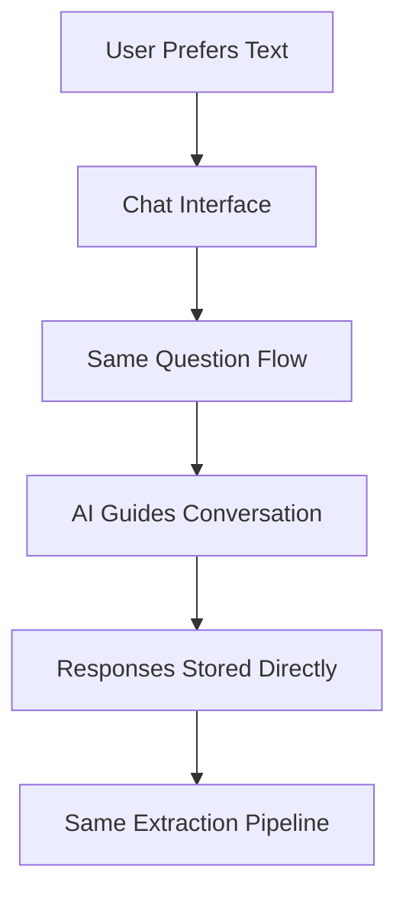

### 8.8 Alternative: OpenAI Whisper Integration

If Vapi.ai is not suitable, we can build a custom solution:

```javascript
// Alternative: Custom Whisper Integration
const customVoiceInterview = {
  recording: {
    // Browser MediaRecorder API
    format: "webm",
    sampleRate: 16000
  },
  transcription: {
    provider: "openai-whisper",
    model: "whisper-1",
    language: "en"
  },
  conversation: {
    provider: "openai",
    model: "gpt-4-turbo",
    // Same system prompt as Vapi agent
  }
};
```

---

## 8. Database Schema for Supabase

### 8.1 Complete Schema Overview

```sql
-- ============================================================================
-- LIQUID BOOKS PSYCHOMETRIC PROFILING DATABASE SCHEMA
-- Platform: Supabase (PostgreSQL)
-- Total Data Points: 299 (164 questionnaire + 135 conversation)
-- ============================================================================

-- Enable required extensions
CREATE EXTENSION IF NOT EXISTS "uuid-ossp";
CREATE EXTENSION IF NOT EXISTS "pgcrypto";

-- ============================================================================
-- CORE TABLES
-- ============================================================================

-- Main author profile table
CREATE TABLE author_profiles (
  id UUID PRIMARY KEY DEFAULT uuid_generate_v4(),
  user_id UUID REFERENCES auth.users(id) ON DELETE CASCADE,

  -- Basic info
  display_name TEXT,
  email TEXT,

  -- Assessment status
  questionnaire_completed BOOLEAN DEFAULT FALSE,
  conversation_completed BOOLEAN DEFAULT FALSE,
  profile_completeness DECIMAL(5,2) DEFAULT 0.00, -- Percentage 0-100

  -- Timestamps
  created_at TIMESTAMPTZ DEFAULT NOW(),
  updated_at TIMESTAMPTZ DEFAULT NOW(),
  last_assessment_at TIMESTAMPTZ,

  -- Computed profile summary (JSON for flexibility)
  profile_summary JSONB DEFAULT '{}'::jsonb,
  writing_style_profile JSONB DEFAULT '{}'::jsonb,

  UNIQUE(user_id)
);

-- ============================================================================
-- CATEGORY 1: BIG FIVE PERSONALITY (30 Data Points)
-- ============================================================================

CREATE TABLE big_five_scores (
  id UUID PRIMARY KEY DEFAULT uuid_generate_v4(),
  author_id UUID REFERENCES author_profiles(id) ON DELETE CASCADE,

  -- Openness (6 facets, scale 1-5)
  openness_imagination DECIMAL(3,2),           -- 1. Fantasy/imagination
  openness_artistic DECIMAL(3,2),              -- 2. Aesthetic appreciation
  openness_emotions DECIMAL(3,2),              -- 3. Emotional depth
  openness_adventure DECIMAL(3,2),             -- 4. Novelty seeking
  openness_intellect DECIMAL(3,2),             -- 5. Intellectual curiosity
  openness_liberalism DECIMAL(3,2),            -- 6. Value unconventionality
  openness_total DECIMAL(3,2) GENERATED ALWAYS AS (
    (openness_imagination + openness_artistic + openness_emotions +
     openness_adventure + openness_intellect + openness_liberalism) / 6
  ) STORED,

  -- Conscientiousness (6 facets)
  conscientiousness_self_efficacy DECIMAL(3,2),  -- 7. Confidence in abilities
  conscientiousness_orderliness DECIMAL(3,2),    -- 8. Organization preference
  conscientiousness_dutifulness DECIMAL(3,2),    -- 9. Obligation adherence
  conscientiousness_achievement DECIMAL(3,2),    -- 10. Goal striving
  conscientiousness_self_discipline DECIMAL(3,2),-- 11. Task persistence
  conscientiousness_deliberation DECIMAL(3,2),   -- 12. Careful thinking
  conscientiousness_total DECIMAL(3,2) GENERATED ALWAYS AS (
    (conscientiousness_self_efficacy + conscientiousness_orderliness +
     conscientiousness_dutifulness + conscientiousness_achievement +
     conscientiousness_self_discipline + conscientiousness_deliberation) / 6
  ) STORED,

  -- Extraversion (6 facets)
  extraversion_friendliness DECIMAL(3,2),      -- 13. Warmth towards others
  extraversion_gregariousness DECIMAL(3,2),    -- 14. Social preference
  extraversion_assertiveness DECIMAL(3,2),     -- 15. Social dominance
  extraversion_activity DECIMAL(3,2),          -- 16. Energy level
  extraversion_excitement DECIMAL(3,2),        -- 17. Stimulation seeking
  extraversion_cheerfulness DECIMAL(3,2),      -- 18. Positive emotions
  extraversion_total DECIMAL(3,2) GENERATED ALWAYS AS (
    (extraversion_friendliness + extraversion_gregariousness +
     extraversion_assertiveness + extraversion_activity +
     extraversion_excitement + extraversion_cheerfulness) / 6
  ) STORED,

  -- Agreeableness (6 facets)
  agreeableness_trust DECIMAL(3,2),            -- 19. Trust in others
  agreeableness_morality DECIMAL(3,2),         -- 20. Ethical straightforwardness
  agreeableness_altruism DECIMAL(3,2),         -- 21. Helping behavior
  agreeableness_cooperation DECIMAL(3,2),      -- 22. Conflict avoidance
  agreeableness_modesty DECIMAL(3,2),          -- 23. Humility
  agreeableness_sympathy DECIMAL(3,2),         -- 24. Concern for others
  agreeableness_total DECIMAL(3,2) GENERATED ALWAYS AS (
    (agreeableness_trust + agreeableness_morality + agreeableness_altruism +
     agreeableness_cooperation + agreeableness_modesty + agreeableness_sympathy) / 6
  ) STORED,

  -- Neuroticism (6 facets)
  neuroticism_anxiety DECIMAL(3,2),            -- 25. Worry tendency
  neuroticism_anger DECIMAL(3,2),              -- 26. Frustration tendency
  neuroticism_depression DECIMAL(3,2),         -- 27. Sadness tendency
  neuroticism_self_consciousness DECIMAL(3,2), -- 28. Social anxiety
  neuroticism_immoderation DECIMAL(3,2),       -- 29. Impulse control
  neuroticism_vulnerability DECIMAL(3,2),      -- 30. Stress susceptibility
  neuroticism_total DECIMAL(3,2) GENERATED ALWAYS AS (
    (neuroticism_anxiety + neuroticism_anger + neuroticism_depression +
     neuroticism_self_consciousness + neuroticism_immoderation + neuroticism_vulnerability) / 6
  ) STORED,

  -- Metadata
  assessment_version TEXT DEFAULT '1.0',
  created_at TIMESTAMPTZ DEFAULT NOW(),
  updated_at TIMESTAMPTZ DEFAULT NOW(),

  UNIQUE(author_id)
);

-- ============================================================================
-- CATEGORY 2: COGNITIVE STYLE (12 Data Points)
-- ============================================================================

CREATE TABLE cognitive_style (
  id UUID PRIMARY KEY DEFAULT uuid_generate_v4(),
  author_id UUID REFERENCES author_profiles(id) ON DELETE CASCADE,

  -- Cognitive Style Index (scale 1-5)
  intuition_analysis_spectrum DECIMAL(3,2),    -- 1. Intuitive vs Analytical
  global_local_processing DECIMAL(3,2),        -- 2. Big picture vs Details
  verbal_visual_preference DECIMAL(3,2),       -- 3. Words vs Images
  sequential_random_ordering DECIMAL(3,2),     -- 4. Linear vs Non-linear

  -- Kolb Learning Style
  concrete_abstract DECIMAL(3,2),              -- 5. Experience vs Concepts
  active_reflective DECIMAL(3,2),              -- 6. Doing vs Observing
  kolb_type TEXT CHECK (kolb_type IN (         -- 7. Derived learning style
    'diverging', 'assimilating', 'converging', 'accommodating'
  )),

  -- Information Processing
  convergent_divergent DECIMAL(3,2),           -- 8. Single vs Multiple solutions
  field_dependence DECIMAL(3,2),               -- 9. Context reliance
  reflection_impulsivity DECIMAL(3,2),         -- 10. Speed vs Accuracy

  -- Working Style
  risk_tolerance DECIMAL(3,2),                 -- 11. Uncertainty comfort
  ambiguity_tolerance DECIMAL(3,2),            -- 12. Vagueness comfort

  created_at TIMESTAMPTZ DEFAULT NOW(),
  updated_at TIMESTAMPTZ DEFAULT NOW(),

  UNIQUE(author_id)
);

-- ============================================================================
-- CATEGORY 3: EMOTIONAL INTELLIGENCE (15 Data Points)
-- ============================================================================

CREATE TABLE emotional_intelligence (
  id UUID PRIMARY KEY DEFAULT uuid_generate_v4(),
  author_id UUID REFERENCES author_profiles(id) ON DELETE CASCADE,

  -- Self-Perception (5 facets)
  self_regard DECIMAL(3,2),                    -- 1. Self-confidence
  self_actualization DECIMAL(3,2),             -- 2. Growth pursuit
  emotional_self_awareness DECIMAL(3,2),       -- 3. Emotion recognition
  emotional_expression DECIMAL(3,2),           -- 4. Emotion communication
  assertiveness DECIMAL(3,2),                  -- 5. Self-advocacy

  -- Other-Perception (5 facets)
  interpersonal_relationships DECIMAL(3,2),    -- 6. Relationship quality
  empathy DECIMAL(3,2),                        -- 7. Others' feelings
  social_responsibility DECIMAL(3,2),          -- 8. Community contribution
  problem_solving DECIMAL(3,2),                -- 9. Emotional problem solving
  reality_testing DECIMAL(3,2),                -- 10. Objective assessment

  -- Stress Management (5 facets)
  flexibility DECIMAL(3,2),                    -- 11. Adaptability
  stress_tolerance DECIMAL(3,2),               -- 12. Pressure handling
  impulse_control DECIMAL(3,2),                -- 13. Emotional regulation
  optimism DECIMAL(3,2),                       -- 14. Positive outlook
  happiness DECIMAL(3,2),                      -- 15. Life satisfaction

  -- Computed totals
  total_eq DECIMAL(3,2) GENERATED ALWAYS AS (
    (self_regard + self_actualization + emotional_self_awareness +
     emotional_expression + assertiveness + interpersonal_relationships +
     empathy + social_responsibility + problem_solving + reality_testing +
     flexibility + stress_tolerance + impulse_control + optimism + happiness) / 15
  ) STORED,

  created_at TIMESTAMPTZ DEFAULT NOW(),
  updated_at TIMESTAMPTZ DEFAULT NOW(),

  UNIQUE(author_id)
);

-- ============================================================================
-- CATEGORY 4: DISC COMMUNICATION (8 Data Points)
-- ============================================================================

CREATE TABLE disc_scores (
  id UUID PRIMARY KEY DEFAULT uuid_generate_v4(),
  author_id UUID REFERENCES author_profiles(id) ON DELETE CASCADE,

  -- Primary DISC scores (scale 0-100, sum = 100)
  dominance DECIMAL(5,2),                      -- 1. Direct, results-oriented
  influence DECIMAL(5,2),                      -- 2. Enthusiastic, collaborative
  steadiness DECIMAL(5,2),                     -- 3. Patient, supportive
  conscientiousness DECIMAL(5,2),              -- 4. Analytical, precise

  -- Secondary characteristics
  primary_style TEXT CHECK (primary_style IN ('D', 'I', 'S', 'C')),  -- 5. Dominant style
  secondary_style TEXT CHECK (secondary_style IN ('D', 'I', 'S', 'C')), -- 6. Secondary style

  -- Communication preferences
  pace_preference DECIMAL(3,2),                -- 7. Fast vs Slow
  people_task_orientation DECIMAL(3,2),        -- 8. People vs Task focus

  created_at TIMESTAMPTZ DEFAULT NOW(),
  updated_at TIMESTAMPTZ DEFAULT NOW(),

  UNIQUE(author_id)
);

-- ============================================================================
-- CATEGORY 5: VALUES & MOTIVATIONS (12 Data Points)
-- ============================================================================

CREATE TABLE values_motivations (
  id UUID PRIMARY KEY DEFAULT uuid_generate_v4(),
  author_id UUID REFERENCES author_profiles(id) ON DELETE CASCADE,

  -- Schwartz Values (10 basic values, scale 1-6)
  value_self_direction DECIMAL(3,2),           -- 1. Independence, creativity
  value_stimulation DECIMAL(3,2),              -- 2. Excitement, novelty
  value_hedonism DECIMAL(3,2),                 -- 3. Pleasure, enjoyment
  value_achievement DECIMAL(3,2),              -- 4. Success, competence
  value_power DECIMAL(3,2),                    -- 5. Status, control
  value_security DECIMAL(3,2),                 -- 6. Safety, stability
  value_conformity DECIMAL(3,2),               -- 7. Rule adherence
  value_tradition DECIMAL(3,2),                -- 8. Cultural customs
  value_benevolence DECIMAL(3,2),              -- 9. Welfare of close others
  value_universalism DECIMAL(3,2),             -- 10. Welfare of all

  -- Higher-order value dimensions
  self_enhancement_transcendence DECIMAL(3,2), -- 11. Self vs Others focus
  openness_conservation DECIMAL(3,2),          -- 12. Change vs Stability

  created_at TIMESTAMPTZ DEFAULT NOW(),
  updated_at TIMESTAMPTZ DEFAULT NOW(),

  UNIQUE(author_id)
);

-- ============================================================================
-- CATEGORY 6: VIA CHARACTER STRENGTHS (24 Data Points)
-- ============================================================================

CREATE TABLE via_strengths (
  id UUID PRIMARY KEY DEFAULT uuid_generate_v4(),
  author_id UUID REFERENCES author_profiles(id) ON DELETE CASCADE,

  -- Wisdom & Knowledge (5 strengths, scale 1-5)
  creativity_strength DECIMAL(3,2),            -- 1. Novel thinking
  curiosity_strength DECIMAL(3,2),             -- 2. Interest in experience
  judgment_strength DECIMAL(3,2),              -- 3. Critical thinking
  love_of_learning DECIMAL(3,2),               -- 4. Mastering new skills
  perspective_strength DECIMAL(3,2),           -- 5. Wisdom to advise

  -- Courage (4 strengths)
  bravery_strength DECIMAL(3,2),               -- 6. Facing challenges
  perseverance_strength DECIMAL(3,2),          -- 7. Finishing what started
  honesty_strength DECIMAL(3,2),               -- 8. Authenticity
  zest_strength DECIMAL(3,2),                  -- 9. Vitality

  -- Humanity (3 strengths)
  love_strength DECIMAL(3,2),                  -- 10. Close relationships
  kindness_strength DECIMAL(3,2),              -- 11. Generosity
  social_intelligence DECIMAL(3,2),            -- 12. Awareness of motives

  -- Justice (3 strengths)
  teamwork_strength DECIMAL(3,2),              -- 13. Collaboration
  fairness_strength DECIMAL(3,2),              -- 14. Equal treatment
  leadership_strength DECIMAL(3,2),            -- 15. Organizing activities

  -- Temperance (4 strengths)
  forgiveness_strength DECIMAL(3,2),           -- 16. Mercy
  humility_strength DECIMAL(3,2),              -- 17. Modesty
  prudence_strength DECIMAL(3,2),              -- 18. Careful choices
  self_regulation DECIMAL(3,2),                -- 19. Self-control

  -- Transcendence (5 strengths)
  appreciation_beauty DECIMAL(3,2),            -- 20. Awe, wonder
  gratitude_strength DECIMAL(3,2),             -- 21. Thankfulness
  hope_strength DECIMAL(3,2),                  -- 22. Optimism
  humor_strength DECIMAL(3,2),                 -- 23. Playfulness
  spirituality_strength DECIMAL(3,2),          -- 24. Purpose, meaning

  -- Signature strengths (top 5)
  signature_strengths TEXT[], -- Array of top 5 strength names

  created_at TIMESTAMPTZ DEFAULT NOW(),
  updated_at TIMESTAMPTZ DEFAULT NOW(),

  UNIQUE(author_id)
);

-- ============================================================================
-- CATEGORY 7: ENNEAGRAM PROFILE (6 Data Points)
-- ============================================================================

CREATE TABLE enneagram_profile (
  id UUID PRIMARY KEY DEFAULT uuid_generate_v4(),
  author_id UUID REFERENCES author_profiles(id) ON DELETE CASCADE,

  -- Core type (1-9)
  primary_type INTEGER CHECK (primary_type BETWEEN 1 AND 9),  -- 1. Core type
  wing_type INTEGER CHECK (wing_type BETWEEN 1 AND 9),        -- 2. Wing influence

  -- Triadic centers (scale 1-5)
  instinctual_center DECIMAL(3,2),             -- 3. Gut/body center
  feeling_center DECIMAL(3,2),                 -- 4. Heart center
  thinking_center DECIMAL(3,2),                -- 5. Head center

  -- Integration/Disintegration
  integration_level INTEGER CHECK (integration_level BETWEEN 1 AND 9), -- 6. Health level

  -- Type scores for all 9 types
  type_scores JSONB, -- {"type_1": 3.2, "type_2": 4.1, ...}

  created_at TIMESTAMPTZ DEFAULT NOW(),
  updated_at TIMESTAMPTZ DEFAULT NOW(),

  UNIQUE(author_id)
);

-- ============================================================================
-- CATEGORY 8: CREATIVITY PROFILE (8 Data Points)
-- ============================================================================

CREATE TABLE creativity_profile (
  id UUID PRIMARY KEY DEFAULT uuid_generate_v4(),
  author_id UUID REFERENCES author_profiles(id) ON DELETE CASCADE,

  -- Divergent Thinking (4 facets, scale 1-5)
  fluency DECIMAL(3,2),                        -- 1. Idea quantity
  flexibility DECIMAL(3,2),                    -- 2. Category switching
  originality DECIMAL(3,2),                    -- 3. Uniqueness
  elaboration DECIMAL(3,2),                    -- 4. Detail richness

  -- Creative Personality (4 facets)
  openness_to_experience DECIMAL(3,2),         -- 5. New experience seeking
  tolerance_ambiguity DECIMAL(3,2),            -- 6. Uncertainty comfort
  intrinsic_motivation DECIMAL(3,2),           -- 7. Internal drive
  creative_self_efficacy DECIMAL(3,2),         -- 8. Confidence in creativity

  created_at TIMESTAMPTZ DEFAULT NOW(),
  updated_at TIMESTAMPTZ DEFAULT NOW(),

  UNIQUE(author_id)
);

-- ============================================================================
-- CATEGORY 9: THINKING STYLE (10 Data Points)
-- ============================================================================

CREATE TABLE thinking_style (
  id UUID PRIMARY KEY DEFAULT uuid_generate_v4(),
  author_id UUID REFERENCES author_profiles(id) ON DELETE CASCADE,

  -- Sternberg Mental Self-Government (5 styles, scale 1-5)
  legislative_style DECIMAL(3,2),              -- 1. Creating own rules
  executive_style DECIMAL(3,2),                -- 2. Following guidelines
  judicial_style DECIMAL(3,2),                 -- 3. Evaluating/judging
  hierarchical_style DECIMAL(3,2),             -- 4. Prioritizing goals
  anarchic_style DECIMAL(3,2),                 -- 5. Random approach

  -- Processing preferences (5 styles)
  internal_external DECIMAL(3,2),              -- 6. Solo vs collaborative
  global_local DECIMAL(3,2),                   -- 7. Abstract vs concrete
  liberal_conservative DECIMAL(3,2),           -- 8. New vs familiar
  monarchic_oligarchic DECIMAL(3,2),           -- 9. Single vs multiple goals
  systematic_intuitive DECIMAL(3,2),           -- 10. Method vs instinct

  created_at TIMESTAMPTZ DEFAULT NOW(),
  updated_at TIMESTAMPTZ DEFAULT NOW(),

  UNIQUE(author_id)
);

-- ============================================================================
-- CATEGORY 10: WRITING PREFERENCES (25 Data Points)
-- ============================================================================

CREATE TABLE writing_preferences (
  id UUID PRIMARY KEY DEFAULT uuid_generate_v4(),
  author_id UUID REFERENCES author_profiles(id) ON DELETE CASCADE,

  -- Structure preferences (5 data points, scale 1-5)
  outline_preference DECIMAL(3,2),             -- 1. Planning vs Discovery
  paragraph_length DECIMAL(3,2),               -- 2. Short vs Long
  sentence_complexity DECIMAL(3,2),            -- 3. Simple vs Complex
  chapter_structure DECIMAL(3,2),              -- 4. Rigid vs Flexible
  narrative_linearity DECIMAL(3,2),            -- 5. Linear vs Non-linear

  -- Style preferences (5 data points)
  formality_level DECIMAL(3,2),                -- 6. Casual vs Formal
  technical_density DECIMAL(3,2),              -- 7. Light vs Heavy
  metaphor_usage DECIMAL(3,2),                 -- 8. Literal vs Figurative
  humor_integration DECIMAL(3,2),              -- 9. Serious vs Playful
  personal_anecdotes DECIMAL(3,2),             -- 10. Impersonal vs Personal

  -- Voice preferences (5 data points)
  first_second_third DECIMAL(3,2),             -- 11. POV preference
  active_passive DECIMAL(3,2),                 -- 12. Voice preference
  direct_indirect DECIMAL(3,2),                -- 13. Address style
  confident_hedging DECIMAL(3,2),              -- 14. Certainty level
  reader_engagement DECIMAL(3,2),              -- 15. Engagement level

  -- Content preferences (5 data points)
  theory_practice DECIMAL(3,2),                -- 16. Concepts vs Application
  breadth_depth DECIMAL(3,2),                  -- 17. Coverage style
  citation_density DECIMAL(3,2),               -- 18. Reference frequency
  example_frequency DECIMAL(3,2),              -- 19. Example usage
  visual_textual DECIMAL(3,2),                 -- 20. Media preference

  -- Process preferences (5 data points)
  drafting_speed DECIMAL(3,2),                 -- 21. Fast vs Slow
  revision_frequency DECIMAL(3,2),             -- 22. Light vs Heavy editing
  feedback_seeking DECIMAL(3,2),               -- 23. Solo vs Collaborative
  research_intensity DECIMAL(3,2),             -- 24. Light vs Deep research
  deadline_relationship DECIMAL(3,2),          -- 25. Early vs Last-minute

  created_at TIMESTAMPTZ DEFAULT NOW(),
  updated_at TIMESTAMPTZ DEFAULT NOW(),

  UNIQUE(author_id)
);

-- ============================================================================
-- CATEGORY 11: LIWC METRICS (8 Data Points)
-- ============================================================================

CREATE TABLE liwc_metrics (
  id UUID PRIMARY KEY DEFAULT uuid_generate_v4(),
  author_id UUID REFERENCES author_profiles(id) ON DELETE CASCADE,

  -- Linguistic dimensions (8 metrics, percentages 0-100)
  analytical_thinking DECIMAL(5,2),            -- 1. Formal, logical style
  clout DECIMAL(5,2),                          -- 2. Confidence, leadership
  authenticity DECIMAL(5,2),                   -- 3. Personal, honest style
  emotional_tone DECIMAL(5,2),                 -- 4. Positive vs negative
  first_person_singular DECIMAL(5,2),          -- 5. I, me, my usage
  first_person_plural DECIMAL(5,2),            -- 6. We, us, our usage
  cognitive_processes DECIMAL(5,2),            -- 7. Thinking words
  social_words DECIMAL(5,2),                   -- 8. People references

  -- Source writing samples analyzed
  samples_analyzed INTEGER DEFAULT 0,
  total_word_count INTEGER DEFAULT 0,

  created_at TIMESTAMPTZ DEFAULT NOW(),
  updated_at TIMESTAMPTZ DEFAULT NOW(),

  UNIQUE(author_id)
);

-- ============================================================================
-- CATEGORY 12: REASONING PATTERNS (6 Data Points)
-- ============================================================================

CREATE TABLE reasoning_patterns (
  id UUID PRIMARY KEY DEFAULT uuid_generate_v4(),
  author_id UUID REFERENCES author_profiles(id) ON DELETE CASCADE,

  -- Reasoning styles (scale 1-5)
  inductive_deductive DECIMAL(3,2),            -- 1. Specific→General vs General→Specific
  analogical_reasoning DECIMAL(3,2),           -- 2. Comparison-based thinking
  causal_reasoning DECIMAL(3,2),               -- 3. Cause-effect focus
  abductive_reasoning DECIMAL(3,2),            -- 4. Best explanation seeking
  dialectical_reasoning DECIMAL(3,2),          -- 5. Thesis-antithesis-synthesis
  systems_thinking DECIMAL(3,2),               -- 6. Interconnection awareness

  created_at TIMESTAMPTZ DEFAULT NOW(),
  updated_at TIMESTAMPTZ DEFAULT NOW(),

  UNIQUE(author_id)
);

-- ============================================================================
-- CATEGORY 13-22: CONVERSATION DATA (135 Data Points)
-- ============================================================================

CREATE TABLE conversation_data (
  id UUID PRIMARY KEY DEFAULT uuid_generate_v4(),
  author_id UUID REFERENCES author_profiles(id) ON DELETE CASCADE,

  -- Category 13: Narrative Patterns (15 data points)
  story_structure_preference TEXT,             -- 1. Linear, episodic, circular
  conflict_resolution_style TEXT,              -- 2. Confrontational, avoidant, etc.
  protagonist_perspective TEXT,                -- 3. Hero, observer, ensemble
  temporal_orientation TEXT,                   -- 4. Past, present, future focus
  causal_attribution_style TEXT,               -- 5. Internal, external, mixed
  narrative_complexity DECIMAL(3,2),           -- 6. Simple vs complex narratives
  emotional_arc_preference TEXT,               -- 7. Triumph, tragedy, redemption
  setting_importance DECIMAL(3,2),             -- 8. Setting detail emphasis
  character_development_style TEXT,            -- 9. Static, dynamic, transformative
  narrative_voice TEXT,                        -- 10. Intimate, distant, variable
  tension_building_approach TEXT,              -- 11. Gradual, sudden, oscillating
  resolution_preference TEXT,                  -- 12. Closed, open, ambiguous
  moral_stance TEXT,                           -- 13. Explicit, implicit, absent
  humor_in_narrative DECIMAL(3,2),             -- 14. Humor frequency
  self_disclosure_level DECIMAL(3,2),          -- 15. Personal revelation degree

  -- Category 14: Communication Dynamics (15 data points)
  response_latency DECIMAL(5,2),               -- 16. Pause before responding (ms)
  turn_taking_style TEXT,                      -- 17. Cooperative, competitive
  topic_initiation_frequency DECIMAL(3,2),     -- 18. New topic introduction rate
  elaboration_tendency DECIMAL(3,2),           -- 19. Detail expansion degree
  questioning_style TEXT,                      -- 20. Clarifying, probing, rhetorical
  feedback_responsiveness DECIMAL(3,2),        -- 21. Adaptation to feedback
  conversation_steering DECIMAL(3,2),          -- 22. Control vs following
  interruption_tolerance DECIMAL(3,2),         -- 23. Handling interruptions
  silence_comfort DECIMAL(3,2),                -- 24. Comfort with pauses
  verbal_affirmations TEXT,                    -- 25. "mm-hmm", "yes" patterns
  discourse_markers TEXT,                      -- 26. "so", "well", "you know" usage
  hedging_frequency DECIMAL(3,2),              -- 27. Uncertainty markers
  intensifier_usage DECIMAL(3,2),              -- 28. "very", "extremely" usage
  politeness_strategies TEXT,                  -- 29. Direct, indirect, mitigated
  code_switching TEXT,                         -- 30. Register/style shifts

  -- Category 15: Emotional Expression (12 data points)
  emotional_vocabulary_range DECIMAL(3,2),     -- 31. Emotion word variety
  emotion_labeling_precision TEXT,             -- 32. Specific vs general labels
  affect_intensity DECIMAL(3,2),               -- 33. Emotional strength
  emotional_valence_balance DECIMAL(3,2),      -- 34. Positive/negative ratio
  emotion_regulation_markers TEXT,             -- 35. Self-regulation cues
  empathic_responses DECIMAL(3,2),             -- 36. Response to others' emotions
  vulnerability_expression DECIMAL(3,2),       -- 37. Sharing struggles
  enthusiasm_expression DECIMAL(3,2),          -- 38. Excitement display
  frustration_expression DECIMAL(3,2),         -- 39. Annoyance display
  gratitude_expression DECIMAL(3,2),           -- 40. Thankfulness frequency
  nostalgia_frequency DECIMAL(3,2),            -- 41. Past positive reference
  anticipation_expression DECIMAL(3,2),        -- 42. Future excitement

  -- Category 16: Intellectual Style (12 data points)
  abstraction_level DECIMAL(3,2),              -- 43. Concrete to abstract
  conceptual_integration DECIMAL(3,2),         -- 44. Idea connection
  intellectual_humility DECIMAL(3,2),          -- 45. Acknowledging limits
  certainty_language DECIMAL(3,2),             -- 46. Confidence in claims
  qualification_frequency DECIMAL(3,2),        -- 47. "Sometimes", "perhaps" usage
  evidence_citation DECIMAL(3,2),              -- 48. Supporting claims
  counterargument_consideration DECIMAL(3,2),  -- 49. Alternative viewpoints
  synthesis_ability DECIMAL(3,2),              -- 50. Combining perspectives
  analogy_generation DECIMAL(3,2),             -- 51. Creating comparisons
  hypothetical_reasoning DECIMAL(3,2),         -- 52. "What if" exploration
  meta_cognitive_awareness DECIMAL(3,2),       -- 53. Thinking about thinking
  intellectual_curiosity_verbal DECIMAL(3,2),  -- 54. Question asking

  -- Category 17: Social Orientation (12 data points)
  social_reference_frequency DECIMAL(3,2),     -- 55. Mentioning others
  relationship_framing TEXT,                   -- 56. How relationships described
  group_identification DECIMAL(3,2),           -- 57. "We" vs "they" usage
  authority_reference TEXT,                    -- 58. Expert/authority citation
  social_comparison DECIMAL(3,2),              -- 59. Self vs others comparison
  collaborative_language DECIMAL(3,2),         -- 60. Partnership markers
  competitive_language DECIMAL(3,2),           -- 61. Achievement comparison
  social_obligation_markers DECIMAL(3,2),      -- 62. "Should", "must" for others
  social_support_seeking DECIMAL(3,2),         -- 63. Requesting help/validation
  advice_giving_tendency DECIMAL(3,2),         -- 64. Offering guidance
  social_norm_reference DECIMAL(3,2),          -- 65. "People usually" statements
  in_group_out_group DECIMAL(3,2),             -- 66. Us vs them framing

  -- Category 18: Decision Making Patterns (15 data points)
  decision_speed TEXT,                         -- 67. Quick vs deliberate
  risk_framing TEXT,                           -- 68. Opportunity vs threat
  option_generation DECIMAL(3,2),              -- 69. Number of alternatives
  criteria_explicitness DECIMAL(3,2),          -- 70. Decision criteria clarity
  intuition_reliance DECIMAL(3,2),             -- 71. Gut feeling reference
  data_reliance DECIMAL(3,2),                  -- 72. Evidence-based decisions
  past_experience_weight DECIMAL(3,2),         -- 73. Historical reference
  future_projection DECIMAL(3,2),              -- 74. Consequence consideration
  decision_reversibility DECIMAL(3,2),         -- 75. Commitment level
  stakeholder_consideration DECIMAL(3,2),      -- 76. Others' impact
  decision_delegation DECIMAL(3,2),            -- 77. Sharing responsibility
  regret_anticipation DECIMAL(3,2),            -- 78. "What if I don't" thinking
  satisficing_maximizing DECIMAL(3,2),         -- 79. Good enough vs best
  decision_confidence DECIMAL(3,2),            -- 80. Post-decision certainty
  decision_documentation DECIMAL(3,2),         -- 81. Recording rationale

  -- Category 19: Learning & Growth (12 data points)
  learning_orientation TEXT,                   -- 82. Mastery vs performance
  feedback_processing TEXT,                    -- 83. Defensive vs receptive
  failure_framing TEXT,                        -- 84. Setback interpretation
  growth_mindset_indicators DECIMAL(3,2),      -- 85. Ability as developable
  skill_acquisition_approach TEXT,             -- 86. Incremental vs holistic
  knowledge_source_preference TEXT,            -- 87. Books, people, experience
  mentorship_orientation DECIMAL(3,2),         -- 88. Seeking/providing guidance
  self_improvement_focus DECIMAL(3,2),         -- 89. Development emphasis
  curiosity_direction TEXT,                    -- 90. Breadth vs depth
  experimentation_comfort DECIMAL(3,2),        -- 91. Trial and error comfort
  reflection_practice DECIMAL(3,2),            -- 92. Self-review frequency
  knowledge_sharing DECIMAL(3,2),              -- 93. Teaching orientation

  -- Category 20: Stress & Coping (12 data points)
  stress_verbalization DECIMAL(3,2),           -- 94. Expressing pressure
  coping_strategies TEXT,                      -- 95. Problem vs emotion focused
  support_seeking DECIMAL(3,2),                -- 96. Reaching out behavior
  avoidance_language DECIMAL(3,2),             -- 97. Escape/withdrawal cues
  resilience_narrative TEXT,                   -- 98. Bounce-back framing
  control_orientation DECIMAL(3,2),            -- 99. Internal vs external control
  catastrophizing_tendency DECIMAL(3,2),       -- 100. Worst-case thinking
  optimistic_reframing DECIMAL(3,2),           -- 101. Silver lining finding
  compartmentalization DECIMAL(3,2),           -- 102. Issue separation
  timeline_perspective DECIMAL(3,2),           -- 103. Short vs long-term view
  self_compassion_language DECIMAL(3,2),       -- 104. Self-kindness
  perspective_taking DECIMAL(3,2),             -- 105. Distancing ability

  -- Category 21: Creativity Indicators (12 data points)
  associative_fluency DECIMAL(3,2),            -- 106. Connection making
  metaphor_generation DECIMAL(3,2),            -- 107. Novel comparisons
  perspective_shifting DECIMAL(3,2),           -- 108. Viewpoint changes
  playful_language DECIMAL(3,2),               -- 109. Wit and wordplay
  unconventional_ideas DECIMAL(3,2),           -- 110. Novel suggestions
  aesthetic_references DECIMAL(3,2),           -- 111. Beauty/art mentions
  imagination_language DECIMAL(3,2),           -- 112. "Imagine", "picture" usage
  constraint_challenging DECIMAL(3,2),         -- 113. "What if we" statements
  combination_thinking DECIMAL(3,2),           -- 114. Merging disparate ideas
  elaboration_richness DECIMAL(3,2),           -- 115. Idea development depth
  novelty_seeking_verbal DECIMAL(3,2),         -- 116. New experience interest
  creative_confidence DECIMAL(3,2),            -- 117. Creative self-assessment

  -- Category 22: Values in Action (18 data points)
  achievement_language DECIMAL(3,2),           -- 118. Success/accomplishment
  affiliation_language DECIMAL(3,2),           -- 119. Connection/belonging
  power_language DECIMAL(3,2),                 -- 120. Influence/control
  autonomy_language DECIMAL(3,2),              -- 121. Independence/freedom
  security_language DECIMAL(3,2),              -- 122. Safety/stability
  adventure_language DECIMAL(3,2),             -- 123. Excitement/exploration
  tradition_language DECIMAL(3,2),             -- 124. Heritage/customs
  universalism_language DECIMAL(3,2),          -- 125. Equality/justice
  benevolence_language DECIMAL(3,2),           -- 126. Helping/caring
  conformity_language DECIMAL(3,2),            -- 127. Rule following
  stimulation_language DECIMAL(3,2),           -- 128. Variety/novelty
  hedonism_language DECIMAL(3,2),              -- 129. Pleasure/enjoyment
  spiritual_language DECIMAL(3,2),             -- 130. Meaning/purpose
  self_direction_language DECIMAL(3,2),        -- 131. Choice/creativity
  moral_language DECIMAL(3,2),                 -- 132. Right/wrong framing
  value_conflicts TEXT,                        -- 133. Competing priorities
  value_consistency DECIMAL(3,2),              -- 134. Behavioral alignment
  value_salience TEXT,                         -- 135. Most emphasized values

  -- Metadata
  conversation_duration_minutes INTEGER,
  vapi_session_id TEXT,
  transcript_url TEXT,
  analyzed_at TIMESTAMPTZ,

  created_at TIMESTAMPTZ DEFAULT NOW(),
  updated_at TIMESTAMPTZ DEFAULT NOW(),

  UNIQUE(author_id)
);

-- ============================================================================
-- WRITING SAMPLES TABLE (for LIWC analysis)
-- ============================================================================

CREATE TABLE writing_samples (
  id UUID PRIMARY KEY DEFAULT uuid_generate_v4(),
  author_id UUID REFERENCES author_profiles(id) ON DELETE CASCADE,

  -- Sample metadata
  title TEXT,
  source_type TEXT CHECK (source_type IN ('uploaded', 'generated', 'imported')),
  word_count INTEGER,

  -- Content (stored securely)
  content_hash TEXT, -- For deduplication
  content_encrypted TEXT, -- Encrypted content

  -- Automated analysis results (15 data points)
  avg_sentence_length DECIMAL(5,2),            -- 1. Words per sentence
  avg_word_length DECIMAL(5,2),                -- 2. Characters per word
  vocabulary_richness DECIMAL(5,4),            -- 3. Type-token ratio
  passive_voice_percentage DECIMAL(5,2),       -- 4. Passive constructions
  question_percentage DECIMAL(5,2),            -- 5. Interrogative sentences
  exclamation_percentage DECIMAL(5,2),         -- 6. Emphatic sentences
  conjunction_density DECIMAL(5,2),            -- 7. Connective usage
  pronoun_ratio DECIMAL(5,2),                  -- 8. Personal pronouns
  adjective_density DECIMAL(5,2),              -- 9. Descriptive words
  adverb_density DECIMAL(5,2),                 -- 10. Modifier usage
  nominalization_ratio DECIMAL(5,2),           -- 11. Abstract nouns
  readability_score DECIMAL(5,2),              -- 12. Flesch-Kincaid
  sentiment_polarity DECIMAL(5,4),             -- 13. Positive/negative (-1 to 1)
  sentiment_subjectivity DECIMAL(5,4),         -- 14. Objective/subjective (0-1)
  topic_coherence DECIMAL(5,4),                -- 15. Thematic consistency

  created_at TIMESTAMPTZ DEFAULT NOW(),

  -- Index for efficient author lookups
  CONSTRAINT fk_author FOREIGN KEY (author_id) REFERENCES author_profiles(id)
);

-- ============================================================================
-- ASSESSMENT SESSION TRACKING
-- ============================================================================

CREATE TABLE assessment_sessions (
  id UUID PRIMARY KEY DEFAULT uuid_generate_v4(),
  author_id UUID REFERENCES author_profiles(id) ON DELETE CASCADE,

  -- Session type
  session_type TEXT CHECK (session_type IN (
    'quick_start', 'deep_dive', 'conversation', 'writing_analysis'
  )),

  -- Status tracking
  status TEXT CHECK (status IN ('started', 'in_progress', 'completed', 'abandoned')),
  progress_percentage DECIMAL(5,2) DEFAULT 0,

  -- Timing
  started_at TIMESTAMPTZ DEFAULT NOW(),
  completed_at TIMESTAMPTZ,
  duration_minutes INTEGER,

  -- Session data
  responses JSONB DEFAULT '{}'::jsonb,
  vapi_session_id TEXT,
  vapi_recording_url TEXT,

  created_at TIMESTAMPTZ DEFAULT NOW()
);

-- ============================================================================
-- INDEXES FOR PERFORMANCE
-- ============================================================================

-- Author profile lookups
CREATE INDEX idx_author_profiles_user ON author_profiles(user_id);
CREATE INDEX idx_author_profiles_completeness ON author_profiles(profile_completeness);

-- Score table lookups by author
CREATE INDEX idx_big_five_author ON big_five_scores(author_id);
CREATE INDEX idx_cognitive_style_author ON cognitive_style(author_id);
CREATE INDEX idx_eq_author ON emotional_intelligence(author_id);
CREATE INDEX idx_disc_author ON disc_scores(author_id);
CREATE INDEX idx_values_author ON values_motivations(author_id);
CREATE INDEX idx_via_author ON via_strengths(author_id);
CREATE INDEX idx_enneagram_author ON enneagram_profile(author_id);
CREATE INDEX idx_creativity_author ON creativity_profile(author_id);
CREATE INDEX idx_thinking_author ON thinking_style(author_id);
CREATE INDEX idx_writing_prefs_author ON writing_preferences(author_id);
CREATE INDEX idx_liwc_author ON liwc_metrics(author_id);
CREATE INDEX idx_reasoning_author ON reasoning_patterns(author_id);
CREATE INDEX idx_conversation_author ON conversation_data(author_id);

-- Writing samples
CREATE INDEX idx_writing_samples_author ON writing_samples(author_id);
CREATE INDEX idx_writing_samples_source ON writing_samples(source_type);

-- Assessment sessions
CREATE INDEX idx_sessions_author ON assessment_sessions(author_id);
CREATE INDEX idx_sessions_type ON assessment_sessions(session_type);
CREATE INDEX idx_sessions_status ON assessment_sessions(status);

-- ============================================================================
-- ROW LEVEL SECURITY POLICIES
-- ============================================================================

-- Enable RLS on all tables
ALTER TABLE author_profiles ENABLE ROW LEVEL SECURITY;
ALTER TABLE big_five_scores ENABLE ROW LEVEL SECURITY;
ALTER TABLE cognitive_style ENABLE ROW LEVEL SECURITY;
ALTER TABLE emotional_intelligence ENABLE ROW LEVEL SECURITY;
ALTER TABLE disc_scores ENABLE ROW LEVEL SECURITY;
ALTER TABLE values_motivations ENABLE ROW LEVEL SECURITY;
ALTER TABLE via_strengths ENABLE ROW LEVEL SECURITY;
ALTER TABLE enneagram_profile ENABLE ROW LEVEL SECURITY;
ALTER TABLE creativity_profile ENABLE ROW LEVEL SECURITY;
ALTER TABLE thinking_style ENABLE ROW LEVEL SECURITY;
ALTER TABLE writing_preferences ENABLE ROW LEVEL SECURITY;
ALTER TABLE liwc_metrics ENABLE ROW LEVEL SECURITY;
ALTER TABLE reasoning_patterns ENABLE ROW LEVEL SECURITY;
ALTER TABLE conversation_data ENABLE ROW LEVEL SECURITY;
ALTER TABLE writing_samples ENABLE ROW LEVEL SECURITY;
ALTER TABLE assessment_sessions ENABLE ROW LEVEL SECURITY;

-- Policy: Users can only access their own data
CREATE POLICY "Users can view own profile" ON author_profiles
  FOR SELECT USING (auth.uid() = user_id);

CREATE POLICY "Users can update own profile" ON author_profiles
  FOR UPDATE USING (auth.uid() = user_id);

CREATE POLICY "Users can insert own profile" ON author_profiles
  FOR INSERT WITH CHECK (auth.uid() = user_id);

-- Macro for creating policies on score tables
-- (Each table follows same pattern: user can CRUD their own data)

-- Big Five policies
CREATE POLICY "Users can view own big_five" ON big_five_scores
  FOR SELECT USING (
    author_id IN (SELECT id FROM author_profiles WHERE user_id = auth.uid())
  );

CREATE POLICY "Users can insert own big_five" ON big_five_scores
  FOR INSERT WITH CHECK (
    author_id IN (SELECT id FROM author_profiles WHERE user_id = auth.uid())
  );

CREATE POLICY "Users can update own big_five" ON big_five_scores
  FOR UPDATE USING (
    author_id IN (SELECT id FROM author_profiles WHERE user_id = auth.uid())
  );

-- Repeat pattern for all other tables...
-- (In production, use a function or script to generate these)

-- ============================================================================
-- FUNCTIONS FOR PROFILE AGGREGATION
-- ============================================================================

-- Function to calculate profile completeness
CREATE OR REPLACE FUNCTION calculate_profile_completeness(p_author_id UUID)
RETURNS DECIMAL AS $$
DECLARE
  total_fields INTEGER := 299;
  filled_fields INTEGER := 0;
  completeness DECIMAL;
BEGIN
  -- Count filled Big Five fields
  SELECT COUNT(*) INTO filled_fields FROM (
    SELECT 1 FROM big_five_scores WHERE author_id = p_author_id
      AND openness_imagination IS NOT NULL
    -- ... count all non-null fields
  ) t;

  -- Add counts from other tables...

  completeness := (filled_fields::DECIMAL / total_fields) * 100;
  RETURN completeness;
END;
$$ LANGUAGE plpgsql;

-- Function to generate AI writing prompt from profile
CREATE OR REPLACE FUNCTION generate_writing_style_prompt(p_author_id UUID)
RETURNS TEXT AS $$
DECLARE
  prompt TEXT;
  big_five RECORD;
  writing_prefs RECORD;
  disc RECORD;
BEGIN
  SELECT * INTO big_five FROM big_five_scores WHERE author_id = p_author_id;
  SELECT * INTO writing_prefs FROM writing_preferences WHERE author_id = p_author_id;
  SELECT * INTO disc FROM disc_scores WHERE author_id = p_author_id;

  prompt := 'Write in the voice of an author with the following characteristics: ';

  -- Add personality traits
  IF big_five.openness_total > 3.5 THEN
    prompt := prompt || 'Creative and open to new ideas. ';
  END IF;

  IF big_five.extraversion_total > 3.5 THEN
    prompt := prompt || 'Energetic and enthusiastic tone. ';
  ELSE
    prompt := prompt || 'Thoughtful and introspective tone. ';
  END IF;

  -- Add writing preferences
  IF writing_prefs.formality_level > 3.5 THEN
    prompt := prompt || 'Use formal language. ';
  ELSE
    prompt := prompt || 'Use conversational language. ';
  END IF;

  -- Add more characteristics...

  RETURN prompt;
END;
$$ LANGUAGE plpgsql;

-- ============================================================================
-- TRIGGERS FOR AUTOMATIC UPDATES
-- ============================================================================

-- Update timestamp trigger
CREATE OR REPLACE FUNCTION update_updated_at()
RETURNS TRIGGER AS $$
BEGIN
  NEW.updated_at = NOW();
  RETURN NEW;
END;
$$ LANGUAGE plpgsql;

-- Apply to all tables
CREATE TRIGGER update_author_profiles_timestamp
  BEFORE UPDATE ON author_profiles
  FOR EACH ROW EXECUTE FUNCTION update_updated_at();

CREATE TRIGGER update_big_five_timestamp
  BEFORE UPDATE ON big_five_scores
  FOR EACH ROW EXECUTE FUNCTION update_updated_at();

-- ... repeat for all tables

-- Trigger to update profile completeness
CREATE OR REPLACE FUNCTION update_profile_completeness()
RETURNS TRIGGER AS $$
BEGIN
  UPDATE author_profiles
  SET profile_completeness = calculate_profile_completeness(NEW.author_id)
  WHERE id = NEW.author_id;
  RETURN NEW;
END;
$$ LANGUAGE plpgsql;

CREATE TRIGGER update_completeness_on_big_five
  AFTER INSERT OR UPDATE ON big_five_scores
  FOR EACH ROW EXECUTE FUNCTION update_profile_completeness();

-- ... repeat for all score tables
```

### 8.2 Entity Relationship Diagram

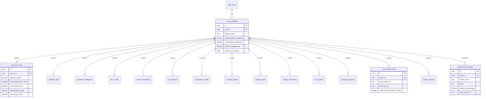

---

## 9. API Endpoints

### 9.1 REST API Overview

Base URL: `https://api.liquidbooks.io/v1`

Authentication: Bearer token (Supabase JWT)

#### Profile Management

| Method | Endpoint | Description |
|--------|----------|-------------|
| `GET` | `/profiles/me` | Get current user's author profile |
| `POST` | `/profiles` | Create new author profile |
| `PATCH` | `/profiles/me` | Update author profile |
| `GET` | `/profiles/me/completeness` | Get profile completeness percentage |
| `GET` | `/profiles/me/summary` | Get computed profile summary |

#### Assessment Sessions

| Method | Endpoint | Description |
|--------|----------|-------------|
| `POST` | `/assessments/start` | Start new assessment session |
| `GET` | `/assessments/:sessionId` | Get session status and progress |
| `POST` | `/assessments/:sessionId/responses` | Submit assessment responses |
| `POST` | `/assessments/:sessionId/complete` | Mark session as completed |
| `GET` | `/assessments/history` | Get all past assessment sessions |

#### Questionnaire Scores

| Method | Endpoint | Description |
|--------|----------|-------------|
| `GET` | `/scores/big-five` | Get Big Five personality scores |
| `POST` | `/scores/big-five` | Save Big Five scores |
| `GET` | `/scores/cognitive-style` | Get cognitive style scores |
| `POST` | `/scores/cognitive-style` | Save cognitive style scores |
| `GET` | `/scores/emotional-intelligence` | Get EQ scores |
| `POST` | `/scores/emotional-intelligence` | Save EQ scores |
| `GET` | `/scores/disc` | Get DISC profile scores |
| `POST` | `/scores/disc` | Save DISC scores |
| `GET` | `/scores/values` | Get values & motivations |
| `POST` | `/scores/values` | Save values scores |
| `GET` | `/scores/via-strengths` | Get VIA character strengths |
| `POST` | `/scores/via-strengths` | Save VIA scores |
| `GET` | `/scores/enneagram` | Get Enneagram profile |
| `POST` | `/scores/enneagram` | Save Enneagram scores |
| `GET` | `/scores/creativity` | Get creativity profile |
| `POST` | `/scores/creativity` | Save creativity scores |
| `GET` | `/scores/thinking-style` | Get thinking style |
| `POST` | `/scores/thinking-style` | Save thinking style |
| `GET` | `/scores/writing-preferences` | Get writing preferences |
| `POST` | `/scores/writing-preferences` | Save writing preferences |
| `GET` | `/scores/liwc` | Get LIWC metrics |
| `POST` | `/scores/liwc` | Save LIWC metrics |
| `GET` | `/scores/reasoning` | Get reasoning patterns |
| `POST` | `/scores/reasoning` | Save reasoning patterns |
| `GET` | `/scores/all` | Get all scores in one response |

#### Conversation System (Vapi.ai Integration)

| Method | Endpoint | Description |
|--------|----------|-------------|
| `POST` | `/conversation/initiate` | Initiate Vapi call to user |
| `POST` | `/conversation/webhook` | Vapi webhook for call events |
| `GET` | `/conversation/:sessionId/transcript` | Get call transcript |
| `POST` | `/conversation/:sessionId/analyze` | Trigger AI analysis of transcript |
| `GET` | `/conversation/:sessionId/data` | Get extracted conversation data |

#### Writing Samples

| Method | Endpoint | Description |
|--------|----------|-------------|
| `POST` | `/writing-samples` | Upload writing sample |
| `GET` | `/writing-samples` | List all writing samples |
| `GET` | `/writing-samples/:id` | Get specific sample |
| `DELETE` | `/writing-samples/:id` | Delete writing sample |
| `POST` | `/writing-samples/:id/analyze` | Trigger LIWC-style analysis |

#### AI Writing Generation

| Method | Endpoint | Description |
|--------|----------|-------------|
| `POST` | `/ai/generate-prompt` | Generate AI writing prompt from profile |
| `POST` | `/ai/write-chapter` | Generate chapter using author profile |
| `POST` | `/ai/refine` | Refine generated content |
| `GET` | `/ai/style-guide` | Get generated style guide for author |

### 9.2 Detailed Endpoint Specifications

#### POST `/assessments/start`

Start a new assessment session.

**Request Body:**
```json
{
  "session_type": "quick_start" | "deep_dive" | "conversation" | "writing_analysis"
}
```

**Response:**
```json
{
  "session_id": "uuid",
  "session_type": "quick_start",
  "status": "started",
  "questions": [
    {
      "id": "bf_openness_1",
      "category": "big_five",
      "subcategory": "openness",
      "text": "I have a vivid imagination.",
      "type": "likert_5",
      "options": ["Strongly Disagree", "Disagree", "Neutral", "Agree", "Strongly Agree"]
    }
  ],
  "total_questions": 50,
  "estimated_minutes": 12
}
```

#### POST `/assessments/:sessionId/responses`

Submit responses for assessment questions.

**Request Body:**
```json
{
  "responses": [
    {
      "question_id": "bf_openness_1",
      "value": 4,
      "timestamp": "2024-01-15T10:30:00Z"
    },
    {
      "question_id": "bf_openness_2",
      "value": 5,
      "timestamp": "2024-01-15T10:30:15Z"
    }
  ]
}
```

**Response:**
```json
{
  "session_id": "uuid",
  "responses_saved": 2,
  "progress_percentage": 45.5,
  "remaining_questions": 27
}
```

#### POST `/conversation/initiate`

Initiate a Vapi.ai voice call to the user.

**Request Body:**
```json
{
  "phone_number": "+1234567890",
  "preferred_time": "2024-01-15T14:00:00Z",
  "language": "en",
  "session_type": "full_interview"
}
```

**Response:**
```json
{
  "call_id": "vapi_call_abc123",
  "session_id": "uuid",
  "status": "initiated",
  "estimated_duration_minutes": 8,
  "callback_url": "https://api.liquidbooks.io/v1/conversation/webhook"
}
```

#### POST `/conversation/webhook`

Webhook endpoint for Vapi.ai call events.

**Request Body (from Vapi):**
```json
{
  "event": "call.ended",
  "call_id": "vapi_call_abc123",
  "duration_seconds": 485,
  "recording_url": "https://vapi.ai/recordings/abc123.mp3",
  "transcript": [
    {
      "role": "assistant",
      "content": "Tell me about a time when you had to solve a difficult problem...",
      "timestamp": 0
    },
    {
      "role": "user",
      "content": "Well, I remember when I was working on...",
      "timestamp": 5200
    }
  ]
}
```

**Response:**
```json
{
  "status": "received",
  "analysis_triggered": true,
  "estimated_analysis_time_seconds": 30
}
```

#### POST `/ai/generate-prompt`

Generate a comprehensive AI writing prompt based on the author's psychometric profile.

**Request Body:**
```json
{
  "include_categories": ["personality", "writing_style", "voice", "reasoning"],
  "writing_context": {
    "book_type": "technical",
    "target_audience": "developers",
    "chapter_topic": "API design patterns"
  }
}
```

**Response:**
```json
{
  "prompt": "You are writing as an author with the following characteristics:\n\n## Personality Profile\n- High openness (4.2/5): Creative, imaginative, values novelty\n- Moderate extraversion (3.1/5): Balanced energy, can be both reflective and engaging\n- High conscientiousness (4.5/5): Organized, thorough, detail-oriented\n\n## Writing Style\n- Formality: Semi-formal (3.2/5) - Professional but approachable\n- Sentence complexity: Moderate (3.0/5) - Clear but not oversimplified\n- Metaphor usage: High (4.1/5) - Uses analogies to explain concepts\n- Humor integration: Moderate (2.8/5) - Occasional wit, not primary focus\n\n## Voice Characteristics\n- First-person plural preference: Uses 'we' to include reader\n- Active voice dominant (4.2/5)\n- Direct communication style\n- High reader engagement (4.0/5)\n\n## Reasoning Patterns\n- Inductive-deductive balance (3.5/5): Combines examples with principles\n- Strong analogical reasoning (4.3/5): Explains through comparisons\n- Systems thinking (3.8/5): Considers interconnections\n\n## Instructions\nWrite content that:\n1. Opens with a relatable scenario or question\n2. Builds concepts from concrete examples to abstract principles\n3. Uses technical analogies from everyday life\n4. Maintains an inclusive, collaborative tone\n5. Ends sections with actionable takeaways\n\nNow write about: API design patterns for the target audience of developers.",
  "profile_confidence": 0.87,
  "data_points_used": 156,
  "categories_included": ["big_five", "writing_preferences", "disc", "reasoning_patterns", "conversation_data"]
}
```

#### POST `/ai/write-chapter`

Generate a full chapter using the author's profile.

**Request Body:**
```json
{
  "chapter_title": "RESTful API Design Principles",
  "outline": [
    "Introduction to REST",
    "Resource naming conventions",
    "HTTP methods and their meanings",
    "Status codes best practices",
    "Versioning strategies"
  ],
  "word_count_target": 3000,
  "include_examples": true,
  "tone_override": null
}
```

**Response:**
```json
{
  "chapter_id": "uuid",
  "content": "# RESTful API Design Principles\n\nWe've all been there—staring at an API documentation...",
  "word_count": 3127,
  "sections": [
    {
      "title": "Introduction to REST",
      "word_count": 425,
      "readability_score": 62.3
    }
  ],
  "style_adherence_score": 0.91,
  "profile_traits_reflected": [
    "high_openness_metaphors",
    "collaborative_we_language",
    "systematic_structure"
  ],
  "suggested_revisions": [
    {
      "location": "paragraph_7",
      "suggestion": "Consider adding a practical code example here based on your preference for concrete illustrations"
    }
  ]
}
```

### 9.3 API Request/Response Examples

#### Complete Assessment Flow

```typescript
// 1. Start assessment session
const startResponse = await fetch('/api/v1/assessments/start', {
  method: 'POST',
  headers: {
    'Authorization': `Bearer ${token}`,
    'Content-Type': 'application/json'
  },
  body: JSON.stringify({ session_type: 'quick_start' })
});
const session = await startResponse.json();

// 2. Submit responses as user completes questions
const submitResponse = await fetch(`/api/v1/assessments/${session.session_id}/responses`, {
  method: 'POST',
  headers: {
    'Authorization': `Bearer ${token}`,
    'Content-Type': 'application/json'
  },
  body: JSON.stringify({
    responses: [
      { question_id: 'bf_openness_1', value: 4 },
      { question_id: 'bf_openness_2', value: 5 }
    ]
  })
});

// 3. Complete the session
const completeResponse = await fetch(`/api/v1/assessments/${session.session_id}/complete`, {
  method: 'POST',
  headers: { 'Authorization': `Bearer ${token}` }
});

// 4. Get computed scores
const scoresResponse = await fetch('/api/v1/scores/all', {
  headers: { 'Authorization': `Bearer ${token}` }
});
const scores = await scoresResponse.json();
```

#### Vapi Conversation Flow

```typescript
// 1. Initiate voice call
const callResponse = await fetch('/api/v1/conversation/initiate', {
  method: 'POST',
  headers: {
    'Authorization': `Bearer ${token}`,
    'Content-Type': 'application/json'
  },
  body: JSON.stringify({
    phone_number: '+1234567890',
    session_type: 'full_interview'
  })
});
const call = await callResponse.json();

// 2. Vapi calls the user and sends webhook when complete
// (handled by /conversation/webhook endpoint)

// 3. After webhook processes, get conversation data
const conversationData = await fetch(`/api/v1/conversation/${call.session_id}/data`, {
  headers: { 'Authorization': `Bearer ${token}` }
});
const extracted = await conversationData.json();
// Contains all 135 conversation data points
```

#### Generate AI Writing Content

```typescript
// 1. First generate the prompt
const promptResponse = await fetch('/api/v1/ai/generate-prompt', {
  method: 'POST',
  headers: {
    'Authorization': `Bearer ${token}`,
    'Content-Type': 'application/json'
  },
  body: JSON.stringify({
    include_categories: ['personality', 'writing_style', 'voice'],
    writing_context: {
      book_type: 'educational',
      target_audience: 'beginners',
      chapter_topic: 'Introduction to Machine Learning'
    }
  })
});
const { prompt, profile_confidence } = await promptResponse.json();

// 2. Generate chapter content
const chapterResponse = await fetch('/api/v1/ai/write-chapter', {
  method: 'POST',
  headers: {
    'Authorization': `Bearer ${token}`,
    'Content-Type': 'application/json'
  },
  body: JSON.stringify({
    chapter_title: 'What is Machine Learning?',
    outline: [
      'Definition and everyday examples',
      'Types of machine learning',
      'When to use ML vs traditional programming',
      'Getting started roadmap'
    ],
    word_count_target: 2500,
    include_examples: true
  })
});
const chapter = await chapterResponse.json();
```

### 9.4 Error Responses

All endpoints return consistent error responses:

```json
{
  "error": {
    "code": "VALIDATION_ERROR",
    "message": "Invalid session type provided",
    "details": {
      "field": "session_type",
      "provided": "invalid",
      "allowed": ["quick_start", "deep_dive", "conversation", "writing_analysis"]
    }
  },
  "request_id": "req_abc123"
}
```

**Error Codes:**
| Code | HTTP Status | Description |
|------|-------------|-------------|
| `UNAUTHORIZED` | 401 | Missing or invalid authentication |
| `FORBIDDEN` | 403 | User doesn't have access to resource |
| `NOT_FOUND` | 404 | Resource doesn't exist |
| `VALIDATION_ERROR` | 400 | Invalid request parameters |
| `RATE_LIMITED` | 429 | Too many requests |
| `VAPI_ERROR` | 502 | Vapi.ai service error |
| `AI_GENERATION_ERROR` | 500 | AI content generation failed |
| `ANALYSIS_TIMEOUT` | 504 | Transcript analysis timed out |

### 9.5 Rate Limits

| Endpoint Category | Rate Limit |
|-------------------|------------|
| Profile & Scores | 100 req/min |
| Assessment Sessions | 30 req/min |
| Conversation Initiate | 5 req/hour |
| AI Generation | 10 req/hour |
| Writing Samples Upload | 20 req/hour |

---

## 10. Architecture Diagrams

### 10.1 System Architecture Overview

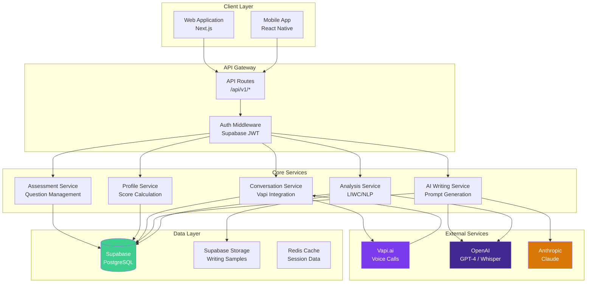

### 10.2 Data Flow: Complete Assessment Journey

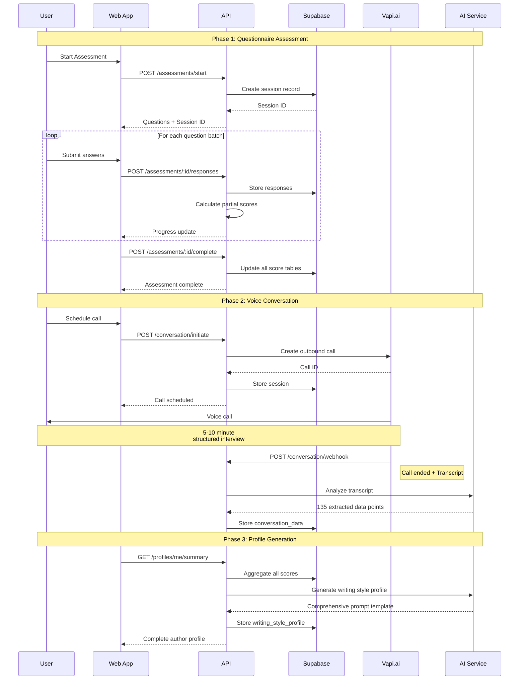

### 10.3 Psychometric Data Processing Pipeline

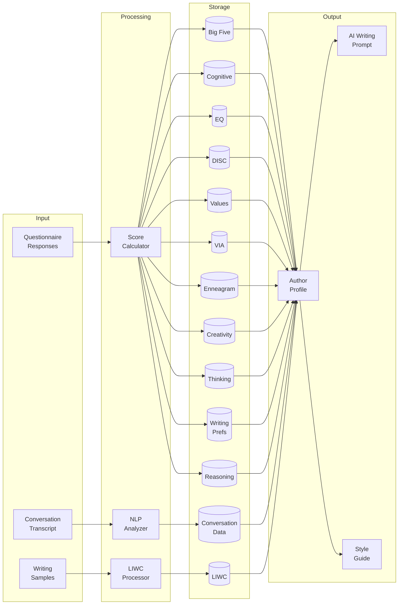

### 10.4 Vapi.ai Integration Flow

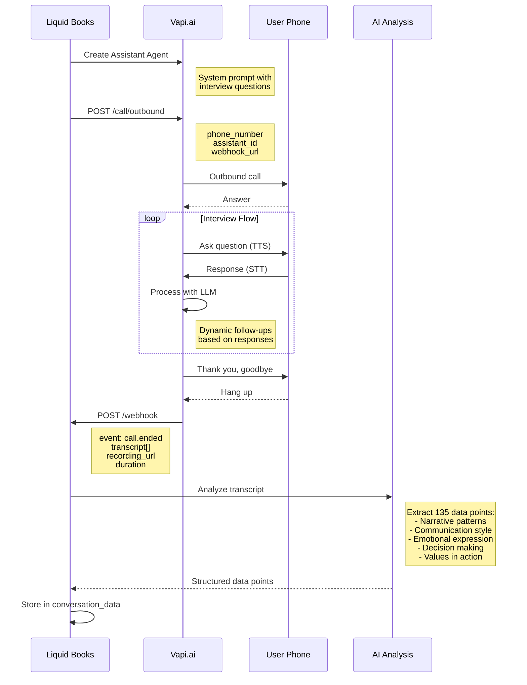

### 10.5 AI Writing Generation Pipeline

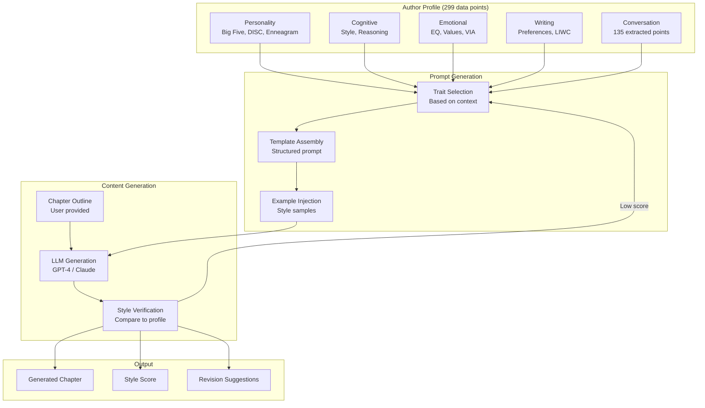

### 10.6 Component Architecture (Next.js)

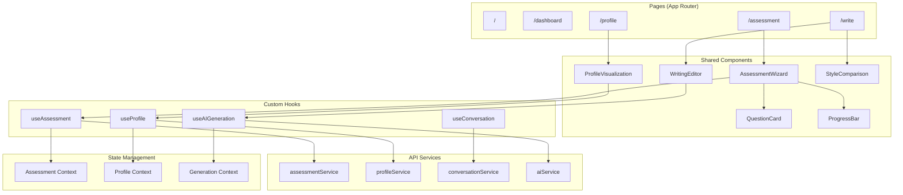

### 10.7 Database Relationship Diagram

```mermaid
erDiagram
    auth_users ||--o| author_profiles : "1:1"
    author_profiles ||--o| big_five_scores : "1:1"
    author_profiles ||--o| cognitive_style : "1:1"
    author_profiles ||--o| emotional_intelligence : "1:1"
    author_profiles ||--o| disc_scores : "1:1"
    author_profiles ||--o| values_motivations : "1:1"
    author_profiles ||--o| via_strengths : "1:1"
    author_profiles ||--o| enneagram_profile : "1:1"
    author_profiles ||--o| creativity_profile : "1:1"
    author_profiles ||--o| thinking_style : "1:1"
    author_profiles ||--o| writing_preferences : "1:1"
    author_profiles ||--o| liwc_metrics : "1:1"
    author_profiles ||--o| reasoning_patterns : "1:1"
    author_profiles ||--o| conversation_data : "1:1"
    author_profiles ||--o{ writing_samples : "1:N"
    author_profiles ||--o{ assessment_sessions : "1:N"
    author_profiles ||--o{ generated_chapters : "1:N"

    author_profiles {
        uuid id PK
        uuid user_id FK
        decimal profile_completeness
        jsonb writing_style_profile
        timestamp last_assessment_at
    }

    big_five_scores {
        uuid id PK
        uuid author_id FK
        decimal openness_total
        decimal conscientiousness_total
        decimal extraversion_total
        decimal agreeableness_total
        decimal neuroticism_total
    }

    conversation_data {
        uuid id PK
        uuid author_id FK
        text vapi_session_id
        integer conversation_duration
        timestamp analyzed_at
    }

    assessment_sessions {
        uuid id PK
        uuid author_id FK
        text session_type
        text status
        jsonb responses
    }

    writing_samples {
        uuid id PK
        uuid author_id FK
        text title
        integer word_count
        decimal readability_score
    }

    generated_chapters {
        uuid id PK
        uuid author_id FK
        text title
        text content
        decimal style_adherence_score
    }
```

### 10.8 Deployment Architecture

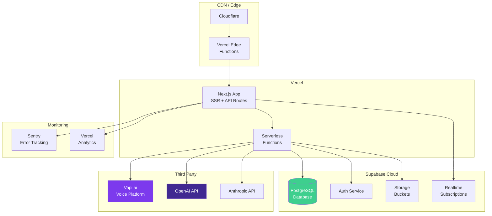

### 10.9 Security Architecture

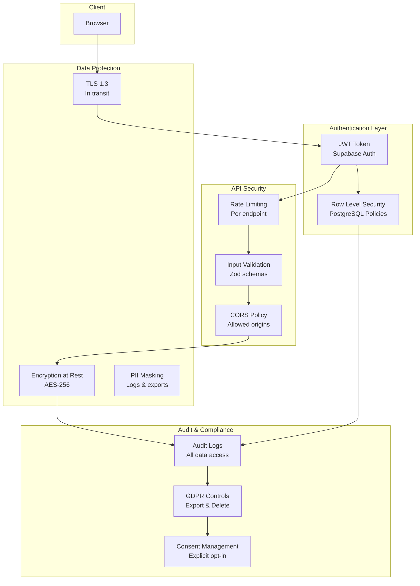

---

## 11. Implementation Phases

### Phase 1: Foundation (Core Infrastructure)

**Objective:** Establish the foundational infrastructure for user authentication, database, and basic profile management.

#### Deliverables

| Component | Description | Priority |
|-----------|-------------|----------|
| Supabase Setup | Create project, configure auth, set up database | Critical |
| Database Schema | Deploy all 16 tables from Section 8 | Critical |
| Row Level Security | Implement RLS policies for all tables | Critical |
| Auth Integration | Google OAuth + Email magic link | Critical |
| Basic API Routes | Profile CRUD endpoints | High |
| Environment Config | Secure env vars for all services | Critical |

#### Technical Tasks

```markdown
1. Database Setup
   - [ ] Create Supabase project
   - [ ] Run schema migrations (16 tables)
   - [ ] Create performance indexes
   - [ ] Enable RLS on all tables
   - [ ] Create RLS policies
   - [ ] Test policies with different user contexts

2. Authentication
   - [ ] Configure Supabase Auth
   - [ ] Set up Google OAuth provider
   - [ ] Configure email templates
   - [ ] Implement auth middleware
   - [ ] Create protected route wrapper

3. Core API
   - [ ] POST /profiles - Create profile
   - [ ] GET /profiles/me - Get current profile
   - [ ] PATCH /profiles/me - Update profile
   - [ ] GET /profiles/me/completeness - Get progress
```

#### Success Criteria
- Users can sign up/sign in via Google or email
- Author profile is created on first login
- Profile completeness shows 0% for new users
- All API endpoints respond correctly with auth

---

### Phase 2: Questionnaire Assessment System

**Objective:** Build the complete questionnaire-based assessment system covering 164 data points across 12 categories.

#### Deliverables

| Component | Description | Priority |
|-----------|-------------|----------|
| Question Bank | All questions for 12 categories | Critical |
| Assessment UI | Multi-step wizard component | Critical |
| Score Calculator | Algorithms for all psychometric scales | Critical |
| Progress Tracking | Save partial progress, resume later | High |
| Score Storage | Store computed scores in database | Critical |
| Profile Update | Update completeness on score save | High |

#### Question Categories to Implement

| Category | Questions | Data Points |
|----------|-----------|-------------|
| Big Five | 30 items (IPIP-NEO short) | 30 |
| Cognitive Style | 15 items | 12 |
| Emotional Intelligence | 20 items | 15 |
| DISC | 24 forced-choice pairs | 8 |
| Values | 21 items (PVQ-21) | 12 |
| VIA Strengths | 24 items (VIA-IS short) | 24 |
| Enneagram | 36 items (RHETI short) | 6 |
| Creativity | 15 items | 8 |
| Thinking Style | 20 items | 10 |
| Writing Preferences | 25 items (custom) | 25 |
| Reasoning Patterns | 12 items | 6 |
| **Total** | **242 items** | **156** |

#### Technical Tasks

```markdown
1. Question Bank Setup
   - [ ] Create question_bank table
   - [ ] Import Big Five questions
   - [ ] Import Cognitive Style questions
   - [ ] Import EQ questions
   - [ ] Import DISC forced-choice items
   - [ ] Import Values questions
   - [ ] Import VIA questions
   - [ ] Import Enneagram questions
   - [ ] Import Creativity questions
   - [ ] Import Thinking Style questions
   - [ ] Create custom Writing Preference questions
   - [ ] Create Reasoning Pattern questions

2. Assessment Flow
   - [ ] Create AssessmentWizard component
   - [ ] Create QuestionCard component (Likert, forced-choice)
   - [ ] Implement progress bar
   - [ ] Add "save and continue later" functionality
   - [ ] Create session management

3. Scoring Algorithms
   - [ ] Big Five scoring (reverse coding, facet aggregation)
   - [ ] Cognitive Style scoring
   - [ ] EQ composite scoring
   - [ ] DISC percentage calculation
   - [ ] Values priority ranking
   - [ ] VIA top 5 identification
   - [ ] Enneagram type determination
   - [ ] Creativity dimension scoring
   - [ ] Thinking style profile
   - [ ] Writing preference spectrum
   - [ ] Reasoning pattern analysis

4. API Endpoints
   - [ ] POST /assessments/start
   - [ ] GET /assessments/:id
   - [ ] POST /assessments/:id/responses
   - [ ] POST /assessments/:id/complete
   - [ ] GET /scores/all
   - [ ] Individual score endpoints (12)
```

#### Success Criteria
- Users can complete full questionnaire in < 25 minutes
- All 156 data points correctly calculated
- Progress saves automatically every 30 seconds
- Users can pause and resume assessment
- Profile completeness updates to ~55% after questionnaire

---

### Phase 3: Voice Conversation System (Vapi.ai)

**Objective:** Implement the AI-guided voice conversation to extract 135 additional data points from natural dialogue.

#### Deliverables

| Component | Description | Priority |
|-----------|-------------|----------|
| Vapi Integration | API connection, agent configuration | Critical |
| Conversation Script | 8-12 question interview flow | Critical |
| Webhook Handler | Process call events and transcripts | Critical |
| Transcript Analysis | AI extraction of data points | Critical |
| Data Storage | Store 135 conversation data points | High |
| Call Scheduling | Let users schedule preferred time | Medium |

#### Vapi Agent Configuration

```markdown
1. Agent Setup
   - [ ] Create Vapi.ai account
   - [ ] Configure assistant with system prompt
   - [ ] Set up voice (ElevenLabs or Play.ht)
   - [ ] Configure transcription settings
   - [ ] Set webhook URL

2. Interview Flow
   - [ ] Opening and rapport building
   - [ ] Narrative patterns questions (3)
   - [ ] Communication style questions (2)
   - [ ] Emotional expression questions (2)
   - [ ] Intellectual style questions (2)
   - [ ] Decision making questions (2)
   - [ ] Values questions (2)
   - [ ] Closing and thanks

3. Webhook Processing
   - [ ] POST /conversation/webhook endpoint
   - [ ] Signature verification
   - [ ] Transcript storage
   - [ ] Async analysis trigger

4. AI Analysis Pipeline
   - [ ] Transcript preprocessing
   - [ ] GPT-4 extraction prompt
   - [ ] Structured output parsing
   - [ ] Confidence scoring
   - [ ] Data point storage
```

#### Data Extraction Targets

| Category | Data Points | Extraction Method |
|----------|-------------|-------------------|
| Narrative Patterns | 15 | Story structure analysis |
| Communication Dynamics | 15 | Turn-taking, latency |
| Emotional Expression | 12 | Sentiment, vocabulary |
| Intellectual Style | 12 | Abstraction, certainty |
| Social Orientation | 12 | Pronouns, references |
| Decision Making | 15 | Risk framing, process |
| Learning & Growth | 12 | Mindset markers |
| Stress & Coping | 12 | Regulation patterns |
| Creativity Indicators | 12 | Metaphors, novelty |
| Values in Action | 18 | Value language |
| **Total** | **135** | |

#### Success Criteria
- Vapi successfully places outbound calls
- Conversations average 5-8 minutes
- Transcripts stored within 30 seconds of call end
- AI extraction completes within 60 seconds
- Profile completeness reaches ~100% after conversation

---

### Phase 4: Writing Sample Analysis

**Objective:** Implement automated analysis of user-uploaded writing samples for LIWC-style metrics.

#### Deliverables

| Component | Description | Priority |
|-----------|-------------|----------|
| Upload System | Secure file upload to Supabase Storage | High |
| Text Extraction | Parse .txt, .docx, .pdf formats | High |
| LIWC Analysis | Compute 8 linguistic dimensions | Critical |
| Writing Metrics | 15 automated metrics per sample | High |
| Aggregate Stats | Combine multiple samples | Medium |

#### Technical Tasks

```markdown
1. File Upload
   - [ ] Configure Supabase Storage bucket
   - [ ] Create upload endpoint
   - [ ] Implement file type validation
   - [ ] Add virus scanning (optional)
   - [ ] Store metadata in writing_samples table

2. Text Processing
   - [ ] .txt direct reading
   - [ ] .docx parsing (mammoth.js)
   - [ ] .pdf extraction (pdf-parse)
   - [ ] Text cleaning and normalization

3. Analysis Pipeline
   - [ ] Sentence tokenization
   - [ ] Word tokenization
   - [ ] POS tagging (compromise.js or OpenAI)
   - [ ] Sentiment analysis
   - [ ] LIWC-style word counting
   - [ ] Readability scoring

4. Metrics Calculation
   - [ ] Average sentence length
   - [ ] Average word length
   - [ ] Vocabulary richness (TTR)
   - [ ] Passive voice percentage
   - [ ] Question percentage
   - [ ] Exclamation percentage
   - [ ] Conjunction density
   - [ ] Pronoun ratio
   - [ ] Adjective density
   - [ ] Adverb density
   - [ ] Nominalization ratio
   - [ ] Readability score (Flesch-Kincaid)
   - [ ] Sentiment polarity
   - [ ] Sentiment subjectivity
   - [ ] Topic coherence
```

#### Success Criteria
- Users can upload .txt, .docx, .pdf files
- Analysis completes within 30 seconds for 10,000 words
- LIWC metrics stored in liwc_metrics table
- Writing sample metrics stored in writing_samples table
- Profile summary incorporates writing analysis

---

### Phase 5: AI Writing Generation

**Objective:** Build the AI-powered writing generation system that uses the author's psychometric profile.

#### Deliverables

| Component | Description | Priority |
|-----------|-------------|----------|
| Prompt Generator | Create author-specific prompts | Critical |
| Chapter Generator | Full chapter generation | Critical |
| Style Verification | Compare output to profile | High |
| Revision System | Iterative refinement | Medium |
| Style Guide Export | Downloadable author guide | Medium |

#### Technical Tasks

```markdown
1. Prompt Generation
   - [ ] Profile aggregation function
   - [ ] Trait-to-instruction mapping
   - [ ] Dynamic prompt templating
   - [ ] Context injection (book type, audience)
   - [ ] Example injection from samples

2. Generation Pipeline
   - [ ] Outline parsing
   - [ ] Section-by-section generation
   - [ ] Continuity maintenance
   - [ ] Length targeting
   - [ ] Format consistency

3. Style Verification
   - [ ] Output analysis (same as writing samples)
   - [ ] Profile comparison scoring
   - [ ] Deviation highlighting
   - [ ] Revision suggestions

4. API Implementation
   - [ ] POST /ai/generate-prompt
   - [ ] POST /ai/write-chapter
   - [ ] POST /ai/refine
   - [ ] GET /ai/style-guide
```

#### Prompt Template Structure

```markdown
## Author Voice Profile

### Personality Traits
[Dynamic: Big Five + DISC + Enneagram summaries]

### Writing Style
[Dynamic: Writing preferences + LIWC metrics]

### Cognitive Approach
[Dynamic: Cognitive style + Reasoning patterns]

### Voice Characteristics
[Dynamic: Conversation data patterns]

### Values & Motivation
[Dynamic: Values + VIA strengths]

## Instructions
[Dynamic: Specific writing instructions derived from profile]

## Context
Book Type: {book_type}
Target Audience: {audience}
Chapter Topic: {topic}

## Generate
[User's outline or request]
```

#### Success Criteria
- Prompts incorporate relevant data from 299 points
- Generated content matches author style (>85% adherence)
- Style verification provides actionable feedback
- Style guide accurately represents author's voice

---

### Phase 6: Dashboard & Visualization

**Objective:** Create a comprehensive dashboard for users to view their profile, track progress, and manage their author identity.

#### Deliverables

| Component | Description | Priority |
|-----------|-------------|----------|
| Profile Dashboard | Visual summary of all scores | High |
| Radar Charts | Big Five, EQ, DISC visualizations | High |
| Progress Tracker | Assessment completion status | Medium |
| Writing History | Past generations and samples | Medium |
| Settings | Account, preferences, export | Medium |

#### Technical Tasks

```markdown
1. Dashboard Components
   - [ ] ProfileOverview component
   - [ ] CompletenessGauge component
   - [ ] CategoryCard components (12)
   - [ ] RecentActivity feed

2. Visualizations (Recharts)
   - [ ] Big Five radar chart
   - [ ] EQ bar chart
   - [ ] DISC pie chart
   - [ ] Values hierarchy
   - [ ] VIA top strengths
   - [ ] Enneagram type wheel
   - [ ] Writing style profile

3. Interactive Features
   - [ ] Score detail modals
   - [ ] Comparison with averages
   - [ ] Strength/weakness insights
   - [ ] Writing style summary card

4. Settings & Export
   - [ ] Profile export (PDF)
   - [ ] Data export (JSON)
   - [ ] Account deletion (GDPR)
   - [ ] Notification preferences
```

#### Success Criteria
- Dashboard loads in < 2 seconds
- All visualizations render correctly
- Users understand their profile at a glance
- Export functions work correctly

---

### Phase 7: Polish & Launch

**Objective:** Finalize the product for launch with testing, optimization, and documentation.

#### Deliverables

| Component | Description | Priority |
|-----------|-------------|----------|
| Testing | Unit, integration, E2E tests | Critical |
| Performance | Optimization, caching | High |
| Documentation | User guides, API docs | High |
| Onboarding | Tutorial flow for new users | Medium |
| Analytics | Usage tracking, funnel analysis | Medium |

#### Technical Tasks

```markdown
1. Testing
   - [ ] Unit tests for scoring algorithms
   - [ ] Integration tests for API endpoints
   - [ ] E2E tests for assessment flow
   - [ ] E2E tests for conversation flow
   - [ ] Load testing for concurrent users

2. Performance
   - [ ] API response time optimization
   - [ ] Database query optimization
   - [ ] Implement Redis caching
   - [ ] Image and asset optimization
   - [ ] Edge function deployment

3. Documentation
   - [ ] User onboarding guide
   - [ ] FAQ section
   - [ ] API documentation (OpenAPI)
   - [ ] Privacy policy update
   - [ ] Terms of service update

4. Analytics
   - [ ] Implement Vercel Analytics
   - [ ] Custom event tracking
   - [ ] Funnel analysis setup
   - [ ] Error tracking (Sentry)

5. Launch Preparation
   - [ ] Production environment setup
   - [ ] DNS and SSL configuration
   - [ ] Backup and recovery procedures
   - [ ] Monitoring and alerting
   - [ ] Support system setup
```

#### Success Criteria
- All tests pass with >80% coverage
- 99.9% uptime during soft launch
- < 200ms API response times
- Zero critical bugs in production
- Users can complete full flow without assistance

---

### Implementation Timeline Overview

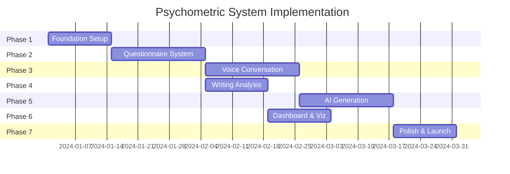

---

### Risk Mitigation

| Risk | Impact | Mitigation |
|------|--------|------------|
| Vapi.ai service outage | High | Implement fallback to Whisper + text chat |
| AI extraction inaccuracy | High | Human review for early users, fine-tuning |
| User abandonment during assessment | Medium | Save progress, email reminders, shorten flow |
| GDPR compliance issues | High | Legal review, explicit consent, data portability |
| Cost overrun on AI calls | Medium | Rate limiting, caching, batch processing |
| Voice quality issues | Medium | Multiple TTS providers, user preference |

---

### Dependencies & Prerequisites

#### External Services Required

| Service | Purpose | Account Needed |
|---------|---------|----------------|
| Supabase | Database, Auth, Storage | Yes (Pro recommended) |
| Vapi.ai | Voice conversations | Yes |
| OpenAI | GPT-4, Whisper | Yes |
| Anthropic | Claude (optional) | Optional |
| Vercel | Hosting | Yes |
| Sentry | Error tracking | Yes (Free tier OK) |

#### Environment Variables

```bash
# Supabase
NEXT_PUBLIC_SUPABASE_URL=
NEXT_PUBLIC_SUPABASE_ANON_KEY=
SUPABASE_SERVICE_ROLE_KEY=

# Vapi.ai
VAPI_API_KEY=
VAPI_ASSISTANT_ID=
VAPI_WEBHOOK_SECRET=

# AI Services
OPENAI_API_KEY=
ANTHROPIC_API_KEY=

# App Config
NEXTAUTH_URL=
NEXTAUTH_SECRET=
```

---

## 12. Research Sources & References

### 12.1 Psychometric Instruments

#### Big Five / OCEAN Model

| Source | Description | URL |
|--------|-------------|-----|
| IPIP-NEO | International Personality Item Pool (public domain) | https://ipip.ori.org/ |
| Costa & McCrae (1992) | NEO-PI-R Manual | https://www.parinc.com/Products/Pkey/276 |
| Goldberg (1999) | IPIP Big Five Factor Markers | https://ipip.ori.org/newBigFive5broadKey.htm |
| John & Srivastava (1999) | Big Five Inventory (BFI) | https://www.ocf.berkeley.edu/~johnlab/bfi.htm |

#### Cognitive Style

| Source | Description | URL |
|--------|-------------|-----|
| Allinson & Hayes (1996) | Cognitive Style Index (CSI) | https://doi.org/10.1016/0001-8791(96)00006-5 |
| Kolb (1984) | Learning Style Inventory | https://learningfromexperience.com/research-library/the-kolb-learning-style-inventory/ |
| Riding & Cheema (1991) | Cognitive Styles Analysis | https://doi.org/10.1080/0144341910110301 |

#### Emotional Intelligence

| Source | Description | URL |
|--------|-------------|-----|
| Bar-On (2006) | EQ-i 2.0 Model | https://www.mhs.com/MHS-Assessment?prodname=eq-i2 |
| Mayer, Salovey & Caruso (2002) | MSCEIT | https://www.mhs.com/MHS-Assessment?prodname=msceit |
| Petrides (2009) | TEIQue | http://www.psychometriclab.com/Default.aspx?Content=Page&id=14 |

#### DISC Assessment

| Source | Description | URL |
|--------|-------------|-----|
| Marston (1928) | Emotions of Normal People (original theory) | https://www.discprofile.com/what-is-disc/history-of-disc |
| DISC Profile | Official assessment | https://www.discprofile.com/ |
| Thomas International | DISC validation studies | https://www.thomas.co/assessments/disc-assessment |

#### Values Assessment

| Source | Description | URL |
|--------|-------------|-----|
| Schwartz (1992) | Theory of Basic Human Values | https://doi.org/10.1016/S0065-2601(08)60281-6 |
| Schwartz (2012) | Portrait Values Questionnaire (PVQ-21) | https://www.europeansocialsurvey.org/docs/methodology/core_ess_questionnaire/ESS_core_questionnaire_human_values.pdf |
| Rokeach (1973) | Rokeach Value Survey | https://psycnet.apa.org/record/1973-30389-000 |

#### VIA Character Strengths

| Source | Description | URL |
|--------|-------------|-----|
| Peterson & Seligman (2004) | Character Strengths and Virtues | https://www.viacharacter.org/character-strengths |
| VIA Institute | Official VIA Survey | https://www.viacharacter.org/survey/account/register |
| VIA Research | Validation Studies | https://www.viacharacter.org/research |

#### Enneagram

| Source | Description | URL |
|--------|-------------|-----|
| RHETI | Riso-Hudson Enneagram Type Indicator | https://www.enneagraminstitute.com/rheti |
| Enneagram Institute | Type descriptions | https://www.enneagraminstitute.com/type-descriptions |
| Wagner (2010) | Nine Lenses on the World | https://www.enneagramspectrum.com/research/ |

#### Creativity Assessment

| Source | Description | URL |
|--------|-------------|-----|
| Torrance (1966) | Torrance Tests of Creative Thinking | https://www.ststesting.com/gift-ttct/ |
| Guilford (1967) | Divergent Thinking Model | https://doi.org/10.1007/978-1-4757-5356-1_3 |
| Runco et al. (2012) | Creativity Assessment Battery | https://creativitytestingservices.com/ |

#### LIWC (Linguistic Analysis)

| Source | Description | URL |
|--------|-------------|-----|
| Pennebaker et al. (2015) | LIWC 2015 Manual | https://liwc.wpengine.com/ |
| Tausczik & Pennebaker (2010) | Psychological meaning of words | https://doi.org/10.1177/0261927X09351676 |
| Boyd et al. (2022) | LIWC-22 | https://www.liwc.app/ |

### 12.2 Research on Personality & Writing Style

#### Key Studies

| Study | Finding | URL |
|-------|---------|-----|
| Mairesse et al. (2007) | Personality correlates with linguistic features | https://doi.org/10.1177/0261927X06286364 |
| Yarkoni (2010) | Big Five predicts word use in blogs | https://doi.org/10.1037/a0020327 |
| Pennebaker & King (1999) | Linguistic styles and personality | https://doi.org/10.1037/0022-3514.77.6.1296 |
| Schwartz et al. (2013) | Facebook language predicts personality | https://doi.org/10.1371/journal.pone.0073791 |
| Hirsh & Peterson (2009) | Personality and language use | https://doi.org/10.1016/j.jrp.2009.03.004 |
| Fast & Funder (2008) | Personality as manifest in word use | https://doi.org/10.1111/j.1467-6494.2008.00508.x |

#### Writing Style Correlations

| Trait | Writing Characteristics | Source |
|-------|------------------------|--------|
| High Openness | More complex words, diverse vocabulary, abstract concepts | Yarkoni (2010) |
| High Conscientiousness | Organized structure, fewer typos, formal language | Pennebaker & King (1999) |
| High Extraversion | More positive words, social references, exclamations | Mairesse et al. (2007) |
| High Agreeableness | Inclusive language, fewer negative words, hedging | Hirsh & Peterson (2009) |
| High Neuroticism | More negative emotion words, first-person singular, anxiety markers | Pennebaker & King (1999) |

### 12.3 AI & Persona Research

#### Role Prompting & Persona Adoption

| Source | Description | URL |
|--------|-------------|-----|
| White et al. (2023) | A Prompt Pattern Catalog | https://arxiv.org/abs/2302.11382 |
| Reynolds & McDonell (2021) | Prompt Programming for Large Language Models | https://arxiv.org/abs/2102.07350 |
| Shanahan et al. (2023) | Role-Play with Large Language Models | https://arxiv.org/abs/2305.16367 |
| Salewski et al. (2023) | In-Context Impersonation | https://arxiv.org/abs/2310.01185 |

#### Style Transfer & Voice Replication

| Source | Description | URL |
|--------|-------------|-----|
| Rao & Tetreault (2018) | Dear Sir or Dude | https://arxiv.org/abs/1803.05567 |
| Tikhonov & Yamshchikov (2018) | Style Transfer for Text | https://arxiv.org/abs/1802.06463 |
| Syed et al. (2020) | Authorship Attribution | https://doi.org/10.1016/j.eswa.2019.113052 |

### 12.4 Voice AI & Conversation Analysis

#### Vapi.ai Documentation

| Resource | URL |
|----------|-----|
| Vapi API Reference | https://docs.vapi.ai/api-reference |
| Vapi Assistants | https://docs.vapi.ai/assistants |
| Vapi Webhooks | https://docs.vapi.ai/webhooks |
| Vapi Phone Calls | https://docs.vapi.ai/phone-calling |

#### Conversation Analysis Research

| Source | Description | URL |
|--------|-------------|-----|
| Levinson (1983) | Pragmatics | Cambridge University Press |
| Schegloff (2007) | Sequence Organization | Cambridge University Press |
| Tannen (2005) | Conversational Style | Oxford University Press |

### 12.5 Technical Documentation

#### Supabase

| Resource | URL |
|----------|-----|
| Supabase Documentation | https://supabase.com/docs |
| Supabase Auth | https://supabase.com/docs/guides/auth |
| Row Level Security | https://supabase.com/docs/guides/auth/row-level-security |
| Supabase Storage | https://supabase.com/docs/guides/storage |

#### Next.js & Vercel

| Resource | URL |
|----------|-----|
| Next.js Documentation | https://nextjs.org/docs |
| App Router | https://nextjs.org/docs/app |
| API Routes | https://nextjs.org/docs/app/building-your-application/routing/route-handlers |
| Vercel Deployment | https://vercel.com/docs |

#### OpenAI

| Resource | URL |
|----------|-----|
| OpenAI API Reference | https://platform.openai.com/docs/api-reference |
| GPT-4 Best Practices | https://platform.openai.com/docs/guides/gpt-best-practices |
| Whisper API | https://platform.openai.com/docs/guides/speech-to-text |

### 12.6 Data Privacy & Ethics

#### GDPR & Data Protection

| Resource | URL |
|----------|-----|
| GDPR Official Text | https://gdpr.eu/ |
| ICO Guidance | https://ico.org.uk/for-organisations/guide-to-data-protection/guide-to-the-general-data-protection-regulation-gdpr/ |
| APA Ethics Code | https://www.apa.org/ethics/code |

#### Psychological Assessment Ethics

| Source | Description |
|--------|-------------|
| ITC Guidelines (2017) | International Test Commission Guidelines on Test Use |
| APA Standards (2014) | Standards for Educational and Psychological Testing |
| BPS Guidelines | British Psychological Society Guidelines for Test Use |

---

## Appendix A: Complete Data Point Reference

### A.1 Questionnaire Data Points (164 Total)

| # | Category | Data Point | Scale | Source Instrument |
|---|----------|------------|-------|-------------------|
| 1 | Big Five | Openness - Imagination | 1-5 | IPIP-NEO |
| 2 | Big Five | Openness - Artistic | 1-5 | IPIP-NEO |
| 3 | Big Five | Openness - Emotions | 1-5 | IPIP-NEO |
| 4 | Big Five | Openness - Adventure | 1-5 | IPIP-NEO |
| 5 | Big Five | Openness - Intellect | 1-5 | IPIP-NEO |
| 6 | Big Five | Openness - Liberalism | 1-5 | IPIP-NEO |
| 7 | Big Five | Conscientiousness - Self-efficacy | 1-5 | IPIP-NEO |
| 8 | Big Five | Conscientiousness - Orderliness | 1-5 | IPIP-NEO |
| 9 | Big Five | Conscientiousness - Dutifulness | 1-5 | IPIP-NEO |
| 10 | Big Five | Conscientiousness - Achievement | 1-5 | IPIP-NEO |
| 11 | Big Five | Conscientiousness - Self-discipline | 1-5 | IPIP-NEO |
| 12 | Big Five | Conscientiousness - Deliberation | 1-5 | IPIP-NEO |
| 13 | Big Five | Extraversion - Friendliness | 1-5 | IPIP-NEO |
| 14 | Big Five | Extraversion - Gregariousness | 1-5 | IPIP-NEO |
| 15 | Big Five | Extraversion - Assertiveness | 1-5 | IPIP-NEO |
| 16 | Big Five | Extraversion - Activity | 1-5 | IPIP-NEO |
| 17 | Big Five | Extraversion - Excitement | 1-5 | IPIP-NEO |
| 18 | Big Five | Extraversion - Cheerfulness | 1-5 | IPIP-NEO |
| 19 | Big Five | Agreeableness - Trust | 1-5 | IPIP-NEO |
| 20 | Big Five | Agreeableness - Morality | 1-5 | IPIP-NEO |
| 21 | Big Five | Agreeableness - Altruism | 1-5 | IPIP-NEO |
| 22 | Big Five | Agreeableness - Cooperation | 1-5 | IPIP-NEO |
| 23 | Big Five | Agreeableness - Modesty | 1-5 | IPIP-NEO |
| 24 | Big Five | Agreeableness - Sympathy | 1-5 | IPIP-NEO |
| 25 | Big Five | Neuroticism - Anxiety | 1-5 | IPIP-NEO |
| 26 | Big Five | Neuroticism - Anger | 1-5 | IPIP-NEO |
| 27 | Big Five | Neuroticism - Depression | 1-5 | IPIP-NEO |
| 28 | Big Five | Neuroticism - Self-consciousness | 1-5 | IPIP-NEO |
| 29 | Big Five | Neuroticism - Immoderation | 1-5 | IPIP-NEO |
| 30 | Big Five | Neuroticism - Vulnerability | 1-5 | IPIP-NEO |
| 31-42 | Cognitive Style | (12 data points) | 1-5 | CSI/Kolb |
| 43-57 | Emotional Intelligence | (15 data points) | 1-5 | EQ-i 2.0 |
| 58-65 | DISC | (8 data points) | 0-100 | DISC Profile |
| 66-77 | Values | (12 data points) | 1-6 | PVQ-21 |
| 78-101 | VIA Strengths | (24 data points) | 1-5 | VIA-IS |
| 102-107 | Enneagram | (6 data points) | 1-9, 1-5 | RHETI |
| 108-115 | Creativity | (8 data points) | 1-5 | TTCT-inspired |
| 116-125 | Thinking Style | (10 data points) | 1-5 | MSG |
| 126-150 | Writing Preferences | (25 data points) | 1-5 | Custom |
| 151-158 | LIWC Metrics | (8 data points) | 0-100 | LIWC-22 |
| 159-164 | Reasoning Patterns | (6 data points) | 1-5 | Custom |

### A.2 Conversation Data Points (135 Total)

| # | Category | Data Point | Type | Extraction Method |
|---|----------|------------|------|-------------------|
| 1-15 | Narrative Patterns | Story structure, conflict, etc. | Text/Decimal | LLM analysis |
| 16-30 | Communication Dynamics | Turn-taking, latency, etc. | Text/Decimal | Transcript analysis |
| 31-42 | Emotional Expression | Vocabulary, intensity, etc. | Decimal | Sentiment + LLM |
| 43-54 | Intellectual Style | Abstraction, certainty, etc. | Decimal | LLM analysis |
| 55-66 | Social Orientation | References, pronouns, etc. | Decimal | Linguistic analysis |
| 67-81 | Decision Making | Speed, risk framing, etc. | Text/Decimal | LLM analysis |
| 82-93 | Learning & Growth | Orientation, mindset, etc. | Text/Decimal | LLM analysis |
| 94-105 | Stress & Coping | Verbalization, strategies, etc. | Text/Decimal | LLM analysis |
| 106-117 | Creativity Indicators | Fluency, metaphors, etc. | Decimal | LLM analysis |
| 118-135 | Values in Action | Value language markers | Decimal | Keyword + LLM |

---

## Appendix B: Sample Question Items

### B.1 Big Five Sample Items (IPIP-NEO Style)

**Openness - Imagination:**
- "I have a vivid imagination."
- "I often daydream about things that might happen."
- "I enjoy getting lost in thought."

**Conscientiousness - Orderliness:**
- "I like order in my environment."
- "I keep my belongings neat and organized."
- "I follow a schedule."

**Extraversion - Gregariousness:**
- "I love large parties."
- "I enjoy being part of a group."
- "I prefer to be around others rather than alone."

### B.2 DISC Forced-Choice Sample

**Choose the word that MOST describes you:**
- A) Adventurous
- B) Playful
- C) Patient
- D) Precise

**Choose the word that LEAST describes you:**
- A) Bold
- B) Enthusiastic
- C) Calm
- D) Careful

### B.3 Writing Preferences Sample Items

**Structure Preference:**
"When I write, I prefer to:"
1. Plan everything in detail before starting
2. Have a rough outline but allow for discovery
3. Start writing and see where it goes
4. Write freely first, then organize later

**Voice Preference:**
"I naturally write using:"
1. First person (I, we)
2. Second person (you)
3. Third person (he, she, they)
4. It varies by project

---

## Appendix C: Scoring Algorithms

### C.1 Big Five Scoring

```typescript
// Big Five facet scoring with reverse coding
function scoreBigFiveFacet(responses: number[], reverseItems: number[]): number {
  const scores = responses.map((score, index) => {
    if (reverseItems.includes(index)) {
      return 6 - score; // Reverse code: 5->1, 4->2, 3->3, 2->4, 1->5
    }
    return score;
  });
  return scores.reduce((a, b) => a + b, 0) / scores.length;
}

// Example for Openness facets
const opennessImaginationItems = [1, 6, 11, 16, 21]; // Item indices
const opennessImaginationReverse = [6, 16]; // Items to reverse
```

### C.2 DISC Percentage Calculation

```typescript
// DISC scoring from forced-choice pairs
function scoreDISC(choices: Array<{most: string, least: string}>): DISCScores {
  const counts = { D: 0, I: 0, S: 0, C: 0 };

  choices.forEach(choice => {
    counts[choice.most] += 2;   // Most adds 2
    counts[choice.least] -= 1;  // Least subtracts 1
  });

  // Normalize to percentages summing to 100
  const total = Object.values(counts).reduce((a, b) => a + Math.max(0, b), 0);

  return {
    dominance: (Math.max(0, counts.D) / total) * 100,
    influence: (Math.max(0, counts.I) / total) * 100,
    steadiness: (Math.max(0, counts.S) / total) * 100,
    conscientiousness: (Math.max(0, counts.C) / total) * 100
  };
}
```

### C.3 Enneagram Type Determination

```typescript
// Enneagram type from 9-type scores
function determineEnneagramType(scores: number[]): EnneagramResult {
  const typeScores = scores.map((score, i) => ({ type: i + 1, score }));
  typeScores.sort((a, b) => b.score - a.score);

  const primaryType = typeScores[0].type;
  const adjacentTypes = [
    primaryType === 1 ? 9 : primaryType - 1,
    primaryType === 9 ? 1 : primaryType + 1
  ];

  // Wing is the higher-scoring adjacent type
  const wing = adjacentTypes.reduce((a, b) =>
    scores[a - 1] > scores[b - 1] ? a : b
  );

  return {
    primaryType,
    wing,
    typeScores: Object.fromEntries(typeScores.map(t => [`type_${t.type}`, t.score]))
  };
}
```

---

## Appendix D: Glossary

| Term | Definition |
|------|------------|
| **Big Five** | Five-factor model of personality: Openness, Conscientiousness, Extraversion, Agreeableness, Neuroticism |
| **DISC** | Behavioral assessment measuring Dominance, Influence, Steadiness, Conscientiousness |
| **Enneagram** | Nine-type personality system with interconnected patterns |
| **EQ / EI** | Emotional Intelligence - ability to perceive, use, understand, and manage emotions |
| **Facet** | Sub-component of a broader personality trait (e.g., "imagination" is a facet of "openness") |
| **IPIP** | International Personality Item Pool - public domain personality assessment items |
| **LIWC** | Linguistic Inquiry and Word Count - text analysis method |
| **Likert Scale** | Rating scale (typically 1-5 or 1-7) for measuring attitudes |
| **NEO-PI-R** | Revised NEO Personality Inventory - gold standard Big Five assessment |
| **PVQ** | Portrait Values Questionnaire - Schwartz values measurement |
| **Role Prompting** | AI technique where the model adopts a specific persona |
| **TTR** | Type-Token Ratio - measure of vocabulary diversity |
| **VIA** | Values in Action - character strengths assessment |

---

## Document History

| Version | Date | Author | Changes |
|---------|------|--------|---------|
| 1.0 | 2024-01-15 | Liquid Books Team | Initial PRD creation |

---

*This PRD is a living document and will be updated as the psychometric profiling system evolves.*

