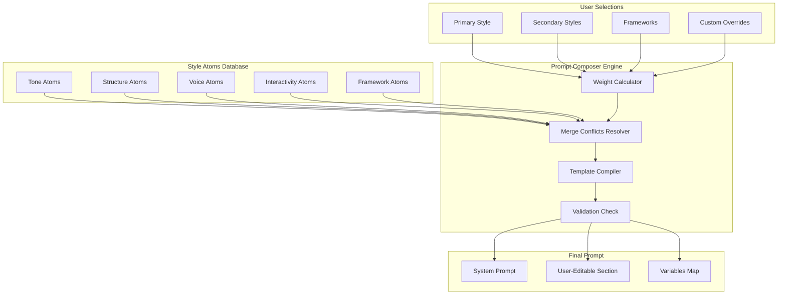
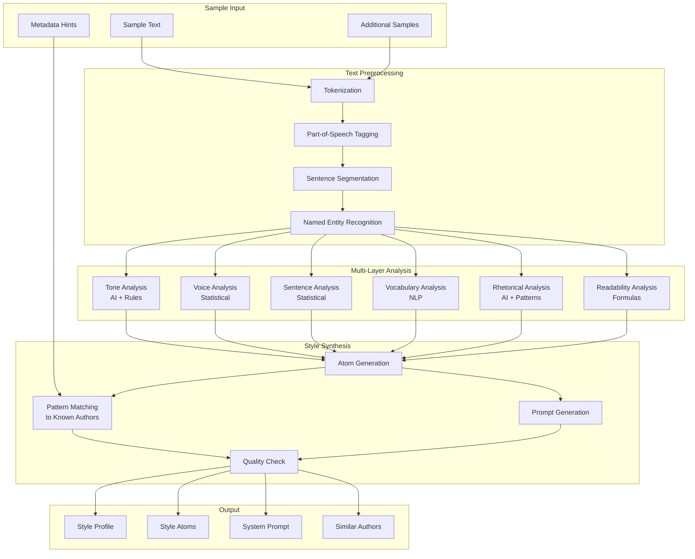
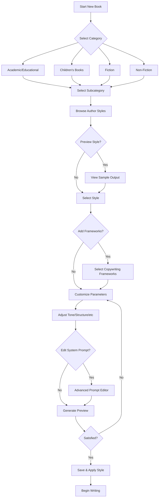
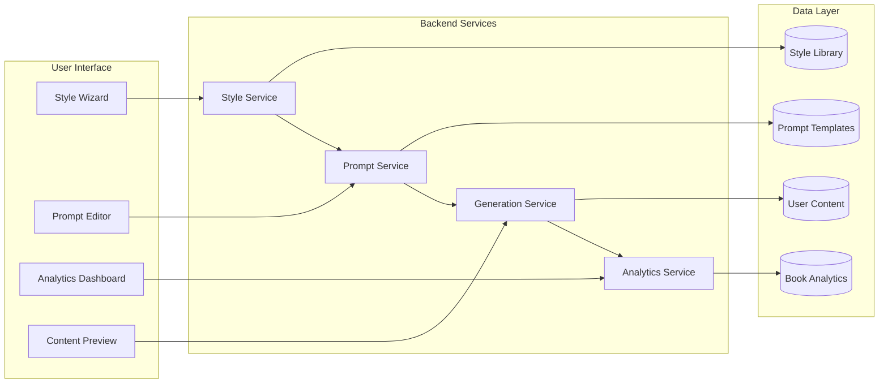

# Liquid Books: Writing Styles & Templates PRD

## Product Requirements Document
**Version:** 1.0
**Last Updated:** 2024-11-29
**Status:** Draft

---

## Table of Contents

1. [Executive Summary](#1-executive-summary)
2. [Problem Statement](#2-problem-statement)
3. [Solution Overview](#3-solution-overview)
4. [Style Configuration Schema](#4-style-configuration-schema)
5. [Book Categories & Master Writers](#5-book-categories--master-writers)
6. [Copywriting & Persuasion Frameworks](#6-copywriting--persuasion-frameworks)
7. [Dynamic Prompt Composition System](#7-dynamic-prompt-composition-system)
8. [System Prompts Library](#8-system-prompts-library)
9. [Book Analytics & Metrics](#9-book-analytics--metrics)
10. [User Flow & Implementation](#10-user-flow--implementation)
11. [Database Schema](#11-database-schema)
12. [API Specifications](#12-api-specifications)

---

## 1. Executive Summary

Liquid Books enables users to create interactive books using Jupyter Book 2 and MyST markdown. This PRD defines the **Writing Styles System** - a comprehensive framework allowing users to select, customize, and apply writing styles from master writers across all book categories.

### Key Features
- **104+ Author Style Templates** across 20 subcategories
- **8 Copywriting Frameworks** for persuasive content
- **Customizable System Prompts** for AI-assisted writing
- **Real-time Book Analytics** with 25+ metrics
- **Style Mixing** - combine multiple author influences

---

## 2. Problem Statement

Authors creating interactive books face several challenges:
1. **Inconsistent Voice**: Maintaining a consistent writing style throughout a book
2. **Style Discovery**: Not knowing which writing style fits their content
3. **Quality Benchmarking**: No metrics to evaluate their writing
4. **AI Guidance**: Generic AI prompts that don't capture specific author styles

### Target Users
- Educators creating courseware
- Technical writers creating documentation
- Authors creating children's books
- Business professionals creating training materials
- Content creators building interactive guides

---

## 3. Solution Overview

### 3.1 Style Selection Wizard

```
┌─────────────────────────────────────────────────────────────┐
│                    STYLE SELECTION FLOW                      │
├─────────────────────────────────────────────────────────────┤
│                                                              │
│  Step 1: Category    Step 2: Subcategory    Step 3: Style   │
│  ┌──────────┐        ┌──────────────┐       ┌────────────┐  │
│  │ Academic │   →    │ Textbook     │   →   │ Feynman    │  │
│  │ Fiction  │        │ Technical    │       │ Boas       │  │
│  │ Non-Fict │        │ Documentation│       │ Spivak     │  │
│  │ Children │        └──────────────┘       └────────────┘  │
│  └──────────┘                                               │
│                                                              │
│  Step 4: Customize   Step 5: Framework      Step 6: Preview │
│  ┌──────────────┐    ┌──────────────┐      ┌─────────────┐  │
│  │ Tone: ████░░ │    │ ☑ Sugarman  │      │ [Sample    │  │
│  │ Interact: ██ │    │ ☑ Cialdini  │      │  Output]   │  │
│  │ Visual: ███░ │    │ ☐ Schwartz  │      │            │  │
│  └──────────────┘    └──────────────┘      └─────────────┘  │
│                                                              │
└─────────────────────────────────────────────────────────────┘
```

### 3.2 Core Components

| Component | Description |
|-----------|-------------|
| **Style Library** | Database of 104+ author styles with metadata |
| **Prompt Engine** | Generates AI prompts based on selected style |
| **Analytics Engine** | Real-time book metrics calculation |
| **Style Mixer** | Combine multiple style influences |
| **Preview Generator** | Sample content in selected style |

---

## 4. Style Configuration Schema

### 4.1 Base Style Object

```typescript
interface BookStyle {
  id: string;
  name: string;
  author: string;
  category: StyleCategory;
  subcategory: string;
  era: 'classic' | 'modern';

  // Core Style Attributes (1-10 scale)
  attributes: {
    tone: ToneConfig;
    structure: StructureConfig;
    interactivity: InteractivityConfig;
    visualDensity: VisualDensityConfig;
    readingLevel: ReadingLevelConfig;
  };

  // AI Configuration
  systemPrompt: string;
  userEditablePrompt: boolean;
  promptVariables: PromptVariable[];

  // Copywriting Frameworks (optional)
  frameworks: CopywritingFramework[];

  // Metadata
  description: string;
  styleDescription: string;
  sampleExcerpt: string;
  influences: string[];
  bestFor: string[];

  createdAt: Date;
  updatedAt: Date;
}
```

### 4.2 Tone Configuration

```typescript
interface ToneConfig {
  primary: ToneType;
  secondary?: ToneType;
  intensity: number; // 1-10

  // Detailed tone markers
  formality: number;      // 1=casual, 10=formal
  warmth: number;         // 1=cold/clinical, 10=warm/friendly
  humor: number;          // 1=serious, 10=humorous
  authority: number;      // 1=peer, 10=expert
  empathy: number;        // 1=detached, 10=deeply empathetic
  directness: number;     // 1=indirect, 10=blunt
}

type ToneType =
  | 'conversational'
  | 'academic'
  | 'authoritative'
  | 'playful'
  | 'inspirational'
  | 'technical'
  | 'narrative'
  | 'poetic'
  | 'journalistic'
  | 'street-smart';
```

### 4.3 Structure Configuration

```typescript
interface StructureConfig {
  type: StructureType;
  chapterLength: 'short' | 'medium' | 'long';
  sectionDensity: number; // sections per chapter

  // Structural elements
  usesEpigraphs: boolean;
  usesCallouts: boolean;
  usesSummaries: boolean;
  usesExercises: boolean;
  usesCaseStudies: boolean;
  usesStories: boolean;

  // Navigation
  progressiveDisclosure: boolean;
  nonLinearNavigation: boolean;
}

type StructureType =
  | 'linear'
  | 'modular'
  | 'spiral'
  | 'case-study'
  | 'problem-solution'
  | 'narrative-arc'
  | 'reference'
  | 'tutorial';
```

### 4.4 Interactivity Configuration

```typescript
interface InteractivityConfig {
  level: number; // 1-10

  // Interactive elements
  codeExecution: boolean;
  quizzes: boolean;
  exercises: boolean;
  simulations: boolean;
  calculators: boolean;
  dragAndDrop: boolean;
  fillInBlanks: boolean;

  // Engagement
  checkpoints: boolean;
  progressTracking: boolean;
  achievements: boolean;

  // Frequency (per chapter)
  interactionsPerChapter: number;
}
```

### 4.5 Visual Density Configuration

```typescript
interface VisualDensityConfig {
  level: number; // 1-10

  // Visual elements
  diagramsPerChapter: number;
  imagesPerChapter: number;
  tablesPerChapter: number;
  codeBlocksPerChapter: number;

  // Diagram types enabled
  mermaidDiagrams: boolean;
  charts: boolean;
  infographics: boolean;
  illustrations: boolean;
  photographs: boolean;

  // Styling
  usesSidebars: boolean;
  usesMarginNotes: boolean;
  usesHighlighting: boolean;
  colorScheme: 'minimal' | 'moderate' | 'vibrant';
}
```

### 4.6 Reading Level Configuration

```typescript
interface ReadingLevelConfig {
  targetGrade: number; // 1-16+ (K through graduate)
  fleschKincaid: number; // Target score

  // Vocabulary
  vocabularyLevel: 'basic' | 'intermediate' | 'advanced' | 'technical';
  definesTerms: boolean;
  usesGlossary: boolean;

  // Sentence structure
  avgSentenceLength: number; // words
  avgParagraphLength: number; // sentences

  // Prerequisites
  assumedKnowledge: string[];
}
```

---

## 5. Book Categories & Master Writers

### 5.1 Category Hierarchy

```
BOOK_CATEGORIES
├── ACADEMIC_EDUCATIONAL
│   ├── Academic Textbooks (Science/Math/Physics)
│   └── Technical Writing & Documentation
├── CHILDRENS_BOOKS
│   ├── Board Books (Ages 0-3)
│   ├── Picture Books (Ages 3-8)
│   ├── Middle Grade (Ages 8-12)
│   └── Young Adult (Ages 12+)
├── FICTION
│   ├── Science Fiction
│   ├── Fantasy
│   ├── Mystery/Thriller
│   ├── Horror
│   ├── Romance
│   └── Literary Fiction
└── NON_FICTION
    ├── Biography/Memoir
    ├── History (Popular)
    ├── Self-Help/Personal Development
    ├── Business/Management
    ├── Popular Science
    ├── Philosophy (Accessible)
    ├── Travel Writing
    └── Cookbooks/Food Writing
```

### 5.2 Complete Author Style Database

---

#### CATEGORY: ACADEMIC & EDUCATIONAL

##### Subcategory: Academic Textbooks (Science/Math/Physics)

| ID | Author | Era | Tone | Structure | Interactivity | Visual | Reading Level |
|----|--------|-----|------|-----------|---------------|--------|---------------|
| `acad-text-001` | Richard Feynman | Classic | Conversational (8), Warm (9), Humorous (6) | Spiral, Story-driven | High (8) - thought experiments | Medium (6) | Intermediate |
| `acad-text-002` | Mary Boas | Classic | Academic (7), Clear (8), Patient (7) | Linear, Methodical | Medium (6) - exercises | Medium (5) | Intermediate |
| `acad-text-003` | Walter Greiner | Classic | Concise (9), Clear (9), Professional (7) | Modular, Example-heavy | High (8) - solved problems | High (7) | Advanced |
| `acad-text-004` | Michael Spivak | Modern | Rigorous (9), Elegant (8), Precise (9) | Linear, Theorem-proof | Medium (5) | Low (3) | Graduate |
| `acad-text-005` | Sadri Hassani | Modern | Accessible (7), Systematic (8), Modern (7) | Modular, Bridge-building | Medium (6) | Medium (6) | Advanced |

**Richard Feynman - Full Style Profile:**

```yaml
id: acad-text-001
name: "The Feynman Style"
author: "Richard Feynman"
category: "academic_educational"
subcategory: "academic_textbooks"
era: "classic"

attributes:
  tone:
    primary: "conversational"
    secondary: "playful"
    intensity: 8
    formality: 4
    warmth: 9
    humor: 6
    authority: 8
    empathy: 7
    directness: 8

  structure:
    type: "spiral"
    chapterLength: "medium"
    sectionDensity: 5
    usesEpigraphs: false
    usesCallouts: true
    usesSummaries: true
    usesExercises: true
    usesCaseStudies: false
    usesStories: true
    progressiveDisclosure: true
    nonLinearNavigation: false

  interactivity:
    level: 8
    codeExecution: true
    quizzes: true
    exercises: true
    simulations: true
    calculators: true
    dragAndDrop: false
    fillInBlanks: false
    checkpoints: true
    progressTracking: true
    achievements: false
    interactionsPerChapter: 8

  visualDensity:
    level: 6
    diagramsPerChapter: 4
    imagesPerChapter: 2
    tablesPerChapter: 2
    codeBlocksPerChapter: 3
    mermaidDiagrams: true
    charts: true
    infographics: false
    illustrations: true
    photographs: false
    usesSidebars: true
    usesMarginNotes: true
    usesHighlighting: true
    colorScheme: "moderate"

  readingLevel:
    targetGrade: 13
    fleschKincaid: 45
    vocabularyLevel: "intermediate"
    definesTerms: true
    usesGlossary: true
    avgSentenceLength: 18
    avgParagraphLength: 4
    assumedKnowledge: ["basic calculus", "physics fundamentals"]

description: "Richard Feynman revolutionized physics education with his legendary lectures at Caltech. His style treats the reader as an intelligent friend, using analogies, thought experiments, and genuine curiosity to illuminate complex concepts."

styleDescription: "Conversational and intuitive; uses everyday analogies to explain complex physics; emphasizes understanding over memorization; includes 'what if' thought experiments; acknowledges confusion as part of learning; celebrates the joy of discovery."

sampleExcerpt: |
  "Now I'm going to discuss how we would look for a new law. In general, we look for a new law by the following process. First, we guess it. Then we compute the consequences of the guess to see what, if this is right, if this law we guessed is right, to see what it would imply. And then we compare the computation results directly to observation, to see if it works. If it disagrees with experiment, it's wrong. In that simple statement is the key to science."

influences:
  - "Einstein's thought experiments"
  - "His father's teaching style"
  - "Jazz improvisation"

bestFor:
  - "Physics courses"
  - "Science education"
  - "Making complex topics accessible"
  - "Building intuition before formalism"
```

---

##### Subcategory: Technical Writing & Documentation

| ID | Author | Era | Tone | Structure | Interactivity | Visual | Reading Level |
|----|--------|-----|------|-----------|---------------|--------|---------------|
| `tech-write-001` | William Zinsser | Classic | Clear (10), Warm (6), Encouraging (7) | Linear, Principle-based | Low (3) | Low (2) | General |
| `tech-write-002` | Mike Markel | Classic | Professional (8), Comprehensive (9) | Modular, Rhetorical | Medium (5) | Medium (6) | Professional |
| `tech-write-003` | JoAnn T. Hackos | Classic | Methodical (9), Process-oriented (9) | Sequential, Planning-focused | Medium (5) | High (7) | Professional |
| `tech-write-004` | Kieran Morgan | Modern | Practical (8), Modern (8), AI-aware (7) | Modular, Tool-integrated | High (8) | Medium (6) | Professional |
| `tech-write-005` | Alred/Brusaw/Oliu | Modern | Encyclopedic (9), Reference (10) | Alphabetical, Reference | Low (2) | Medium (5) | Professional |

---

#### CATEGORY: CHILDREN'S BOOKS

##### Subcategory: Board Books (Ages 0-3)

| ID | Author | Era | Tone | Structure | Interactivity | Visual | Reading Level |
|----|--------|-----|------|-----------|---------------|--------|---------------|
| `child-board-001` | Bill Martin Jr. & Eric Carle | Classic | Rhythmic (10), Repetitive (10), Joyful (9) | Pattern-based, Call-response | High (9) - tactile | Very High (10) | Pre-K |
| `child-board-002` | Sandra Boynton | Modern | Whimsical (10), Humorous (9), Playful (10) | Simple narrative, Rhyming | High (8) | Very High (10) | Pre-K |
| `child-board-003` | Karen Katz | Modern | Gentle (9), Reassuring (9), Interactive (8) | Lift-the-flap, Question-answer | Very High (10) | Very High (10) | Pre-K |

**Sandra Boynton - Full Style Profile:**

```yaml
id: child-board-002
name: "The Boynton Style"
author: "Sandra Boynton"
category: "childrens_books"
subcategory: "board_books"
era: "modern"

attributes:
  tone:
    primary: "playful"
    secondary: "whimsical"
    intensity: 10
    formality: 1
    warmth: 10
    humor: 9
    authority: 2
    empathy: 8
    directness: 8

  structure:
    type: "linear"
    chapterLength: "short"
    sectionDensity: 1
    usesEpigraphs: false
    usesCallouts: false
    usesSummaries: false
    usesExercises: false
    usesCaseStudies: false
    usesStories: true
    progressiveDisclosure: false
    nonLinearNavigation: false

  interactivity:
    level: 8
    codeExecution: false
    quizzes: false
    exercises: false
    simulations: false
    calculators: false
    dragAndDrop: true
    fillInBlanks: false
    checkpoints: false
    progressTracking: false
    achievements: false
    interactionsPerChapter: 5

  visualDensity:
    level: 10
    diagramsPerChapter: 0
    imagesPerChapter: 15
    tablesPerChapter: 0
    codeBlocksPerChapter: 0
    mermaidDiagrams: false
    charts: false
    infographics: false
    illustrations: true
    photographs: false
    usesSidebars: false
    usesMarginNotes: false
    usesHighlighting: false
    colorScheme: "vibrant"

  readingLevel:
    targetGrade: 0
    fleschKincaid: 95
    vocabularyLevel: "basic"
    definesTerms: false
    usesGlossary: false
    avgSentenceLength: 5
    avgParagraphLength: 1
    assumedKnowledge: []

description: "Sandra Boynton creates board books that delight both children and parents with silly humor, memorable characters (hippos, chickens, pigs), and catchy rhythms that beg to be read aloud."

styleDescription: "Whimsical humor that works on two levels - simple fun for babies, wit for parents; anthropomorphic animals with big personalities; bouncy rhymes; unexpected endings; celebrates silliness."

sampleExcerpt: |
  "The sun has set not long ago.
  Now everybody goes below
  To take a bath in one big tub
  With soap all over—SCRUB SCRUB SCRUB!"

bestFor:
  - "Baby books (0-3)"
  - "Read-aloud content"
  - "Bedtime routines"
  - "Parent-child bonding content"
```

---

##### Subcategory: Picture Books (Ages 3-8)

| ID | Author | Era | Tone | Structure | Interactivity | Visual | Reading Level |
|----|--------|-----|------|-----------|---------------|--------|---------------|
| `child-pic-001` | Dr. Seuss | Classic | Inventive (10), Playful (10), Moral (6) | Rhyming narrative | Medium (6) | Very High (10) | K-2 |
| `child-pic-002` | Maurice Sendak | Classic | Psychological (8), Dreamlike (9), Validating (8) | Fantasy journey | Medium (5) | Very High (10) | K-3 |
| `child-pic-003` | A.A. Milne | Classic | Gentle (9), Philosophical (7), Innocent (9) | Episodic adventures | Low (3) | High (8) | K-3 |
| `child-pic-004` | Mo Willems | Modern | Minimalist (8), Humorous (10), Emotional (8) | Dialogue-driven | High (8) | High (8) | K-2 |
| `child-pic-005` | Peter H. Reynolds | Modern | Encouraging (10), Quiet (7), Creative (9) | Reflective narrative | Medium (5) | High (8) | K-3 |

---

##### Subcategory: Middle Grade (Ages 8-12)

| ID | Author | Era | Tone | Structure | Interactivity | Visual | Reading Level |
|----|--------|-----|------|-----------|---------------|--------|---------------|
| `child-mid-001` | Roald Dahl | Classic | Subversive (9), Humorous (10), Champion-child (9) | Adventure narrative | Medium (5) | Medium (6) | Grade 3-6 |
| `child-mid-002` | C.S. Lewis | Classic | Allegorical (8), Adventurous (8), Moral (8) | Quest narrative | Low (3) | Medium (5) | Grade 4-7 |
| `child-mid-003` | Rick Riordan | Modern | Action-packed (9), Humorous (8), Educational (7) | Series-structured | Medium (6) | Medium (5) | Grade 4-7 |
| `child-mid-004` | Kelly Yang | Modern | Hopeful (9), Contemporary (8), Diverse (9) | Realistic fiction | Medium (5) | Low (3) | Grade 4-6 |
| `child-mid-005` | B.B. Alston | Modern | Urban fantasy (8), Diverse (10), Exciting (8) | Series mystery | Medium (6) | Medium (5) | Grade 4-7 |

---

##### Subcategory: Young Adult (Ages 12+)

| ID | Author | Era | Tone | Structure | Interactivity | Visual | Reading Level |
|----|--------|-----|------|-----------|---------------|--------|---------------|
| `child-ya-001` | S.E. Hinton | Classic | Raw (9), Authentic (10), Social realist (9) | First-person narrative | Low (3) | Low (2) | Grade 7-10 |
| `child-ya-002` | Judy Blume | Classic | Honest (10), Relatable (9), Boundary-pushing (8) | Coming-of-age | Low (3) | Low (2) | Grade 6-9 |
| `child-ya-003` | John Green | Modern | Intellectual (8), Philosophical (7), Emotional (9) | Contemporary literary | Low (3) | Low (2) | Grade 8-12 |
| `child-ya-004` | Angie Thomas | Modern | Powerful (10), Social justice (10), Authentic (10) | First-person contemporary | Low (3) | Low (2) | Grade 8-12 |
| `child-ya-005` | Becky Albertalli | Modern | Warm (9), Humorous (8), LGBTQ+ (10) | Contemporary romance | Low (3) | Low (2) | Grade 7-10 |

---

#### CATEGORY: FICTION

##### Subcategory: Science Fiction

| ID | Author | Era | Tone | Structure | Interactivity | Visual | Reading Level |
|----|--------|-----|------|-----------|---------------|--------|---------------|
| `fic-sf-001` | Isaac Asimov | Classic | Ideas-driven (10), Methodical (9), Clear (9) | Series/connected universe | Medium (5) | Low (3) | Adult |
| `fic-sf-002` | Arthur C. Clarke | Classic | Hard science (10), Prophetic (9), Elegant (8) | Epic scope | Low (3) | Low (3) | Adult |
| `fic-sf-003` | Philip K. Dick | Classic | Paranoid (9), Reality-bending (10), Philosophical (9) | Mind-bending | Low (2) | Low (2) | Adult |
| `fic-sf-004` | Liu Cixin | Modern | Epic (10), Hard science (9), Civilizational (9) | Trilogy structure | Low (3) | Medium (5) | Adult |
| `fic-sf-005` | N.K. Jemisin | Modern | Lyrical (9), Innovative (10), Social (9) | Second-person possible | Medium (5) | Low (3) | Adult |
| `fic-sf-006` | Andy Weir | Modern | Technical (9), Problem-solving (10), Humorous (8) | Survival narrative | High (7) | Medium (6) | Adult |

**Isaac Asimov - Full Style Profile:**

```yaml
id: fic-sf-001
name: "The Asimov Style"
author: "Isaac Asimov"
category: "fiction"
subcategory: "science_fiction"
era: "classic"

attributes:
  tone:
    primary: "authoritative"
    secondary: "conversational"
    intensity: 8
    formality: 6
    warmth: 5
    humor: 4
    authority: 9
    empathy: 5
    directness: 9

  structure:
    type: "linear"
    chapterLength: "medium"
    sectionDensity: 4
    usesEpigraphs: true
    usesCallouts: false
    usesSummaries: false
    usesExercises: false
    usesCaseStudies: false
    usesStories: true
    progressiveDisclosure: true
    nonLinearNavigation: false

  interactivity:
    level: 5
    codeExecution: false
    quizzes: true
    exercises: false
    simulations: true
    calculators: false
    dragAndDrop: false
    fillInBlanks: false
    checkpoints: false
    progressTracking: false
    achievements: false
    interactionsPerChapter: 2

  visualDensity:
    level: 3
    diagramsPerChapter: 1
    imagesPerChapter: 0
    tablesPerChapter: 1
    codeBlocksPerChapter: 0
    mermaidDiagrams: true
    charts: true
    infographics: false
    illustrations: false
    photographs: false
    usesSidebars: false
    usesMarginNotes: false
    usesHighlighting: false
    colorScheme: "minimal"

  readingLevel:
    targetGrade: 14
    fleschKincaid: 55
    vocabularyLevel: "advanced"
    definesTerms: true
    usesGlossary: false
    avgSentenceLength: 20
    avgParagraphLength: 5
    assumedKnowledge: ["basic science", "logic"]

description: "Isaac Asimov, the 'father of modern science fiction,' wrote with crystalline clarity and encyclopedic knowledge. His works explore grand ideas—robotics, galactic empires, the nature of intelligence—through dialogue and logical exposition."

styleDescription: "Ideas-first approach where characters serve concepts; clear, methodical prose with scientific precision; coherent world-building that rewards careful reading; dialogue as primary vehicle for exposition; leaves nothing to interpretation."

sampleExcerpt: |
  "The Three Laws of Robotics:
  1. A robot may not injure a human being or, through inaction, allow a human being to come to harm.
  2. A robot must obey orders given it by human beings except where such orders would conflict with the First Law.
  3. A robot must protect its own existence as long as such protection does not conflict with the First or Second Law."

bestFor:
  - "Hard science fiction"
  - "Philosophical exploration"
  - "World-building documentation"
  - "Technical concepts through narrative"
```

---

##### Subcategory: Fantasy

| ID | Author | Era | Tone | Structure | Interactivity | Visual | Reading Level |
|----|--------|-----|------|-----------|---------------|--------|---------------|
| `fic-fan-001` | J.R.R. Tolkien | Classic | Mythological (10), Elevated (9), Dense (8) | Epic quest | Low (3) | Medium (5) | Adult |
| `fic-fan-002` | Ursula K. Le Guin | Classic | Philosophical (9), Lyrical (9), Anthropological (8) | Exploration narrative | Low (3) | Low (3) | Adult |
| `fic-fan-003` | C.S. Lewis | Classic | Allegorical (9), Accessible (8), Moral (9) | Quest narrative | Low (3) | Medium (5) | All ages |
| `fic-fan-004` | Brandon Sanderson | Modern | Clear (9), Systematic (10), Accessible (9) | Epic series | Medium (6) | Medium (6) | Adult |
| `fic-fan-005` | Patrick Rothfuss | Modern | Poetic (10), Musical (9), Layered (9) | Frame narrative | Low (3) | Low (3) | Adult |
| `fic-fan-006` | N.K. Jemisin | Modern | Innovative (10), Lyrical (9), Political (8) | Non-linear | Low (3) | Low (3) | Adult |

---

##### Subcategory: Mystery/Thriller

| ID | Author | Era | Tone | Structure | Interactivity | Visual | Reading Level |
|----|--------|-----|------|-----------|---------------|--------|---------------|
| `fic-mys-001` | Agatha Christie | Classic | Puzzle (10), Fair-play (9), Ensemble (8) | Whodunit | Medium (6) | Low (3) | General |
| `fic-mys-002` | Arthur Conan Doyle | Classic | Deductive (10), Victorian (8), Methodical (9) | Case-based | Medium (5) | Low (3) | General |
| `fic-mys-003` | Raymond Chandler | Classic | Hard-boiled (10), Poetic noir (9), Cynical (8) | First-person | Low (3) | Low (2) | Adult |
| `fic-mys-004` | Anthony Horowitz | Modern | Christie-homage (9), Metafictional (8), Clever (9) | Puzzle-box | Medium (6) | Low (3) | Adult |
| `fic-mys-005` | Tana French | Modern | Psychological (10), Literary (9), Unreliable (8) | Character-driven | Low (3) | Low (2) | Adult |
| `fic-mys-006` | Lucy Foley | Modern | Locked-room (9), Multi-POV (9), Slow-burn (8) | Multiple viewpoints | Low (3) | Low (2) | Adult |

---

##### Subcategory: Horror

| ID | Author | Era | Tone | Structure | Interactivity | Visual | Reading Level |
|----|--------|-----|------|-----------|---------------|--------|---------------|
| `fic-hor-001` | H.P. Lovecraft | Classic | Cosmic (10), Archaic (8), Atmospheric (10) | Revelation structure | Low (2) | Low (2) | Adult |
| `fic-hor-002` | Shirley Jackson | Classic | Psychological (10), Domestic (8), Literary (9) | Slow dread | Low (2) | Low (2) | Adult |
| `fic-hor-003` | Stephen King | Classic/Modern | Character-driven (10), Relatable (9), Prolific (10) | Long-form | Medium (5) | Low (3) | Adult |
| `fic-hor-004` | Paul Tremblay | Modern | Ambiguous (10), Literary (9), Psychological (9) | Unreliable narrative | Low (3) | Low (2) | Adult |
| `fic-hor-005` | Joe Hill | Modern | Character-driven (9), Modern pace (8), Accessible (8) | Genre-blending | Low (3) | Low (3) | Adult |
| `fic-hor-006` | Tananarive Due | Modern | Historical (8), Social commentary (9), Supernatural (8) | Multi-generational | Low (3) | Low (2) | Adult |

---

##### Subcategory: Romance

| ID | Author | Era | Tone | Structure | Interactivity | Visual | Reading Level |
|----|--------|-----|------|-----------|---------------|--------|---------------|
| `fic-rom-001` | Jane Austen | Classic | Witty (10), Ironic (9), Social (9) | Marriage plot | Low (2) | Low (2) | Adult |
| `fic-rom-002` | Georgette Heyer | Classic | Historical (10), Witty (9), Adventure (7) | Regency adventure | Low (2) | Low (2) | Adult |
| `fic-rom-003` | Nora Roberts | Modern | Versatile (10), Strong heroines (9), Suspenseful (7) | Genre-blending | Low (3) | Low (2) | Adult |
| `fic-rom-004` | Julia Quinn | Modern | Regency wit (9), Humorous (9), Sharp dialogue (9) | Series romance | Low (3) | Low (2) | Adult |
| `fic-rom-005` | Talia Hibbert | Modern | Contemporary (9), Diverse (10), Warm (9) | Contemporary romance | Low (3) | Low (2) | Adult |

---

##### Subcategory: Literary Fiction

| ID | Author | Era | Tone | Structure | Interactivity | Visual | Reading Level |
|----|--------|-----|------|-----------|---------------|--------|---------------|
| `fic-lit-001` | Ernest Hemingway | Classic | Sparse (10), Understated (10), Iceberg (10) | Short chapters | Low (2) | Low (1) | Adult |
| `fic-lit-002` | Virginia Woolf | Classic | Stream-of-consciousness (10), Lyrical (10), Interior (9) | Non-linear | Low (2) | Low (1) | Adult |
| `fic-lit-003` | Gabriel García Márquez | Classic | Magical realism (10), Lush (10), Multi-generational (9) | Saga structure | Low (2) | Low (2) | Adult |
| `fic-lit-004` | Toni Morrison | Modern | Poetic (10), Mythological (9), Rhythmic (10) | Non-linear | Low (2) | Low (2) | Adult |
| `fic-lit-005` | Kazuo Ishiguro | Modern | Restrained (10), Precise (9), Memory-focused (9) | Unreliable narrator | Low (2) | Low (1) | Adult |
| `fic-lit-006` | Chimamanda Ngozi Adichie | Modern | Clear (9), Feminist (9), Nigerian voice (10) | Contemporary realism | Low (2) | Low (2) | Adult |

---

#### CATEGORY: NON-FICTION

##### Subcategory: Biography/Memoir

| ID | Author | Era | Tone | Structure | Interactivity | Visual | Reading Level |
|----|--------|-----|------|-----------|---------------|--------|---------------|
| `nf-bio-001` | Robert Caro | Classic | Exhaustive (10), Narrative (9), Power-focused (10) | Epic biography | Low (2) | Medium (5) | Adult |
| `nf-bio-002` | David McCullough | Classic | Accessible (9), Storytelling (10), American (9) | Narrative biography | Low (3) | Medium (5) | General |
| `nf-bio-003` | Walter Isaacson | Modern | Meticulous (10), Novelistic (9), Interdisciplinary (9) | Comprehensive life | Medium (5) | Medium (6) | General |
| `nf-bio-004` | Tara Westover | Modern | Lyrical (9), Honest (10), Educational theme (9) | Memoir arc | Low (2) | Low (2) | Adult |
| `nf-bio-005` | Michelle Obama | Modern | Authentic (10), Inspirational (9), Intimate (8) | Chronological memoir | Low (3) | Medium (5) | General |

---

##### Subcategory: History (Popular)

| ID | Author | Era | Tone | Structure | Interactivity | Visual | Reading Level |
|----|--------|-----|------|-----------|---------------|--------|---------------|
| `nf-his-001` | Barbara Tuchman | Classic | Vivid (10), Lyrical (9), Technicolor (10) | Narrative history | Low (2) | Medium (5) | Adult |
| `nf-his-002` | Doris Kearns Goodwin | Classic/Modern | Psychological (9), Literary (9), Leadership (9) | Multiple biography | Low (3) | Medium (5) | General |
| `nf-his-003` | David McCullough | Classic | Storytelling (10), Accessible (9), American (10) | Narrative | Low (3) | Medium (5) | General |
| `nf-his-004` | Yuval Noah Harari | Modern | Big-picture (10), Provocative (9), Accessible (9) | Thematic | Medium (5) | High (7) | General |
| `nf-his-005` | Erik Larson | Modern | Novelistic (10), Parallel (9), Meticulous (9) | Dual narrative | Low (3) | Low (3) | Adult |

---

##### Subcategory: Self-Help/Personal Development

| ID | Author | Era | Tone | Structure | Interactivity | Visual | Reading Level |
|----|--------|-----|------|-----------|---------------|--------|---------------|
| `nf-self-001` | Dale Carnegie | Classic | Practical (10), Anecdotal (9), Conversational (8) | Principle-based | Medium (6) | Low (3) | General |
| `nf-self-002` | Stephen R. Covey | Classic | Principle-centered (10), Systematic (9), Professional (8) | 7 Habits framework | High (7) | Medium (6) | General |
| `nf-self-003` | Tony Robbins | Modern | High-energy (10), Action-oriented (10), Empowering (10) | Systems approach | High (8) | High (7) | General |
| `nf-self-004` | Brené Brown | Modern | Research-based (9), Vulnerable (10), Warm (10) | Story + data | Medium (6) | Medium (5) | General |
| `nf-self-005` | James Clear | Modern | Evidence-based (10), Systems-thinking (9), Actionable (10) | Framework-based | High (8) | High (7) | General |

---

##### Subcategory: Business/Management

| ID | Author | Era | Tone | Structure | Interactivity | Visual | Reading Level |
|----|--------|-----|------|-----------|---------------|--------|---------------|
| `nf-bus-001` | Peter Drucker | Classic | Pithy (10), Timeless (10), Insightful (10) | Essay-based | Medium (5) | Low (3) | Professional |
| `nf-bus-002` | Jim Collins | Modern | Research-driven (10), Framework (10), Evidence (9) | Concept chapters | Medium (6) | High (7) | Professional |
| `nf-bus-003` | Clayton Christensen | Modern | Academic rigor (9), Innovation (10), Practical (8) | Theory + cases | Medium (6) | Medium (6) | Professional |
| `nf-bus-004` | Simon Sinek | Modern | TED-style (9), Purpose (10), Accessible (9) | Simple framework | Medium (5) | High (7) | General |
| `nf-bus-005` | Adam Grant | Modern | Psychology-based (9), Contrarian (8), Engaging (9) | Research stories | Medium (6) | Medium (6) | General |

---

##### Subcategory: Popular Science

| ID | Author | Era | Tone | Structure | Interactivity | Visual | Reading Level |
|----|--------|-----|------|-----------|---------------|--------|---------------|
| `nf-sci-001` | Carl Sagan | Classic | Poetic (10), Wonder (10), Philosophical (9) | Cosmic narrative | Medium (5) | High (8) | General |
| `nf-sci-002` | Stephen Jay Gould | Classic | Essay (10), Evolutionary (9), Literary (9) | Essay collection | Low (3) | Medium (5) | Adult |
| `nf-sci-003` | Richard Dawkins | Classic/Modern | Clear (9), Evolutionary (10), Uncompromising (8) | Argumentative | Medium (5) | Medium (5) | Adult |
| `nf-sci-004` | Neil deGrasse Tyson | Modern | Personable (10), Accessible (10), Charismatic (9) | Friendly guide | High (7) | High (8) | General |
| `nf-sci-005` | Mary Roach | Modern | Humor-driven (10), Quirky (10), Investigative (9) | Research adventure | Medium (6) | Medium (5) | General |
| `nf-sci-006` | Bill Bryson | Modern | Self-deprecating (10), Curious (10), Enthusiastic (9) | Amateur explorer | Medium (6) | Medium (5) | General |

**Carl Sagan - Full Style Profile:**

```yaml
id: nf-sci-001
name: "The Sagan Style"
author: "Carl Sagan"
category: "non_fiction"
subcategory: "popular_science"
era: "classic"

attributes:
  tone:
    primary: "inspirational"
    secondary: "poetic"
    intensity: 10
    formality: 5
    warmth: 9
    humor: 4
    authority: 9
    empathy: 8
    directness: 7

  structure:
    type: "narrative-arc"
    chapterLength: "medium"
    sectionDensity: 5
    usesEpigraphs: true
    usesCallouts: true
    usesSummaries: true
    usesExercises: false
    usesCaseStudies: true
    usesStories: true
    progressiveDisclosure: true
    nonLinearNavigation: false

  interactivity:
    level: 5
    codeExecution: false
    quizzes: true
    exercises: false
    simulations: true
    calculators: true
    dragAndDrop: false
    fillInBlanks: false
    checkpoints: false
    progressTracking: true
    achievements: false
    interactionsPerChapter: 3

  visualDensity:
    level: 8
    diagramsPerChapter: 3
    imagesPerChapter: 5
    tablesPerChapter: 1
    codeBlocksPerChapter: 0
    mermaidDiagrams: true
    charts: true
    infographics: true
    illustrations: true
    photographs: true
    usesSidebars: true
    usesMarginNotes: true
    usesHighlighting: true
    colorScheme: "moderate"

  readingLevel:
    targetGrade: 12
    fleschKincaid: 50
    vocabularyLevel: "intermediate"
    definesTerms: true
    usesGlossary: true
    avgSentenceLength: 22
    avgParagraphLength: 5
    assumedKnowledge: ["basic science literacy"]

description: "Carl Sagan brought the cosmos to millions with his poetic voice and infectious wonder. His writing speaks to you, not at you, making even the grandest concepts feel personally meaningful."

styleDescription: "Wide-eyed wonder at the universe; poetic but precise language; speaks to readers as intelligent equals; connects cosmic concepts to human meaning; balances scientific accuracy with accessible explanation; celebrates both knowledge and mystery."

sampleExcerpt: |
  "The cosmos is within us. We are made of star-stuff. We are a way for the universe to know itself. Some part of our being knows this is where we came from. We long to return. And we can, because the cosmos is also within us. We're made of star stuff. We are a way for the cosmos to know itself."

bestFor:
  - "Popular science"
  - "Astronomy and cosmology"
  - "Inspiring wonder about science"
  - "Making complex topics meaningful"
```

---

##### Subcategory: Philosophy (Accessible)

| ID | Author | Era | Tone | Structure | Interactivity | Visual | Reading Level |
|----|--------|-----|------|-----------|---------------|--------|---------------|
| `nf-phi-001` | Bertrand Russell | Classic | Elegant (10), Clear (10), Witty (8) | Survey/essay | Low (3) | Low (2) | Adult |
| `nf-phi-002` | Albert Camus | Classic | Literary (10), Existentialist (10), Beautiful (9) | Essay/fiction | Low (2) | Low (1) | Adult |
| `nf-phi-003` | Jean-Paul Sartre | Classic | Existentialist (10), Literary (9), Engaged (8) | Essay/drama | Low (2) | Low (1) | Adult |
| `nf-phi-004` | Alain de Botton | Modern | Contemporary (10), Practical (9), Accessible (10) | Self-help philosophy | Medium (6) | High (7) | General |
| `nf-phi-005` | Michael Sandel | Modern | Socratic (10), Ethical (9), Engaging (9) | Dialogue/lecture | High (7) | Medium (5) | General |

---

##### Subcategory: Travel Writing

| ID | Author | Era | Tone | Structure | Interactivity | Visual | Reading Level |
|----|--------|-----|------|-----------|---------------|--------|---------------|
| `nf-trav-001` | Paul Theroux | Classic | Literary (9), People-focused (10), Deep (9) | Journey narrative | Low (3) | Low (3) | Adult |
| `nf-trav-002` | Bruce Chatwin | Classic | Lyrical (10), Philosophical (9), Unconventional (10) | Fragment/meditation | Low (2) | Low (2) | Adult |
| `nf-trav-003` | Jan Morris | Classic | Elegant (10), Historical (9), City-portrait (10) | Place study | Low (3) | Medium (5) | Adult |
| `nf-trav-004` | Bill Bryson | Modern | Self-deprecating (10), Humorous (10), Curious (9) | Episodic journey | Medium (5) | Medium (5) | General |
| `nf-trav-005` | Pico Iyer | Modern | Philosophical (9), Global (9), Reflective (9) | Meditation | Low (3) | Low (3) | Adult |

---

##### Subcategory: Cookbooks/Food Writing

| ID | Author | Era | Tone | Structure | Interactivity | Visual | Reading Level |
|----|--------|-----|------|-----------|---------------|--------|---------------|
| `nf-cook-001` | Julia Child | Classic | Demystifying (10), Warm (10), Precise (10) | Recipe-based | High (8) | High (8) | General |
| `nf-cook-002` | M.F.K. Fisher | Classic | Literary (10), Sensory (10), Personal (9) | Essay/memoir | Low (3) | Low (2) | Adult |
| `nf-cook-003` | Jacques Pépin | Classic | Technical (9), French (9), Dual-purpose (8) | Technique-based | High (8) | High (8) | Intermediate |
| `nf-cook-004` | J. Kenji López-Alt | Modern | Science-based (10), Rigorous (10), Accessible (9) | Tested methodology | High (9) | High (9) | General |
| `nf-cook-005` | Samin Nosrat | Modern | Elemental (10), Warm (10), Fundamental (9) | Concept-based | High (8) | High (9) | General |
| `nf-cook-006` | Yotam Ottolenghi | Modern | Bold (10), Vegetable-forward (9), Generous (9) | Vibrant recipes | High (8) | Very High (10) | General |

---

## 6. Copywriting & Persuasion Frameworks

### 6.1 Framework Overview

These frameworks can be layered on top of any author style to enhance persuasive writing, particularly for educational, self-help, and business content.

```typescript
interface CopywritingFramework {
  id: string;
  name: string;
  author: string;
  description: string;
  keyPrinciple: string;
  applicationAreas: string[];
  systemPromptAddition: string;
  implementation: FrameworkImplementation;
}

interface FrameworkImplementation {
  requiredSections: string[];
  techniquesUsed: string[];
  visualElements: string[];
  metrics: string[];
}
```

### 6.2 Complete Framework Library

---

#### Framework 1: Eugene Schwartz - Awareness Levels

```yaml
id: "framework-schwartz"
name: "Awareness Level Targeting"
author: "Eugene Schwartz"
description: "Identify and match content to the reader's current state of awareness about their problem and your solution."

keyPrinciple: "Meet readers exactly where they are in their journey from unaware to most aware."

awarenessLevels:
  - level: 1
    name: "Unaware"
    description: "Reader doesn't know they have a problem"
    approach: "Lead with story, curiosity, or surprising fact"
    headline_style: "Intrigue-based, no product mention"

  - level: 2
    name: "Problem Aware"
    description: "Reader knows the problem but not the solution"
    approach: "Agitate the problem, show you understand their pain"
    headline_style: "Problem-focused, empathetic"

  - level: 3
    name: "Solution Aware"
    description: "Reader knows solutions exist but not yours"
    approach: "Differentiate your approach, show unique mechanism"
    headline_style: "Solution-focused, USP-driven"

  - level: 4
    name: "Product Aware"
    description: "Reader knows your product but hasn't committed"
    approach: "Overcome objections, provide proof, reduce risk"
    headline_style: "Benefit + proof focused"

  - level: 5
    name: "Most Aware"
    description: "Reader knows and trusts you"
    approach: "Direct offer, special deals, urgency"
    headline_style: "Direct offer, call to action"

applicationAreas:
  - "Educational content introduction"
  - "Course landing pages"
  - "Book chapter openings"
  - "Tutorial series progression"

systemPromptAddition: |
  Before writing any content, first identify the reader's STATE OF AWARENESS:

  1. UNAWARE: They don't know they have a problem
     → Lead with a compelling story or surprising revelation
     → Never mention your solution directly

  2. PROBLEM AWARE: They feel the pain but don't know solutions exist
     → Acknowledge and agitate their specific frustration
     → Show deep understanding before revealing solutions

  3. SOLUTION AWARE: They know solutions exist but not yours
     → Differentiate your unique approach
     → Explain your "secret mechanism"

  4. PRODUCT AWARE: They know you but haven't committed
     → Provide proof, testimonials, case studies
     → Address and overcome specific objections

  5. MOST AWARE: They trust you completely
     → Make direct offers
     → Focus on urgency and special incentives

  Match your opening, tone, and depth to their awareness level.
```

---

#### Framework 2: Joseph Sugarman - Slippery Slope

```yaml
id: "framework-sugarman"
name: "Slippery Slope Technique"
author: "Joseph Sugarman"
description: "Construct content where each element compels the reader to consume the next, creating irresistible forward momentum."

keyPrinciple: "Every element of your copy exists for one purpose: to get the reader to read the next sentence."

components:
  - name: "The Hook"
    description: "First sentence must be impossible to ignore"
    techniques:
      - "Start with a bold, controversial statement"
      - "Ask a question the reader must answer"
      - "Present a mystery that demands resolution"
      - "Share a startling statistic"

  - name: "Curiosity Seeds"
    description: "Plant open loops that demand closure"
    techniques:
      - "Hint at revelations to come"
      - "Create 'bucket brigades' (And here's the thing...)"
      - "Promise patterns of three"
      - "Use cliffhanger paragraph endings"

  - name: "Momentum Builders"
    description: "Short sentences. Punchy paragraphs. Relentless pace."
    techniques:
      - "Vary sentence length dramatically"
      - "Use one-word paragraphs for emphasis"
      - "Break grammar rules for impact"
      - "Create rhythm through repetition"

  - name: "The Greased Chute"
    description: "Remove all friction from reading"
    techniques:
      - "Use simple, conversational language"
      - "Eliminate jargon unless essential"
      - "Break up long passages with subheads"
      - "White space is your friend"

applicationAreas:
  - "Chapter introductions"
  - "Tutorial hooks"
  - "Email sequences"
  - "Landing page copy"

systemPromptAddition: |
  Apply SLIPPERY SLOPE principles throughout:

  OPENING HOOK:
  - Your first sentence must grab attention so powerfully that reading the second is automatic
  - Use: bold claims, intriguing questions, startling facts, or story hooks

  CURIOSITY LOOPS:
  - Plant seeds of upcoming revelations ("But that's not even the most surprising part...")
  - Use "bucket brigades" to maintain momentum:
    • "Here's the thing..."
    • "But wait, there's more..."
    • "Now here's where it gets interesting..."
    • "And that's when I discovered..."

  SENTENCE STRUCTURE:
  - Vary dramatically: long flowing sentences followed by punchy short ones
  - Single-word paragraphs for emphasis
  - End paragraphs with hooks that demand the next paragraph

  FRICTION ELIMINATION:
  - Simple language (8th grade reading level)
  - Short paragraphs (2-4 sentences max)
  - Generous white space
  - Subheadings every 300-400 words

  Every sentence should make NOT reading the next one feel impossible.
```

---

#### Framework 3: Russell Brunson - Epiphany Bridge

```yaml
id: "framework-brunson"
name: "Epiphany Bridge Stories"
author: "Russell Brunson"
description: "Use strategic storytelling to help readers experience the same 'aha moment' that transformed your understanding."

keyPrinciple: "Logic doesn't change behavior; emotion does. Use story to transfer emotion and create transformation."

storyStructure:
  - phase: "The Backstory"
    purpose: "Establish relatability and context"
    elements:
      - "Your situation before the epiphany"
      - "The false beliefs you held"
      - "The struggles you faced"
    example: "I used to believe that [false belief], just like you might right now..."

  - phase: "The Wall"
    purpose: "Create tension and desperation"
    elements:
      - "The moment things got critical"
      - "Why old approaches weren't working"
      - "The emotional low point"
    example: "I had tried everything. Nothing worked. I was about to give up when..."

  - phase: "The Epiphany"
    purpose: "The 'aha' moment of transformation"
    elements:
      - "The specific trigger or discovery"
      - "The exact moment of realization"
      - "How the new belief replaced the old"
    example: "That's when it hit me. What if I had been looking at this completely wrong?"

  - phase: "The Plan"
    purpose: "Bridge to your framework/solution"
    elements:
      - "What you did differently"
      - "The systematic approach that emerged"
      - "The logic behind the new method"
    example: "I developed a simple framework based on this realization..."

  - phase: "The Transformation"
    purpose: "Show results and possibility"
    elements:
      - "The outcome of applying the new approach"
      - "Emotional and practical results"
      - "What's now possible for the reader"
    example: "Within [timeframe], I went from [before state] to [after state]..."

falseBeliefTypes:
  - "The Vehicle" - Beliefs about the method/approach itself
  - "Internal Beliefs" - Beliefs about their own capability
  - "External Beliefs" - Beliefs about outside forces/circumstances

applicationAreas:
  - "Course introductions"
  - "Chapter openers"
  - "Case study presentations"
  - "Methodology explanations"

systemPromptAddition: |
  Structure key sections using EPIPHANY BRIDGE storytelling:

  1. THE BACKSTORY
     - Start with relatable struggle ("I used to believe...")
     - Mirror the reader's current false belief
     - Build emotional connection through shared experience

  2. THE WALL
     - Show the moment of crisis or desperation
     - Emphasize that old approaches weren't working
     - Create tension that demands resolution

  3. THE EPIPHANY
     - Reveal the specific "aha" moment
     - Make the new insight feel like a sudden realization
     - Shatter the false belief with the new truth
     - Use phrases like: "That's when it hit me..." or "Suddenly I realized..."

  4. THE PLAN
     - Bridge naturally to your framework/methodology
     - Show the logical structure that emerged from the insight
     - Make the path forward clear and systematic

  5. THE TRANSFORMATION
     - Prove the new approach works with results
     - Paint the "after" picture vividly
     - Help reader see this transformation is possible for them

  Target at least one FALSE BELIEF per major section:
  - Vehicle beliefs (about the method)
  - Internal beliefs (about their capability)
  - External beliefs (about circumstances)
```

---

#### Framework 4: Dan Kennedy & Claude Hopkins - Scientific Proof

```yaml
id: "framework-kennedy-hopkins"
name: "Scientific Advertising & Results-Based Proof"
author: "Dan Kennedy & Claude Hopkins"
description: "Ground all claims in tangible, measurable results. The step-by-step section is the ultimate proof."

keyPrinciple: "Make specific, provable claims. Vague enthusiasm convinces no one. Precise specificity builds trust."

proofElements:
  - type: "Specific Numbers"
    description: "Exact figures trump round numbers"
    examples:
      - "87.3% success rate" beats "almost 90%"
      - "In 23 days" beats "in about a month"
      - "$4,847 increase" beats "thousands more"
    application: "Use precise numbers throughout - steps, timeframes, results"

  - type: "Case Studies"
    description: "Real examples with verifiable details"
    required_elements:
      - "Specific person/company name (with permission)"
      - "Exact starting situation"
      - "Precise steps taken"
      - "Measurable outcomes"
      - "Timeline of events"

  - type: "Process Documentation"
    description: "Step-by-step proof that the method works"
    requirements:
      - "Each step must be logically airtight"
      - "Include potential failure points and how to avoid"
      - "Show cause-and-effect relationships"
      - "Make steps replicable by reader"

  - type: "Comparative Analysis"
    description: "Show advantage over alternatives"
    approaches:
      - "Before/after comparisons"
      - "Your method vs. common alternatives"
      - "Time/cost/effort comparisons"
      - "Risk reduction analysis"

  - type: "Authority Stacking"
    description: "Leverage credible third-party validation"
    sources:
      - "Academic research citations"
      - "Expert endorsements"
      - "Industry recognition"
      - "Media mentions"

danKennedyPrinciples:
  - "No one believes anything anymore—prove everything"
  - "Specificity = Credibility"
  - "Results are the only thing that matters"
  - "If you can't prove it, don't claim it"

applicationAreas:
  - "Tutorial step-by-step sections"
  - "Methodology explanations"
  - "Results/outcome chapters"
  - "Case study presentations"

systemPromptAddition: |
  Apply SCIENTIFIC PROOF principles:

  SPECIFICITY IS CREDIBILITY:
  - Use exact numbers, not approximations
  - "87.3%" beats "about 90%"
  - "In 23 days" beats "in about a month"
  - "$4,847" beats "thousands of dollars"

  EVERY CLAIM NEEDS PROOF:
  - Never make a claim without supporting evidence
  - If you can't prove it, don't say it
  - Stack multiple forms of proof when possible

  STEP-BY-STEP IS THE ULTIMATE PROOF:
  - Each step must be logically airtight
  - Include failure points and how to avoid them
  - Show clear cause-and-effect relationships
  - Make every step replicable

  CASE STUDY REQUIREMENTS:
  - Specific name/situation (when possible)
  - Exact starting conditions
  - Precise actions taken
  - Measurable, specific outcomes
  - Clear timeline

  COMPARATIVE PROOF:
  - Show before/after states
  - Compare to alternative approaches
  - Quantify advantages where possible

  Remember: Vague enthusiasm convinces no one. Precise specificity builds unshakeable trust.
```

---

#### Framework 5: David Ogilvy - Headline Supremacy

```yaml
id: "framework-ogilvy"
name: "Headline & Title Mastery"
author: "David Ogilvy"
description: "The headline is 80% of your communication's effectiveness. It must sell the core idea by merging a powerful benefit with specificity."

keyPrinciple: "On average, five times as many people read the headline as read the body copy. When you've written your headline, you've spent eighty cents of your dollar."

headlineFormulas:
  - formula: "How to [Achieve Desired Outcome]"
    example: "How to Win Friends and Influence People"
    strength: "Direct promise, clear benefit"

  - formula: "[Number] Ways to [Achieve Outcome]"
    example: "7 Ways to Triple Your Reading Speed"
    strength: "Specific, scannable, promises structure"

  - formula: "The Secret of [Desirable Thing]"
    example: "The Secret of Making People Like You"
    strength: "Curiosity + implied exclusive knowledge"

  - formula: "[Surprising Fact] About [Topic]"
    example: "What Nobody Tells You About Learning to Code"
    strength: "Curiosity gap, counterintuitive"

  - formula: "Why [Common Approach] Doesn't Work (And What Does)"
    example: "Why Diets Fail (And What Actually Works)"
    strength: "Challenges beliefs, promises better alternative"

  - formula: "[Specific Result] in [Specific Timeframe]"
    example: "Speak Conversational Spanish in 30 Days"
    strength: "Concrete promise, clear commitment"

ogilvyPrinciples:
  - "Headlines that promise a benefit sell more"
  - "Include the brand name (or key concept) in the headline"
  - "News headlines (introducing something new) get above-average readership"
  - "Localize when possible (specific audiences, contexts)"
  - "Long headlines can outperform short ones if they add information"

applicationAreas:
  - "Book titles and subtitles"
  - "Chapter titles"
  - "Section headers"
  - "Landing page headlines"
  - "Email subject lines"

systemPromptAddition: |
  Apply OGILVY HEADLINE PRINCIPLES:

  THE 80/20 RULE:
  - 80% of readers only see the headline
  - Your headline IS your first impression
  - Spend proportional time crafting it

  HEADLINE REQUIREMENTS:
  - Include a clear BENEFIT (what the reader gains)
  - Be SPECIFIC (use numbers, timeframes, outcomes)
  - Create CURIOSITY without being clickbait
  - Make a PROMISE you'll deliver on

  PROVEN FORMULAS:
  - "How to [Achieve Desired Outcome]"
  - "[Number] Ways to [Achieve Specific Result]"
  - "The [Surprising/Secret] Truth About [Topic]"
  - "Why [Common Approach] Fails (And What Works Instead)"
  - "[Specific Result] in [Specific Timeframe]"

  FOR CHAPTER/SECTION TITLES:
  - Each title should make a promise
  - Titles are navigation—help readers find what they need
  - Consider both scan-readers and deep-readers

  TEST YOUR HEADLINES:
  - Would you click on this?
  - Does it promise something specific?
  - Does it differentiate from generic alternatives?
  - Would this work on its own as a tweet/post?
```

---

#### Framework 6: Visual Anchoring - Mermaid.js Diagrams

```yaml
id: "framework-visual"
name: "Visual Concept Anchoring"
author: "Liquid Books Framework"
description: "Use Mermaid.js diagrams strategically to cement understanding of complex concepts, workflows, and architectures."

keyPrinciple: "A well-designed diagram is worth a thousand words of explanation. Visual anchors create lasting mental models."

diagramTypes:
  - type: "flowchart"
    useWhen: "Showing processes, decision trees, or sequences"
    example: |
      ```mermaid
      flowchart TD
          A[Start] --> B{Decision?}
          B -->|Yes| C[Action 1]
          B -->|No| D[Action 2]
          C --> E[End]
          D --> E
      ```
    bestFor: ["Processes", "Algorithms", "Decision logic"]

  - type: "sequenceDiagram"
    useWhen: "Showing interactions between components or people"
    example: |
      ```mermaid
      sequenceDiagram
          User->>Server: Request
          Server->>Database: Query
          Database-->>Server: Results
          Server-->>User: Response
      ```
    bestFor: ["API flows", "Communication", "Protocols"]

  - type: "classDiagram"
    useWhen: "Showing structure, relationships, or hierarchies"
    example: |
      ```mermaid
      classDiagram
          Animal <|-- Dog
          Animal <|-- Cat
          Animal: +String name
          Animal: +makeSound()
      ```
    bestFor: ["System architecture", "Data models", "Relationships"]

  - type: "mindmap"
    useWhen: "Showing concept relationships or brainstorming"
    example: |
      ```mermaid
      mindmap
        root((Central Concept))
          Branch 1
            Sub-topic A
            Sub-topic B
          Branch 2
            Sub-topic C
      ```
    bestFor: ["Concept maps", "Topic overview", "Brainstorming"]

  - type: "timeline"
    useWhen: "Showing historical progression or project phases"
    example: |
      ```mermaid
      timeline
          title Project Timeline
          2023 : Planning Phase
          2024 : Development
          2025 : Launch
      ```
    bestFor: ["History", "Project planning", "Milestones"]

styleGuide:
  colorScheme:
    primary: "#3b82f6"    # Blue for main elements
    secondary: "#10b981"  # Green for success/positive
    warning: "#f59e0b"    # Yellow for caution
    error: "#ef4444"      # Red for errors/negative
    neutral: "#6b7280"    # Gray for background

  textRules:
    - "Keep node text under 5 words"
    - "Use action verbs for process steps"
    - "Maintain consistent capitalization"

  structureRules:
    - "Maximum 7 items per level (cognitive limit)"
    - "Limit nesting to 3 levels deep"
    - "Use consistent direction (TD for processes, LR for timelines)"

placementStrategy:
  - "BEFORE explanation: Create curiosity and provide roadmap"
  - "AFTER explanation: Reinforce and summarize"
  - "AS explanation: For highly visual concepts"

applicationAreas:
  - "Technical documentation"
  - "System architecture"
  - "Process explanations"
  - "Concept relationships"
  - "Decision frameworks"

systemPromptAddition: |
  Use MERMAID.JS DIAGRAMS strategically for visual anchoring:

  WHEN TO USE DIAGRAMS:
  - Processes with 3+ steps
  - Systems with multiple components
  - Decision trees with multiple branches
  - Timelines or sequences
  - Concept relationships

  DIAGRAM SELECTION:
  - flowchart: Processes, decisions, algorithms
  - sequenceDiagram: Interactions, API calls, conversations
  - classDiagram: Structure, relationships, hierarchy
  - mindmap: Concept overview, brainstorming
  - timeline: Historical, project phases, milestones

  STYLE RULES:
  - Keep node text under 5 words
  - Maximum 7 items per level
  - Limit to 3 levels of nesting
  - Use action verbs for process steps
  - Color-code by meaning (blue=primary, green=success, red=error)

  PLACEMENT:
  - Before explanation: Creates roadmap and curiosity
  - After explanation: Reinforces and summarizes
  - Never orphan a diagram—always introduce and explain it

  REQUIRED FORMAT:
  ```mermaid
  [diagram code here]
  ```

  Always follow the diagram with a brief explanation of key elements.
```

---

#### Framework 7: Robert Cialdini - Principles of Influence

```yaml
id: "framework-cialdini"
name: "Principles of Persuasion"
author: "Robert Cialdini"
description: "Weave psychological principles of influence subtly throughout content to build trust and encourage action."

keyPrinciple: "Influence isn't manipulation—it's ethical persuasion based on how humans naturally make decisions."

principles:
  - principle: "Reciprocity"
    description: "Give value first; people feel obligated to return favors"
    applications:
      - "Provide exceptional free content"
      - "Share valuable insights before asking for anything"
      - "Offer templates, tools, or resources"
    phrases:
      - "Here's something that took me years to figure out..."
      - "I'm sharing this because it would have saved me months..."

  - principle: "Commitment & Consistency"
    description: "Get small commitments that align with larger goals"
    applications:
      - "Start with easy exercises that build to harder ones"
      - "Use checkboxes and progress indicators"
      - "Reference reader's stated goals"
    phrases:
      - "You've already taken the first step by..."
      - "Since you're committed to..."

  - principle: "Social Proof"
    description: "Show that others like the reader have succeeded"
    applications:
      - "Include diverse testimonials and case studies"
      - "Share statistics on user success"
      - "Reference community size or engagement"
    phrases:
      - "Thousands of developers have used this approach..."
      - "Here's what happened when Sarah tried this..."

  - principle: "Authority"
    description: "Establish credibility through expertise and credentials"
    applications:
      - "Share relevant background and experience"
      - "Cite research and expert sources"
      - "Demonstrate deep understanding of the topic"
    phrases:
      - "In my 15 years of experience..."
      - "According to research from MIT..."

  - principle: "Liking"
    description: "People say yes to those they like and relate to"
    applications:
      - "Share personal stories and vulnerabilities"
      - "Find common ground with readers"
      - "Use warm, conversational tone"
    phrases:
      - "I struggled with this too..."
      - "Like you, I once believed..."

  - principle: "Scarcity"
    description: "Things become more valuable when limited or exclusive"
    applications:
      - "Highlight unique aspects of your approach"
      - "Emphasize time-sensitive information"
      - "Show what readers might miss"
    phrases:
      - "This technique isn't widely known..."
      - "Most people never discover..."

  - principle: "Unity"
    description: "We're influenced by those who share our identity"
    applications:
      - "Use 'we' language for shared identity"
      - "Reference shared experiences or values"
      - "Build community around the content"
    phrases:
      - "As developers, we know..."
      - "We're all working toward..."

applicationAreas:
  - "Throughout all educational content"
  - "Course marketing and introductions"
  - "Testimonial placement"
  - "Community building"

systemPromptAddition: |
  Weave CIALDINI'S PRINCIPLES subtly throughout the content:

  RECIPROCITY:
  - Give exceptional value before asking anything
  - Share "insider" knowledge generously
  - Provide tools, templates, or resources freely

  COMMITMENT & CONSISTENCY:
  - Start with small, achievable wins
  - Build exercises progressively
  - Reference reader's goals: "Since you want to..."

  SOCIAL PROOF:
  - Include case studies of people like the reader
  - Share success statistics when available
  - Reference community: "Join thousands who..."

  AUTHORITY:
  - Cite relevant research and experts
  - Share relevant experience authentically
  - Demonstrate deep topic understanding

  LIKING:
  - Share personal struggles and growth
  - Find common ground with reader
  - Use warm, approachable language

  SCARCITY:
  - Highlight unique insights
  - Emphasize time-sensitive information
  - Show what others miss

  UNITY:
  - Use "we" language
  - Reference shared identity
  - Build sense of community

  IMPORTANT: These should be woven naturally, never forced. Authenticity is paramount.
```

---

#### Framework 8: Gary Halbert & Drayton Bird - Street-Smart Communication

```yaml
id: "framework-halbert-bird"
name: "Street-Smart Direct Communication"
author: "Gary Halbert & Drayton Bird"
description: "Write with direct, empathetic language that cuts through complexity. Speak to readers like a smart friend explaining something at a bar."

keyPrinciple: "Write like you talk—if you wouldn't say it out loud to a friend, don't write it."

toneCharacteristics:
  - characteristic: "Direct"
    description: "Get to the point. No corporate speak."
    examples:
      - Instead of: "This methodology facilitates optimal outcomes"
      - Write: "This approach works. Here's why."

  - characteristic: "Conversational"
    description: "Write like you're talking to a smart friend"
    examples:
      - Instead of: "One might consider the following approach"
      - Write: "Here's what I'd do if I were you"

  - characteristic: "Empathetic"
    description: "Show you understand their struggles deeply"
    examples:
      - Instead of: "Users may experience challenges"
      - Write: "I know how frustrating this is. I've been there."

  - characteristic: "Vivid"
    description: "Use concrete images and sensory language"
    examples:
      - Instead of: "Achieve success in your endeavors"
      - Write: "Wake up without that knot in your stomach"

  - characteristic: "Simple"
    description: "Explain complex ideas with everyday words"
    examples:
      - Instead of: "Utilize the implementation paradigm"
      - Write: "Use this approach"

languageRules:
  avoid:
    - "Corporate jargon (leverage, synergy, optimize)"
    - "Passive voice when active is clearer"
    - "Abstract concepts without concrete examples"
    - "Long sentences when short ones work"
    - "Big words when small ones do the job"

  embrace:
    - "Contractions (I'm, you're, we'll)"
    - "Questions to engage readers"
    - "One-sentence paragraphs for impact"
    - "Analogies from everyday life"
    - "Stories that illustrate points"

garyCism:
  - "Motion beats meditation"
  - "Sell them what they want, give them what they need"
  - "The best marketing is a great product"
  - "Always enter the conversation in your prospect's mind"

applicationAreas:
  - "All content—this should be the default voice"
  - "Especially important for technical topics"
  - "Training materials"
  - "Self-help and business content"

systemPromptAddition: |
  Write with STREET-SMART DIRECTNESS:

  TONE:
  - Direct: Get to the point. No fluff.
  - Conversational: Write like you're explaining to a smart friend at a coffee shop
  - Empathetic: Show you understand their struggles ("I've been there")
  - Vivid: Use concrete images, not abstract concepts

  LANGUAGE RULES:
  - Use contractions (I'm, you'll, we're)
  - Prefer short words over long ones
  - Avoid corporate jargon at all costs
  - Write one-sentence paragraphs for emphasis
  - Use everyday analogies to explain complex ideas

  VOICE TEST:
  - Would you actually say this out loud?
  - Does it sound like a human or a textbook?
  - Would a 12-year-old understand the main point?

  EMPATHY MARKERS:
  - "Look, I get it..."
  - "Here's the thing..."
  - "I know this sounds crazy, but..."
  - "Let me save you the headache..."

  AVOID:
  - "Utilize" (use "use")
  - "Implement" (use "do" or "apply")
  - "Leverage" (use "use" or "build on")
  - "Optimize" (use "improve" or specify what)
  - "Paradigm" (use "approach" or "way of thinking")

  Remember: If you wouldn't say it to a friend explaining the same concept, rewrite it.
```

---

## 7. Dynamic Prompt Composition System

### 7.1 Overview: On-Demand Prompt Generation

Instead of storing complete, static prompts for each author style, we use a **compositional approach** that generates prompts dynamically. This enables:

1. **Style Mixing**: Combine "70% Feynman + 30% Sagan" for physics content with cosmic wonder
2. **Framework Layering**: Add any combination of copywriting frameworks
3. **Real-time Customization**: Adjust parameters and see immediate prompt changes
4. **Reduced Storage**: Store style atoms, not complete prompts
5. **Easier Updates**: Change one component, affect all derived prompts

### 7.2 Architecture: Prompt Assembly Pipeline



### 7.3 Style Atoms: The Building Blocks

Instead of complete prompts, we store atomic style components that can be combined:

```typescript
interface StyleAtom {
  id: string;
  type: AtomType;
  content: string;
  weight: number; // Default weight when used
  conflicts: string[]; // Atom IDs this conflicts with
  requires: string[]; // Atom IDs this requires
  tags: string[];
}

type AtomType =
  | 'tone_instruction'
  | 'voice_marker'
  | 'structure_rule'
  | 'interactivity_directive'
  | 'vocabulary_constraint'
  | 'sentence_pattern'
  | 'framework_principle'
  | 'visual_guideline';
```

#### Example Style Atoms

```yaml
# Feynman Tone Atoms
- id: "feynman-curiosity"
  type: "tone_instruction"
  content: |
    Start every explanation by asking 'why would we even want to know this?'
    Build curiosity before providing answers. Frame learning as discovery,
    not information transfer.
  weight: 1.0
  tags: ["curiosity", "engagement", "scientific"]

- id: "feynman-analogy"
  type: "voice_marker"
  content: |
    Use everyday analogies to explain complex concepts. Rubber bands for
    elasticity, water flow for electricity, billiard balls for particle
    interactions. The analogy should come BEFORE the technical explanation.
  weight: 0.9
  tags: ["analogy", "accessibility", "physics"]

- id: "feynman-honesty"
  type: "tone_instruction"
  content: |
    Never say 'obviously' or 'clearly' - nothing is obvious when you're
    learning. Acknowledge when something is genuinely confusing. Say
    'this is tricky' or 'people often struggle with this' when appropriate.
  weight: 0.8
  tags: ["honesty", "empathy", "learning"]

# Sagan Tone Atoms
- id: "sagan-wonder"
  type: "tone_instruction"
  content: |
    Express genuine awe at the subject matter. Use phrases like 'the
    remarkable thing is...' and 'consider for a moment...' to create
    moments of wonder. Connect small details to cosmic significance.
  weight: 1.0
  tags: ["wonder", "cosmic", "poetic"]

- id: "sagan-humanity"
  type: "voice_marker"
  content: |
    Connect scientific concepts to human meaning and our place in the
    universe. 'We are made of star-stuff' is the template - find the
    human story in every technical topic.
  weight: 0.9
  tags: ["humanity", "meaning", "connection"]

# Structure Atoms
- id: "progressive-disclosure"
  type: "structure_rule"
  content: |
    Present the simplest case first, then progressively add complexity.
    Each section should build on the previous. Never introduce advanced
    concepts before foundational ones are solid.
  weight: 0.8
  tags: ["structure", "learning", "progressive"]

- id: "thought-experiment"
  type: "interactivity_directive"
  content: |
    Include at least one 'what if' thought experiment per major concept.
    Format: Present a hypothetical scenario, ask the reader to predict
    the outcome, then reveal and explain.
  weight: 0.7
  tags: ["interactivity", "engagement", "physics"]
```

### 7.4 The Prompt Composer Engine

```typescript
interface PromptComposerConfig {
  primaryStyle: {
    styleId: string;
    weight: number; // 0.5-1.0
  };
  secondaryStyles?: {
    styleId: string;
    weight: number; // 0.1-0.5
  }[];
  frameworks: string[];
  overrides: {
    tone?: Partial<ToneConfig>;
    structure?: Partial<StructureConfig>;
    custom?: string;
  };
  targetContext: {
    contentType: 'chapter' | 'section' | 'exercise' | 'summary';
    topic?: string;
    audienceLevel?: string;
  };
}

class PromptComposer {
  private atomLibrary: Map<string, StyleAtom>;
  private styleProfiles: Map<string, AuthorStyle>;
  private frameworkLibrary: Map<string, CopywritingFramework>;

  async compose(config: PromptComposerConfig): Promise<ComposedPrompt> {
    // Step 1: Gather atoms from primary style
    const primaryAtoms = await this.getStyleAtoms(config.primaryStyle.styleId);

    // Step 2: Gather atoms from secondary styles
    const secondaryAtoms = await this.getSecondaryAtoms(config.secondaryStyles);

    // Step 3: Weight and merge atoms
    const weightedAtoms = this.applyWeights(primaryAtoms, secondaryAtoms, config);

    // Step 4: Resolve conflicts (e.g., "formal" vs "casual" tone)
    const resolvedAtoms = this.resolveConflicts(weightedAtoms);

    // Step 5: Add framework atoms
    const withFrameworks = this.addFrameworks(resolvedAtoms, config.frameworks);

    // Step 6: Apply user overrides
    const withOverrides = this.applyOverrides(withFrameworks, config.overrides);

    // Step 7: Compile into final prompt
    const prompt = this.compilePrompt(withOverrides, config.targetContext);

    // Step 8: Generate variables map for user editing
    const variables = this.extractVariables(prompt);

    return {
      systemPrompt: prompt.system,
      userEditableSection: prompt.editable,
      variables,
      atomsUsed: resolvedAtoms.map(a => a.id),
      conflictsResolved: this.lastConflicts,
    };
  }

  private resolveConflicts(atoms: WeightedAtom[]): StyleAtom[] {
    const conflicts: ConflictResolution[] = [];

    // Group atoms by conflict sets
    const conflictGroups = this.groupByConflicts(atoms);

    // For each conflict, keep highest weighted atom
    for (const group of conflictGroups) {
      if (group.length > 1) {
        // Sort by weight, keep highest
        group.sort((a, b) => b.effectiveWeight - a.effectiveWeight);
        conflicts.push({
          winner: group[0].atom.id,
          losers: group.slice(1).map(a => a.atom.id),
          reason: 'weight_priority'
        });
      }
    }

    this.lastConflicts = conflicts;
    return conflictGroups.map(g => g[0].atom);
  }
}
```

### 7.5 Style Mixing Examples

#### Example 1: Physics Education (Feynman + Sagan)

```typescript
const physicsEducation: PromptComposerConfig = {
  primaryStyle: {
    styleId: 'acad-text-001', // Feynman
    weight: 0.7
  },
  secondaryStyles: [
    {
      styleId: 'nf-sci-001', // Sagan
      weight: 0.3
    }
  ],
  frameworks: ['framework-visual', 'framework-sugarman'],
  overrides: {},
  targetContext: {
    contentType: 'chapter',
    topic: 'Quantum Mechanics',
    audienceLevel: 'undergraduate'
  }
};

// Generated Prompt Preview:
/*
# CONTENT GENERATION: Physics Education Style

## Voice Blend: Feynman (70%) + Sagan (30%)

### Core Approach
You write like Richard Feynman explaining physics to a curious friend,
with Carl Sagan's sense of cosmic wonder woven throughout.

### Tone Instructions
- Start with curiosity: "Why would we want to know this?" (Feynman)
- Use everyday analogies before technical explanations (Feynman)
- Never say "obviously" - acknowledge genuine difficulty (Feynman)
- Express awe at the subject: "The remarkable thing is..." (Sagan)
- Connect concepts to human meaning and our cosmic story (Sagan)

### Structure
- Progressive disclosure: simple case → complexity
- Include thought experiments for each major concept
- Moments of wonder between technical sections

### Frameworks Applied
- SLIPPERY SLOPE: Hook readers with curiosity, maintain momentum
- VISUAL ANCHORING: Mermaid diagrams for quantum concepts

[... rest of composed prompt ...]
*/
```

#### Example 2: Children's STEM Book (Boynton + Dr. Seuss)

```typescript
const childrenStem: PromptComposerConfig = {
  primaryStyle: {
    styleId: 'child-board-002', // Boynton
    weight: 0.6
  },
  secondaryStyles: [
    {
      styleId: 'child-pic-001', // Dr. Seuss
      weight: 0.4
    }
  ],
  frameworks: [],
  overrides: {
    tone: {
      humor: 10,
      warmth: 10
    }
  },
  targetContext: {
    contentType: 'chapter',
    topic: 'Introduction to Coding',
    audienceLevel: 'ages-4-7'
  }
};
```

#### Example 3: Business Book (Collins + Drucker + Frameworks)

```typescript
const businessLeadership: PromptComposerConfig = {
  primaryStyle: {
    styleId: 'nf-bus-002', // Jim Collins
    weight: 0.5
  },
  secondaryStyles: [
    {
      styleId: 'nf-bus-001', // Drucker
      weight: 0.3
    },
    {
      styleId: 'nf-self-004', // Brené Brown
      weight: 0.2
    }
  ],
  frameworks: [
    'framework-brunson',      // Epiphany Bridge stories
    'framework-kennedy-hopkins', // Scientific proof
    'framework-cialdini',     // Influence principles
    'framework-ogilvy'        // Headlines
  ],
  overrides: {
    structure: {
      usesCaseStudies: true,
      usesExercises: true
    }
  },
  targetContext: {
    contentType: 'chapter',
    topic: 'Building High-Performance Teams',
    audienceLevel: 'executive'
  }
};
```

### 7.6 Conflict Resolution Rules

When mixing styles, conflicts inevitably arise. The system uses these resolution strategies:

```typescript
interface ConflictResolutionRules {
  // Rule 1: Weight Priority
  // Higher weighted style wins for direct conflicts
  weightPriority: boolean;

  // Rule 2: Primary Style Bias
  // For equal weights, primary style wins
  primaryStyleBias: boolean;

  // Rule 3: Merge When Possible
  // Some conflicts can be merged (e.g., "use analogies" + "use metaphors")
  mergeCompatible: boolean;

  // Rule 4: User Override Always Wins
  // Explicit user settings override all style atoms
  userOverridePriority: boolean;

  // Rule 5: Context-Aware Resolution
  // Content type affects which style element is preferred
  contextualResolution: {
    'exercise': ['interactivity', 'engagement'],
    'theory': ['clarity', 'depth'],
    'summary': ['conciseness', 'accessibility']
  };
}

// Example Conflict Resolutions
const conflictExamples = [
  {
    conflict: ['feynman-casual', 'academic-formal'],
    resolution: 'feynman-casual', // Higher weight
    note: 'Casual tone preserved due to primary style weight'
  },
  {
    conflict: ['sagan-long-sentences', 'hemingway-short-sentences'],
    resolution: 'merged-varied-sentences',
    note: 'Merged into "vary sentence length dramatically"'
  },
  {
    conflict: ['minimal-visuals', 'high-visual-density'],
    resolution: 'user-override',
    note: 'User specified visual density of 7/10'
  }
];
```

### 7.7 Real-Time Preview System

```typescript
interface LivePreviewConfig {
  // Debounce settings for real-time updates
  debounceMs: number;

  // Sample content for preview
  sampleTopic: string;
  sampleLength: 'short' | 'medium' | 'long';

  // What to show in preview
  showSections: {
    promptPreview: boolean;
    contentPreview: boolean;
    atomsUsed: boolean;
    conflictsResolved: boolean;
    metricsEstimate: boolean;
  };
}

// Preview API Response
interface LivePreviewResponse {
  // The composed prompt (truncated for display)
  promptPreview: string;

  // AI-generated sample content
  contentSample: string;

  // Metadata
  metadata: {
    estimatedTone: ToneAnalysis;
    estimatedReadingLevel: number;
    atomsActive: string[];
    conflictsResolved: string[];
    frameworksApplied: string[];
  };

  // Generation info
  generationTime: number;
  modelUsed: string;
}
```

### 7.8 User Interface for Style Mixing

```
┌─────────────────────────────────────────────────────────────────────────┐
│                        STYLE COMPOSER                                    │
├─────────────────────────────────────────────────────────────────────────┤
│                                                                          │
│  PRIMARY STYLE                                                           │
│  ┌────────────────────────────────────────────────────────────────┐     │
│  │  [Richard Feynman - Physics Education      ▼]                  │     │
│  │                                                                 │     │
│  │  Weight: ████████████░░░░ 70%                                  │     │
│  └────────────────────────────────────────────────────────────────┘     │
│                                                                          │
│  + ADD SECONDARY STYLE                                                   │
│  ┌────────────────────────────────────────────────────────────────┐     │
│  │  [Carl Sagan - Popular Science             ▼]     [✕ Remove]   │     │
│  │                                                                 │     │
│  │  Weight: ████████░░░░░░░░ 30%                                  │     │
│  └────────────────────────────────────────────────────────────────┘     │
│                                                                          │
│  COPYWRITING FRAMEWORKS                                                  │
│  ┌────────────────────────────────────────────────────────────────┐     │
│  │  ☑ Slippery Slope (Sugarman)    ☐ Awareness Levels (Schwartz) │     │
│  │  ☑ Visual Anchoring (Mermaid)   ☐ Epiphany Bridge (Brunson)   │     │
│  │  ☐ Scientific Proof (Kennedy)   ☐ Influence (Cialdini)        │     │
│  │  ☐ Headlines (Ogilvy)           ☐ Street-Smart (Halbert)      │     │
│  └────────────────────────────────────────────────────────────────┘     │
│                                                                          │
│  QUICK ADJUSTMENTS                                                       │
│  ┌────────────────────────────────────────────────────────────────┐     │
│  │  Formality:    Casual ●────────○────────○ Formal               │     │
│  │  Humor:        Serious ○────────●────────○ Playful             │     │
│  │  Depth:        Surface ○────────○────────● Deep                │     │
│  │  Visuals:      Minimal ○────────●────────○ Rich                │     │
│  └────────────────────────────────────────────────────────────────┘     │
│                                                                          │
│  ┌──────────────────────┐  ┌──────────────────────────────────────┐     │
│  │                      │  │ LIVE PREVIEW                          │     │
│  │  GENERATED PROMPT    │  │                                       │     │
│  │  ─────────────────   │  │ "Now, here's the thing about quantum │     │
│  │  # Style: Feynman +  │  │ mechanics that most people miss.     │     │
│  │  Sagan Blend         │  │ The remarkable thing is—and I mean   │     │
│  │                      │  │ this quite seriously—that particles  │     │
│  │  ## Tone             │  │ don't behave like anything you've    │     │
│  │  - Curious, wonder   │  │ ever seen in your everyday life..."  │     │
│  │  - Use analogies     │  │                                       │     │
│  │  - Express awe...    │  │ [Regenerate Preview]                  │     │
│  │                      │  │                                       │     │
│  │  [View Full Prompt]  │  │ Est. Reading Level: Grade 11          │     │
│  │  [Edit Prompt]       │  │ Tone Match: 94%                       │     │
│  └──────────────────────┘  └──────────────────────────────────────┘     │
│                                                                          │
│                    [Save as Preset]  [Apply to Book]                     │
│                                                                          │
└─────────────────────────────────────────────────────────────────────────┘
```

### 7.9 Preset Style Blends

Common combinations saved for quick access:

```typescript
const presetBlends = [
  {
    id: 'physics-wonder',
    name: 'Physics with Wonder',
    description: 'Feynman clarity + Sagan cosmic perspective',
    config: {
      primaryStyle: { styleId: 'acad-text-001', weight: 0.7 },
      secondaryStyles: [{ styleId: 'nf-sci-001', weight: 0.3 }],
      frameworks: ['framework-visual']
    }
  },
  {
    id: 'business-story',
    name: 'Business Storyteller',
    description: 'Collins frameworks + Brown vulnerability + Brunson stories',
    config: {
      primaryStyle: { styleId: 'nf-bus-002', weight: 0.5 },
      secondaryStyles: [
        { styleId: 'nf-self-004', weight: 0.3 },
        { styleId: 'nf-bus-001', weight: 0.2 }
      ],
      frameworks: ['framework-brunson', 'framework-cialdini']
    }
  },
  {
    id: 'tech-friendly',
    name: 'Friendly Technical',
    description: 'Zinsser clarity + Feynman analogies for documentation',
    config: {
      primaryStyle: { styleId: 'tech-write-001', weight: 0.6 },
      secondaryStyles: [{ styleId: 'acad-text-001', weight: 0.4 }],
      frameworks: ['framework-visual', 'framework-halbert-bird']
    }
  },
  {
    id: 'kids-science',
    name: "Children's Science",
    description: 'Dr. Seuss fun + Sagan wonder for young scientists',
    config: {
      primaryStyle: { styleId: 'child-pic-001', weight: 0.6 },
      secondaryStyles: [{ styleId: 'nf-sci-001', weight: 0.4 }],
      frameworks: []
    }
  },
  {
    id: 'thriller-education',
    name: 'Page-Turner Learning',
    description: 'Christie mystery structure + King accessibility for engaging courses',
    config: {
      primaryStyle: { styleId: 'fic-mys-001', weight: 0.5 },
      secondaryStyles: [{ styleId: 'fic-hor-003', weight: 0.3 }],
      frameworks: ['framework-sugarman', 'framework-brunson']
    }
  }
];
```

### 7.10 API for Dynamic Composition

```typescript
// POST /api/prompts/compose
interface ComposeRequest {
  primaryStyle: {
    styleId: string;
    weight: number;
  };
  secondaryStyles?: {
    styleId: string;
    weight: number;
  }[];
  frameworks?: string[];
  overrides?: {
    tone?: Partial<ToneConfig>;
    structure?: Partial<StructureConfig>;
    interactivity?: Partial<InteractivityConfig>;
    custom?: string;
  };
  targetContext?: {
    contentType?: string;
    topic?: string;
    audienceLevel?: string;
  };
  options?: {
    includePreview?: boolean;
    previewTopic?: string;
  };
}

interface ComposeResponse {
  prompt: {
    system: string;
    editable: string;
    variables: Record<string, any>;
  };
  metadata: {
    atomsUsed: string[];
    conflictsResolved: ConflictResolution[];
    estimatedMetrics: {
      toneProfile: ToneConfig;
      readingLevel: number;
      interactivityLevel: number;
    };
  };
  preview?: {
    sampleContent: string;
    generationTime: number;
  };
}

// POST /api/prompts/preview
interface PreviewRequest {
  promptConfig: ComposeRequest;
  topic: string;
  length: 'short' | 'medium' | 'long';
}

// GET /api/prompts/presets
interface PresetsResponse {
  presets: PresetBlend[];
  categories: string[];
}

// POST /api/prompts/presets
interface SavePresetRequest {
  name: string;
  description: string;
  config: ComposeRequest;
  isPublic: boolean;
}
```

### 7.11 Custom Style from Sample Text

Users can submit their own writing sample (a paragraph or more) and the system will analyze it to create a custom style profile. This enables:

1. **Personal Voice Capture**: Authors can maintain their unique voice
2. **Brand Consistency**: Companies can codify their brand voice
3. **Style Matching**: Match an existing document's style for consistency
4. **Learning Tool**: See how your writing is characterized

#### 7.11.1 Style Analysis Engine

```typescript
interface StyleAnalysisRequest {
  // The sample text to analyze
  sampleText: string;

  // Optional: Multiple samples for better accuracy
  additionalSamples?: string[];

  // Metadata about the sample
  metadata?: {
    source?: string;        // "my blog", "company docs", etc.
    genre?: string;         // Hint for analysis
    targetAudience?: string;
  };

  // Analysis options
  options?: {
    depth: 'quick' | 'standard' | 'deep';
    compareToAuthors?: boolean;  // Find similar author styles
    generatePrompt?: boolean;    // Auto-generate system prompt
  };
}

interface StyleAnalysisResponse {
  // Unique ID for this custom style
  customStyleId: string;

  // Analyzed style profile
  analyzedStyle: {
    // Tone Analysis
    tone: {
      primary: ToneType;
      secondary?: ToneType;
      formality: number;      // 1-10
      warmth: number;         // 1-10
      humor: number;          // 1-10
      authority: number;      // 1-10
      empathy: number;        // 1-10
      directness: number;     // 1-10
      confidence: number;     // How confident we are in this assessment
    };

    // Voice Characteristics
    voice: {
      perspective: 'first' | 'second' | 'third' | 'mixed';
      activeVoiceRatio: number;      // 0-1
      questionFrequency: number;     // per 100 sentences
      exclamationFrequency: number;  // per 100 sentences
      contractionUsage: number;      // 0-1 (0=never, 1=always)
      pronounUsage: {
        i: number;
        we: number;
        you: number;
        they: number;
      };
    };

    // Sentence Structure
    sentencePatterns: {
      avgLength: number;           // words
      lengthVariation: number;     // std deviation
      shortSentenceRatio: number;  // <10 words
      longSentenceRatio: number;   // >25 words
      complexSentenceRatio: number; // multiple clauses
      fragmentUsage: boolean;      // intentional fragments
      listUsage: number;           // lists per 1000 words
    };

    // Paragraph Structure
    paragraphPatterns: {
      avgLength: number;           // sentences
      avgWords: number;
      singleSentenceParagraphs: number; // ratio
      topicSentencePosition: 'first' | 'varied' | 'end';
    };

    // Vocabulary Analysis
    vocabulary: {
      level: 'basic' | 'intermediate' | 'advanced' | 'technical';
      uniquenessRatio: number;     // unique words / total words
      avgWordLength: number;       // characters
      jargonDensity: number;       // technical terms per 1000 words
      adverbFrequency: number;     // per 1000 words
      adjectiveFrequency: number;  // per 1000 words

      // Distinctive words/phrases
      signatureWords: string[];
      avoidedWords: string[];      // notably absent common words
      phrasePatterns: string[];    // recurring phrases
    };

    // Rhetorical Devices
    rhetoricalDevices: {
      analogiesPerSection: number;
      metaphorsPerSection: number;
      questionsPerSection: number;
      storiesPerSection: number;
      dataPointsPerSection: number;
      quotesPerSection: number;
    };

    // Reading Level
    readability: {
      fleschKincaid: number;
      gradeLevel: number;
      readingEase: number;
    };
  };

  // Similar author styles (if compareToAuthors was true)
  similarAuthors?: {
    authorId: string;
    authorName: string;
    similarityScore: number;  // 0-100
    matchingTraits: string[];
    differingTraits: string[];
  }[];

  // Generated style atoms from the analysis
  generatedAtoms: StyleAtom[];

  // Auto-generated system prompt (if requested)
  generatedPrompt?: {
    systemPrompt: string;
    editableSections: string[];
    variables: PromptVariable[];
  };

  // Confidence and quality metrics
  analysisQuality: {
    overallConfidence: number;  // 0-100
    sampleSizeAdequacy: 'insufficient' | 'minimal' | 'good' | 'excellent';
    recommendedAdditionalSamples: number;
    warnings: string[];
  };
}
```

#### 7.11.2 Analysis Pipeline



#### 7.11.3 Tone Detection AI Prompt

```markdown
# STYLE ANALYSIS SYSTEM PROMPT

You are an expert literary analyst specializing in writing style characterization.
Analyze the provided text sample(s) and extract detailed style characteristics.

## Your Task
Analyze the writing sample and provide a comprehensive style profile covering:

### 1. TONE ANALYSIS
Rate each dimension from 1-10 with justification:
- **Formality**: 1=very casual, 10=highly formal
- **Warmth**: 1=cold/clinical, 10=warm/friendly
- **Humor**: 1=completely serious, 10=frequently humorous
- **Authority**: 1=peer/uncertain, 10=expert/confident
- **Empathy**: 1=detached, 10=deeply empathetic
- **Directness**: 1=indirect/hedging, 10=blunt/direct

### 2. VOICE CHARACTERISTICS
Identify:
- Primary perspective (first/second/third person)
- Use of "I" vs "we" vs "you"
- Active vs passive voice tendency
- Use of questions and exclamations
- Contraction usage

### 3. SIGNATURE PATTERNS
Extract:
- Recurring phrases or sentence starters
- Distinctive word choices
- Characteristic sentence structures
- Rhetorical devices used
- What this writer notably AVOIDS

### 4. SIMILAR KNOWN STYLES
Compare to known author styles and identify:
- Most similar author(s) and why
- Key differences from similar authors

### 5. STYLE SUMMARY
Provide a 2-3 sentence description of this writing style that could
be used as a prompt instruction.

## Analysis Guidelines
- Base analysis ONLY on provided text
- Note confidence level for each assessment
- Flag if sample is too short for reliable analysis
- Distinguish between intentional style choices and potential errors
```

#### 7.11.4 Generated Style Atoms Example

When a user submits a sample, the system generates custom atoms:

```yaml
# Example: User submits a blog post sample
# System generates these custom atoms:

- id: "custom-abc123-tone-conversational"
  type: "tone_instruction"
  content: |
    Write in a conversational, first-person voice. Address the reader
    directly as "you" frequently. Use contractions naturally (don't,
    won't, I'm). Include rhetorical questions to engage the reader.
  weight: 1.0
  source: "analyzed"
  confidence: 0.89

- id: "custom-abc123-sentence-varied"
  type: "sentence_pattern"
  content: |
    Vary sentence length dramatically. Mix short punchy sentences
    (3-5 words) with longer flowing ones (20-30 words). Use occasional
    one-word sentences for emphasis. "Exactly." "Done." "Perfect."
  weight: 0.9
  source: "analyzed"
  confidence: 0.92

- id: "custom-abc123-opener-hook"
  type: "structure_rule"
  content: |
    Start sections with a hook—either a provocative question, a
    surprising statement, or a relatable problem. Never start with
    definitions or background. Jump into the action.
  weight: 0.85
  source: "analyzed"
  confidence: 0.78

- id: "custom-abc123-vocab-accessible"
  type: "vocabulary_constraint"
  content: |
    Use everyday vocabulary. Prefer "use" over "utilize", "help" over
    "facilitate". When technical terms are necessary, define them
    immediately in plain language. Target 8th grade reading level.
  weight: 0.9
  source: "analyzed"
  confidence: 0.95

- id: "custom-abc123-signature-phrases"
  type: "voice_marker"
  content: |
    Incorporate signature transitions and phrases:
    - "Here's the thing..."
    - "Let me be real with you..."
    - "The bottom line?"
    - Starting sentences with "And" or "But"
  weight: 0.7
  source: "analyzed"
  confidence: 0.83
```

#### 7.11.5 User Interface for Custom Style

```
┌─────────────────────────────────────────────────────────────────────────┐
│                    CREATE CUSTOM STYLE FROM SAMPLE                       │
├─────────────────────────────────────────────────────────────────────────┤
│                                                                          │
│  ┌────────────────────────────────────────────────────────────────────┐ │
│  │                                                                    │ │
│  │  Paste your writing sample here...                                │ │
│  │                                                                    │ │
│  │  "Here's the thing about learning to code. Most tutorials get it │ │
│  │  completely wrong. They start with theory, definitions, and      │ │
│  │  abstract concepts. Boring. What you actually need is to build   │ │
│  │  something. Anything. Today.                                      │ │
│  │                                                                    │ │
│  │  I learned this the hard way. Spent three months reading books   │ │
│  │  about programming. Know how many programs I wrote? Zero. Then   │ │
│  │  I tried a different approach..."                                 │ │
│  │                                                                    │ │
│  │                                                    [492 words]    │ │
│  └────────────────────────────────────────────────────────────────────┘ │
│                                                                          │
│  ☐ Add another sample for better accuracy (recommended: 3+ samples)     │
│                                                                          │
│  Analysis Depth: ○ Quick  ● Standard  ○ Deep                            │
│                                                                          │
│  ☑ Find similar author styles                                           │
│  ☑ Auto-generate system prompt                                          │
│                                                                          │
│                         [Analyze My Style]                               │
│                                                                          │
├─────────────────────────────────────────────────────────────────────────┤
│                         ANALYSIS RESULTS                                 │
├─────────────────────────────────────────────────────────────────────────┤
│                                                                          │
│  STYLE NAME: [My Blog Voice_____________]                               │
│                                                                          │
│  TONE PROFILE                              SIMILAR AUTHORS               │
│  ┌────────────────────────────────┐       ┌─────────────────────────┐   │
│  │ Formality   ●○○○○○○○○○  2/10   │       │ 87% Gary Halbert        │   │
│  │ Warmth      ○○○○○○○●○○  8/10   │       │ 82% James Clear         │   │
│  │ Humor       ○○○○●○○○○○  5/10   │       │ 76% Seth Godin          │   │
│  │ Authority   ○○○○○○●○○○  7/10   │       │                         │   │
│  │ Empathy     ○○○○○○○●○○  8/10   │       │ [View Comparisons]      │   │
│  │ Directness  ○○○○○○○○●○  9/10   │       └─────────────────────────┘   │
│  └────────────────────────────────┘                                      │
│                                                                          │
│  VOICE CHARACTERISTICS                                                   │
│  ┌────────────────────────────────────────────────────────────────────┐ │
│  │ • First-person perspective with frequent "you" address            │ │
│  │ • Heavy use of contractions (92%)                                 │ │
│  │ • Short paragraphs (avg 2.3 sentences)                            │ │
│  │ • Sentence fragments for emphasis                                  │ │
│  │ • Questions as transitions                                         │ │
│  └────────────────────────────────────────────────────────────────────┘ │
│                                                                          │
│  SIGNATURE PATTERNS                                                      │
│  ┌────────────────────────────────────────────────────────────────────┐ │
│  │ Phrases: "Here's the thing", "The hard way", "Know what?"         │ │
│  │ Starters: "And", "But", Single-word openers                       │ │
│  │ Endings: Questions, calls-to-action                                │ │
│  │ Avoids: Passive voice, jargon, hedging words                      │ │
│  └────────────────────────────────────────────────────────────────────┘ │
│                                                                          │
│  GENERATED SYSTEM PROMPT PREVIEW                                         │
│  ┌────────────────────────────────────────────────────────────────────┐ │
│  │ Write in a conversational, direct first-person voice. Address     │ │
│  │ readers as "you" and use contractions naturally. Start strong—    │ │
│  │ no throat-clearing. Use short paragraphs and varied sentence      │ │
│  │ lengths. Include one-word sentences for punch. Challenge          │ │
│  │ conventional wisdom. Share personal experience as proof...        │ │
│  │                                              [View Full] [Edit]   │ │
│  └────────────────────────────────────────────────────────────────────┘ │
│                                                                          │
│  ANALYSIS QUALITY                                                        │
│  ┌────────────────────────────────────────────────────────────────────┐ │
│  │ Confidence: ████████░░ 82%                                        │ │
│  │ Sample size: Good (492 words)                                      │ │
│  │ ⚠ Adding 2 more samples would improve accuracy by ~15%            │ │
│  └────────────────────────────────────────────────────────────────────┘ │
│                                                                          │
│         [Save as Custom Style]    [Mix with Author Style]               │
│                                                                          │
└─────────────────────────────────────────────────────────────────────────┘
```

#### 7.11.6 Mixing Custom + Author Styles

Custom styles can be mixed with author styles:

```typescript
const customMixConfig: PromptComposerConfig = {
  primaryStyle: {
    styleId: 'custom-abc123', // User's analyzed custom style
    weight: 0.6
  },
  secondaryStyles: [
    {
      styleId: 'nf-self-005', // James Clear
      weight: 0.25
    },
    {
      styleId: 'framework-halbert-bird', // Street-smart directness
      weight: 0.15
    }
  ],
  frameworks: ['framework-sugarman'], // Add slippery slope
  overrides: {},
  targetContext: {
    contentType: 'chapter',
    topic: 'Learning to Code',
    audienceLevel: 'beginner'
  }
};

// Generated prompt combines:
// - 60% user's unique voice patterns
// - 25% James Clear's evidence-based structure
// - 15% Halbert/Bird directness
// - Sugarman's momentum techniques layered throughout
```

#### 7.11.7 API Endpoints for Custom Styles

```typescript
// POST /api/styles/analyze
// Analyze a text sample and create a custom style
interface AnalyzeStyleRequest {
  sampleText: string;
  additionalSamples?: string[];
  metadata?: {
    source?: string;
    genre?: string;
    targetAudience?: string;
  };
  options?: {
    depth: 'quick' | 'standard' | 'deep';
    compareToAuthors?: boolean;
    generatePrompt?: boolean;
  };
}

// Response: StyleAnalysisResponse (defined above)

// POST /api/styles/custom
// Save an analyzed style as a reusable custom style
interface SaveCustomStyleRequest {
  analysisId: string;  // From analyze response
  name: string;
  description?: string;

  // Optional: User can adjust analyzed values
  overrides?: {
    tone?: Partial<ToneConfig>;
    atoms?: StyleAtom[];      // Modified atoms
    prompt?: string;          // Modified prompt
  };
}

interface SaveCustomStyleResponse {
  customStyleId: string;
  name: string;
  canMixWith: boolean;  // Ready for use in composer
}

// GET /api/styles/custom
// List user's custom styles
interface ListCustomStylesResponse {
  styles: {
    id: string;
    name: string;
    createdAt: Date;
    samplePreview: string;  // First 100 chars of original sample
    similarAuthors: string[];
    usageCount: number;
  }[];
}

// PUT /api/styles/custom/:id
// Update a custom style (re-analyze or manual adjustments)
interface UpdateCustomStyleRequest {
  // Add more samples to improve accuracy
  additionalSamples?: string[];

  // Manual adjustments
  overrides?: {
    tone?: Partial<ToneConfig>;
    atoms?: StyleAtom[];
    prompt?: string;
  };

  // Trigger re-analysis with all samples
  reanalyze?: boolean;
}

// POST /api/styles/custom/:id/refine
// Iteratively refine based on generated content feedback
interface RefineCustomStyleRequest {
  generatedContent: string;  // Content generated using this style
  feedback: {
    type: 'too_formal' | 'too_casual' | 'not_enough_X' | 'too_much_X' | 'custom';
    details: string;
    examples?: {
      actual: string;      // What was generated
      preferred: string;   // What user wanted
    }[];
  };
}
```

#### 7.11.8 Database Schema for Custom Styles

```sql
-- Custom Styles from User Samples
CREATE TABLE custom_styles (
  id UUID PRIMARY KEY DEFAULT gen_random_uuid(),
  user_id UUID REFERENCES auth.users(id),

  -- Basic info
  name TEXT NOT NULL,
  description TEXT,

  -- Original samples
  sample_texts TEXT[] NOT NULL,
  total_words INTEGER,

  -- Analyzed profile (JSONB for flexibility)
  analyzed_tone JSONB NOT NULL,
  analyzed_voice JSONB NOT NULL,
  analyzed_sentence_patterns JSONB NOT NULL,
  analyzed_vocabulary JSONB NOT NULL,
  analyzed_rhetorical JSONB NOT NULL,
  analyzed_readability JSONB NOT NULL,

  -- Generated atoms
  generated_atoms JSONB NOT NULL,

  -- Generated prompt
  system_prompt TEXT,
  prompt_variables JSONB,

  -- Similar authors
  similar_authors JSONB,

  -- Quality metrics
  analysis_confidence NUMERIC,
  sample_adequacy TEXT,

  -- User overrides
  user_overrides JSONB,

  -- Metadata
  is_active BOOLEAN DEFAULT true,
  usage_count INTEGER DEFAULT 0,
  last_used_at TIMESTAMPTZ,
  created_at TIMESTAMPTZ DEFAULT NOW(),
  updated_at TIMESTAMPTZ DEFAULT NOW()
);

-- Sample history for iterative improvement
CREATE TABLE custom_style_samples (
  id UUID PRIMARY KEY DEFAULT gen_random_uuid(),
  custom_style_id UUID REFERENCES custom_styles(id) ON DELETE CASCADE,
  sample_text TEXT NOT NULL,
  word_count INTEGER,
  added_at TIMESTAMPTZ DEFAULT NOW()
);

-- Refinement feedback history
CREATE TABLE custom_style_refinements (
  id UUID PRIMARY KEY DEFAULT gen_random_uuid(),
  custom_style_id UUID REFERENCES custom_styles(id) ON DELETE CASCADE,

  feedback_type TEXT NOT NULL,
  feedback_details TEXT,
  example_actual TEXT,
  example_preferred TEXT,

  -- What changed as a result
  adjustments_made JSONB,

  created_at TIMESTAMPTZ DEFAULT NOW()
);

-- Indexes
CREATE INDEX idx_custom_styles_user ON custom_styles(user_id);
CREATE INDEX idx_custom_style_samples_style ON custom_style_samples(custom_style_id);

-- RLS Policies
ALTER TABLE custom_styles ENABLE ROW LEVEL SECURITY;
CREATE POLICY "Users can manage own custom styles" ON custom_styles
  FOR ALL USING (auth.uid() = user_id);

ALTER TABLE custom_style_samples ENABLE ROW LEVEL SECURITY;
CREATE POLICY "Users can manage own samples" ON custom_style_samples
  FOR ALL USING (
    custom_style_id IN (
      SELECT id FROM custom_styles WHERE user_id = auth.uid()
    )
  );
```

#### 7.11.9 Minimum Sample Requirements

| Analysis Depth | Min Words | Recommended | Confidence Range |
|----------------|-----------|-------------|------------------|
| Quick          | 100       | 250+        | 50-70%           |
| Standard       | 300       | 500+        | 70-85%           |
| Deep           | 500       | 1000+       | 85-95%           |

**Best Practices for Users:**
- Provide 3+ diverse samples (different topics, same voice)
- Include samples of different lengths
- Avoid heavily edited or co-written samples
- Use recent writing that reflects current style

#### 7.11.10 Complete Schema Definition for Custom Styles

This section provides the complete, authoritative schema for the Custom Style from Sample feature.

##### A. Core Type Definitions

```typescript
// ============================================================
// CUSTOM STYLE SCHEMA - COMPLETE TYPE DEFINITIONS
// ============================================================

// -----------------------------
// ENUMS & CONSTANTS
// -----------------------------

export type AnalysisDepth = 'quick' | 'standard' | 'deep';
export type SampleAdequacy = 'insufficient' | 'minimal' | 'good' | 'excellent';
export type Perspective = 'first' | 'second' | 'third' | 'mixed';
export type TopicSentencePosition = 'first' | 'varied' | 'end';
export type VocabularyLevel = 'basic' | 'intermediate' | 'advanced' | 'technical';
export type FeedbackType = 'too_formal' | 'too_casual' | 'not_enough_X' | 'too_much_X' | 'missing_element' | 'unwanted_element' | 'custom';

export type ToneType =
  | 'conversational'
  | 'academic'
  | 'authoritative'
  | 'playful'
  | 'inspirational'
  | 'technical'
  | 'narrative'
  | 'poetic'
  | 'journalistic'
  | 'street-smart'
  | 'empathetic'
  | 'provocative';

export type AtomType =
  | 'tone_instruction'
  | 'voice_marker'
  | 'structure_rule'
  | 'interactivity_directive'
  | 'vocabulary_constraint'
  | 'sentence_pattern'
  | 'paragraph_pattern'
  | 'rhetorical_device'
  | 'opening_pattern'
  | 'closing_pattern'
  | 'transition_pattern'
  | 'signature_phrase';

export type AtomSource = 'analyzed' | 'user_defined' | 'refined' | 'inherited';

// -----------------------------
// TONE ANALYSIS SCHEMA
// -----------------------------

export interface ToneAnalysis {
  // Primary and secondary tone classification
  primary: ToneType;
  secondary?: ToneType;

  // Dimensional ratings (1-10 scale)
  dimensions: {
    formality: number;      // 1=very casual, 10=highly formal
    warmth: number;         // 1=cold/clinical, 10=warm/friendly
    humor: number;          // 1=completely serious, 10=frequently humorous
    authority: number;      // 1=peer/uncertain, 10=expert/confident
    empathy: number;        // 1=detached, 10=deeply empathetic
    directness: number;     // 1=indirect/hedging, 10=blunt/direct
    energy: number;         // 1=calm/measured, 10=high-energy/urgent
    optimism: number;       // 1=pessimistic/critical, 10=optimistic/encouraging
  };

  // Confidence scores for each dimension (0-1)
  confidence: {
    primary: number;
    secondary: number;
    formality: number;
    warmth: number;
    humor: number;
    authority: number;
    empathy: number;
    directness: number;
    energy: number;
    optimism: number;
  };

  // Evidence from the text supporting the analysis
  evidence: {
    dimension: keyof ToneAnalysis['dimensions'];
    excerpt: string;
    explanation: string;
  }[];
}

// -----------------------------
// VOICE ANALYSIS SCHEMA
// -----------------------------

export interface VoiceAnalysis {
  // Perspective analysis
  perspective: {
    primary: Perspective;
    ratio: {
      first: number;    // 0-1, percentage of first-person usage
      second: number;   // 0-1, percentage of second-person usage
      third: number;    // 0-1, percentage of third-person usage
    };
  };

  // Pronoun usage patterns
  pronounUsage: {
    i: number;          // Frequency per 1000 words
    we: number;
    you: number;
    they: number;
    it: number;
    one: number;        // Formal "one" usage
  };

  // Voice characteristics
  characteristics: {
    activeVoiceRatio: number;           // 0-1
    passiveVoiceRatio: number;          // 0-1
    questionFrequency: number;          // Per 100 sentences
    exclamationFrequency: number;       // Per 100 sentences
    imperativeFrequency: number;        // Commands per 100 sentences
    contractionUsage: number;           // 0-1 (0=never, 1=always when possible)
  };

  // Direct address patterns
  directAddress: {
    usesDirectAddress: boolean;
    frequency: number;                  // Per 1000 words
    commonForms: string[];              // e.g., ["you", "your", "yourself"]
  };

  confidence: number;                   // Overall confidence 0-1
}

// -----------------------------
// SENTENCE PATTERN SCHEMA
// -----------------------------

export interface SentencePatternAnalysis {
  // Length statistics
  length: {
    average: number;                    // Words per sentence
    median: number;
    min: number;
    max: number;
    standardDeviation: number;
    variation: number;                  // Coefficient of variation
  };

  // Length distribution
  distribution: {
    veryShort: number;                  // 1-5 words, ratio
    short: number;                      // 6-10 words, ratio
    medium: number;                     // 11-20 words, ratio
    long: number;                       // 21-30 words, ratio
    veryLong: number;                   // 31+ words, ratio
  };

  // Structural patterns
  structure: {
    simpleRatio: number;                // Single clause sentences
    compoundRatio: number;              // Multiple independent clauses
    complexRatio: number;               // Independent + dependent clauses
    compoundComplexRatio: number;       // Multiple of both
  };

  // Special patterns
  specialPatterns: {
    fragmentUsage: boolean;             // Intentional sentence fragments
    fragmentFrequency: number;          // Per 100 sentences
    oneWordSentences: number;           // Per 100 sentences
    questionSentences: number;          // Percentage
    listSentences: number;              // Sentences that are list items
  };

  // Opening patterns
  openingPatterns: {
    pattern: string;                    // e.g., "Subject-Verb", "Adverb", "Question"
    frequency: number;                  // Percentage
    examples: string[];
  }[];

  confidence: number;
}

// -----------------------------
// PARAGRAPH PATTERN SCHEMA
// -----------------------------

export interface ParagraphPatternAnalysis {
  // Length statistics
  length: {
    averageSentences: number;
    averageWords: number;
    medianSentences: number;
    medianWords: number;
  };

  // Distribution
  distribution: {
    singleSentence: number;             // Ratio of 1-sentence paragraphs
    short: number;                      // 2-3 sentences
    medium: number;                     // 4-6 sentences
    long: number;                       // 7+ sentences
  };

  // Structure patterns
  structure: {
    topicSentencePosition: TopicSentencePosition;
    usesTransitions: boolean;
    transitionFrequency: number;        // Per paragraph
    commonTransitions: string[];
  };

  // Flow patterns
  flow: {
    buildsToConclusion: boolean;
    usesParallelStructure: boolean;
    endsWithHook: number;               // Percentage that end with hooks
  };

  confidence: number;
}

// -----------------------------
// VOCABULARY ANALYSIS SCHEMA
// -----------------------------

export interface VocabularyAnalysis {
  // Overall level
  level: VocabularyLevel;

  // Statistics
  statistics: {
    uniqueWords: number;
    totalWords: number;
    uniquenessRatio: number;            // Unique / Total (type-token ratio)
    averageWordLength: number;          // Characters
    averageSyllables: number;
  };

  // Word length distribution
  wordLengthDistribution: {
    short: number;                      // 1-4 letters, ratio
    medium: number;                     // 5-7 letters, ratio
    long: number;                       // 8-10 letters, ratio
    veryLong: number;                   // 11+ letters, ratio
  };

  // Complexity indicators
  complexity: {
    polysyllabicRatio: number;          // Words with 3+ syllables
    jargonDensity: number;              // Technical terms per 1000 words
    acronymUsage: number;               // Per 1000 words
    latinateRatio: number;              // Latinate vs Germanic words
  };

  // Parts of speech frequency (per 1000 words)
  partsOfSpeech: {
    nouns: number;
    verbs: number;
    adjectives: number;
    adverbs: number;
    prepositions: number;
    conjunctions: number;
  };

  // Distinctive patterns
  distinctivePatterns: {
    signatureWords: SignatureWord[];
    avoidedWords: string[];             // Common words notably absent
    preferredSynonyms: SynonymPreference[];
    phrasePatterns: PhrasePattern[];
  };

  confidence: number;
}

export interface SignatureWord {
  word: string;
  frequency: number;                    // Per 1000 words
  comparedToAverage: number;            // Ratio vs typical usage (>1 = overused)
  contexts: string[];                   // Example usages
}

export interface SynonymPreference {
  preferred: string;
  avoided: string[];
  examples: string[];
}

export interface PhrasePattern {
  phrase: string;
  frequency: number;
  position: 'opening' | 'transition' | 'closing' | 'any';
  examples: string[];
}

// -----------------------------
// RHETORICAL ANALYSIS SCHEMA
// -----------------------------

export interface RhetoricalAnalysis {
  // Device frequency (per 1000 words unless noted)
  devices: {
    analogies: number;
    metaphors: number;
    similes: number;
    rhetoricalQuestions: number;
    anecdotes: number;                  // Per section/chapter
    statistics: number;                 // Data points cited
    quotes: number;
    repetition: number;                 // Intentional repetition for emphasis
    parallelism: number;
    alliteration: number;
    hyperbole: number;
    understatement: number;
  };

  // Persuasion patterns
  persuasionPatterns: {
    usesLogicalArgument: boolean;
    usesEmotionalAppeal: boolean;
    usesCredibilityMarkers: boolean;
    usesUrgency: boolean;
    usesSocialProof: boolean;
  };

  // Evidence patterns
  evidencePatterns: {
    citesResearch: boolean;
    usesPersonalExperience: boolean;
    usesExpertQuotes: boolean;
    usesDataVisualization: boolean;
    providesExamples: number;           // Per concept introduced
  };

  // Engagement patterns
  engagementPatterns: {
    asksReaderQuestions: boolean;
    includesCallsToAction: boolean;
    acknowledgesCounterarguments: boolean;
    usesHumor: boolean;
    createsCuriosity: boolean;
  };

  confidence: number;
}

// -----------------------------
// READABILITY ANALYSIS SCHEMA
// -----------------------------

export interface ReadabilityAnalysis {
  // Standard scores
  scores: {
    fleschReadingEase: number;          // 0-100, higher = easier
    fleschKincaidGrade: number;         // US grade level
    gunningFogIndex: number;
    smogIndex: number;
    colemanLiauIndex: number;
    automatedReadabilityIndex: number;
    daleChallScore: number;
  };

  // Composite assessment
  composite: {
    averageGradeLevel: number;
    readingLevelLabel: string;          // "Elementary", "Middle School", etc.
    estimatedReadingAge: number;        // Years
  };

  // Accessibility factors
  accessibility: {
    sentenceComplexity: number;         // 1-10
    vocabularyComplexity: number;       // 1-10
    conceptDensity: number;             // Ideas per paragraph
    requiresPriorKnowledge: boolean;
    assumedKnowledge: string[];
  };

  confidence: number;
}

// -----------------------------
// STYLE ATOM SCHEMA
// -----------------------------

export interface StyleAtom {
  id: string;
  type: AtomType;

  // Content
  content: string;                      // The instruction/rule itself
  shortDescription: string;             // Brief summary for UI

  // Weighting
  weight: number;                       // Default weight when used (0-1)
  importance: 'critical' | 'important' | 'optional';

  // Relationships
  conflicts: string[];                  // Atom IDs this conflicts with
  requires: string[];                   // Atom IDs this depends on
  enhances: string[];                   // Atom IDs this works well with

  // Source and confidence
  source: AtomSource;
  confidence: number;                   // 0-1

  // Categorization
  tags: string[];
  category: string;

  // Evidence
  derivedFrom?: {
    excerpts: string[];
    analysis: string;
  };

  // Metadata
  createdAt: Date;
  updatedAt: Date;
}

// -----------------------------
// SIMILAR AUTHOR MATCH SCHEMA
// -----------------------------

export interface SimilarAuthorMatch {
  authorId: string;
  authorName: string;
  authorCategory: string;

  // Match scores
  overallSimilarity: number;            // 0-100

  dimensionalSimilarity: {
    tone: number;
    voice: number;
    sentencePatterns: number;
    vocabulary: number;
    rhetoric: number;
  };

  // Detailed comparison
  matchingTraits: {
    trait: string;
    description: string;
    strength: number;                   // 0-1
  }[];

  differingTraits: {
    trait: string;
    userStyle: string;
    authorStyle: string;
    significance: number;               // 0-1
  }[];

  // Recommendation
  blendRecommendation?: {
    suggestedWeight: number;            // For mixing
    rationale: string;
  };
}

// -----------------------------
// CUSTOM STYLE COMPLETE SCHEMA
// -----------------------------

export interface CustomStyle {
  // Identification
  id: string;
  userId: string;
  name: string;
  description?: string;

  // Original samples
  samples: {
    id: string;
    text: string;
    wordCount: number;
    addedAt: Date;
    metadata?: {
      source?: string;
      context?: string;
    };
  }[];
  totalWords: number;

  // Complete analysis
  analysis: {
    tone: ToneAnalysis;
    voice: VoiceAnalysis;
    sentencePatterns: SentencePatternAnalysis;
    paragraphPatterns: ParagraphPatternAnalysis;
    vocabulary: VocabularyAnalysis;
    rhetorical: RhetoricalAnalysis;
    readability: ReadabilityAnalysis;
  };

  // Generated assets
  generatedAtoms: StyleAtom[];
  generatedPrompt: {
    systemPrompt: string;
    editableSections: {
      id: string;
      label: string;
      content: string;
      canDelete: boolean;
    }[];
    variables: PromptVariable[];
  };

  // Similar authors
  similarAuthors: SimilarAuthorMatch[];

  // Quality assessment
  analysisQuality: {
    overallConfidence: number;
    sampleAdequacy: SampleAdequacy;
    recommendedAdditionalSamples: number;
    dimensionConfidence: {
      tone: number;
      voice: number;
      sentencePatterns: number;
      vocabulary: number;
      rhetorical: number;
      readability: number;
    };
    warnings: AnalysisWarning[];
  };

  // User overrides
  overrides?: {
    tone?: Partial<ToneAnalysis>;
    atoms?: StyleAtom[];
    prompt?: string;
    settings?: Record<string, any>;
  };

  // Refinement history
  refinements: StyleRefinement[];

  // Usage tracking
  usage: {
    count: number;
    lastUsedAt?: Date;
    generatedContentIds: string[];
  };

  // Metadata
  isActive: boolean;
  createdAt: Date;
  updatedAt: Date;
  version: number;
}

export interface AnalysisWarning {
  code: string;
  severity: 'info' | 'warning' | 'error';
  message: string;
  affectedDimensions: string[];
  suggestion?: string;
}

export interface StyleRefinement {
  id: string;
  timestamp: Date;

  feedback: {
    type: FeedbackType;
    details: string;
    examples?: {
      actual: string;
      preferred: string;
    }[];
  };

  adjustments: {
    atomsAdded: string[];
    atomsRemoved: string[];
    atomsModified: {
      atomId: string;
      changes: Record<string, any>;
    }[];
    toneAdjustments?: Partial<ToneAnalysis['dimensions']>;
  };

  resultingConfidenceChange: number;
}

// -----------------------------
// PROMPT VARIABLE SCHEMA
// -----------------------------

export interface PromptVariable {
  key: string;
  label: string;
  description: string;
  type: 'text' | 'number' | 'select' | 'boolean' | 'textarea' | 'slider' | 'tags';

  // Value configuration
  defaultValue: any;
  currentValue?: any;

  // For select type
  options?: {
    value: string;
    label: string;
    description?: string;
  }[];

  // For number/slider type
  validation?: {
    min?: number;
    max?: number;
    step?: number;
    pattern?: string;
    required?: boolean;
  };

  // UI hints
  helpText?: string;
  placeholder?: string;
  group?: string;
  order?: number;

  // Behavior
  affectsAtoms?: string[];              // Which atoms this variable affects
  reanalyzeOnChange?: boolean;
}
```

##### B. API Request/Response Schemas

```typescript
// ============================================================
// API SCHEMAS
// ============================================================

// -----------------------------
// ANALYZE STYLE ENDPOINT
// -----------------------------

// POST /api/styles/analyze
export interface AnalyzeStyleRequest {
  sampleText: string;
  additionalSamples?: string[];

  metadata?: {
    source?: string;
    genre?: string;
    targetAudience?: string;
    context?: string;
  };

  options?: {
    depth: AnalysisDepth;
    compareToAuthors?: boolean;
    maxAuthorComparisons?: number;
    generatePrompt?: boolean;
    generateAtoms?: boolean;
    focusAreas?: ('tone' | 'voice' | 'sentence' | 'vocabulary' | 'rhetoric')[];
  };
}

export interface AnalyzeStyleResponse {
  analysisId: string;

  // Full analysis results
  analysis: {
    tone: ToneAnalysis;
    voice: VoiceAnalysis;
    sentencePatterns: SentencePatternAnalysis;
    paragraphPatterns: ParagraphPatternAnalysis;
    vocabulary: VocabularyAnalysis;
    rhetorical: RhetoricalAnalysis;
    readability: ReadabilityAnalysis;
  };

  // Generated assets
  generatedAtoms?: StyleAtom[];
  generatedPrompt?: {
    systemPrompt: string;
    editableSections: {
      id: string;
      label: string;
      content: string;
    }[];
    variables: PromptVariable[];
  };

  // Similar authors
  similarAuthors?: SimilarAuthorMatch[];

  // Quality metrics
  quality: {
    overallConfidence: number;
    sampleAdequacy: SampleAdequacy;
    totalWordsAnalyzed: number;
    recommendedAdditionalSamples: number;
    warnings: AnalysisWarning[];
  };

  // Metadata
  processingTime: number;
  modelUsed: string;
  expiresAt: Date;                      // How long analysis is cached
}

// -----------------------------
// SAVE CUSTOM STYLE ENDPOINT
// -----------------------------

// POST /api/styles/custom
export interface SaveCustomStyleRequest {
  analysisId: string;
  name: string;
  description?: string;

  overrides?: {
    tone?: Partial<ToneAnalysis['dimensions']>;
    atoms?: {
      add?: Omit<StyleAtom, 'id' | 'createdAt' | 'updatedAt'>[];
      remove?: string[];
      modify?: { id: string; changes: Partial<StyleAtom> }[];
    };
    prompt?: string;
  };

  settings?: {
    isPublic?: boolean;
    allowMixing?: boolean;
    tags?: string[];
  };
}

export interface SaveCustomStyleResponse {
  customStyleId: string;
  name: string;

  status: {
    saved: boolean;
    canMixWithAuthors: boolean;
    canMixWithFrameworks: boolean;
  };

  summary: {
    atomCount: number;
    confidence: number;
    similarAuthors: string[];
  };
}

// -----------------------------
// LIST CUSTOM STYLES ENDPOINT
// -----------------------------

// GET /api/styles/custom
export interface ListCustomStylesRequest {
  page?: number;
  limit?: number;
  sortBy?: 'name' | 'createdAt' | 'updatedAt' | 'usageCount';
  sortOrder?: 'asc' | 'desc';
  filter?: {
    search?: string;
    tags?: string[];
    minConfidence?: number;
  };
}

export interface ListCustomStylesResponse {
  styles: {
    id: string;
    name: string;
    description?: string;

    preview: {
      sampleExcerpt: string;
      primaryTone: ToneType;
      readingLevel: string;
    };

    metrics: {
      confidence: number;
      sampleCount: number;
      wordCount: number;
      atomCount: number;
    };

    similarAuthors: {
      name: string;
      similarity: number;
    }[];

    usage: {
      count: number;
      lastUsedAt?: Date;
    };

    createdAt: Date;
    updatedAt: Date;
  }[];

  pagination: {
    page: number;
    limit: number;
    total: number;
    hasMore: boolean;
  };
}

// -----------------------------
// GET CUSTOM STYLE ENDPOINT
// -----------------------------

// GET /api/styles/custom/:id
export interface GetCustomStyleResponse {
  style: CustomStyle;

  // Include composable info
  composableAs: {
    primaryStyle: boolean;
    secondaryStyle: boolean;
    maxWeight: number;
    compatibleFrameworks: string[];
    conflictingStyles: string[];
  };
}

// -----------------------------
// UPDATE CUSTOM STYLE ENDPOINT
// -----------------------------

// PUT /api/styles/custom/:id
export interface UpdateCustomStyleRequest {
  name?: string;
  description?: string;

  // Add more samples
  additionalSamples?: string[];

  // Manual adjustments
  overrides?: {
    tone?: Partial<ToneAnalysis['dimensions']>;
    atoms?: {
      add?: Omit<StyleAtom, 'id' | 'createdAt' | 'updatedAt'>[];
      remove?: string[];
      modify?: { id: string; changes: Partial<StyleAtom> }[];
    };
    prompt?: string;
  };

  // Trigger full reanalysis
  reanalyze?: boolean;
  reanalyzeOptions?: {
    depth?: AnalysisDepth;
    preserveOverrides?: boolean;
  };

  settings?: {
    isPublic?: boolean;
    allowMixing?: boolean;
    tags?: string[];
  };
}

export interface UpdateCustomStyleResponse {
  style: CustomStyle;

  changes: {
    samplesAdded: number;
    atomsChanged: number;
    confidenceChange: number;
    reanalyzed: boolean;
  };
}

// -----------------------------
// REFINE CUSTOM STYLE ENDPOINT
// -----------------------------

// POST /api/styles/custom/:id/refine
export interface RefineCustomStyleRequest {
  generatedContent: string;
  contentId?: string;

  feedback: {
    type: FeedbackType;
    details: string;

    // Specific examples of issues
    examples?: {
      actual: string;
      preferred: string;
      explanation?: string;
    }[];

    // Ratings for specific aspects
    ratings?: {
      toneAccuracy?: number;            // 1-5
      voiceConsistency?: number;
      vocabularyMatch?: number;
      overallSatisfaction?: number;
    };
  };

  options?: {
    autoAdjust?: boolean;               // Automatically apply suggested changes
    preserveConfidence?: boolean;       // Don't reduce confidence from feedback
  };
}

export interface RefineCustomStyleResponse {
  refinementId: string;

  suggestedAdjustments: {
    atoms: {
      action: 'add' | 'remove' | 'modify';
      atom: StyleAtom | string;
      rationale: string;
    }[];

    toneAdjustments?: {
      dimension: keyof ToneAnalysis['dimensions'];
      currentValue: number;
      suggestedValue: number;
      rationale: string;
    }[];

    promptChanges?: {
      section: string;
      currentContent: string;
      suggestedContent: string;
    }[];
  };

  appliedChanges?: {
    atomsAdded: string[];
    atomsRemoved: string[];
    atomsModified: string[];
    toneAdjusted: string[];
  };

  newConfidence: number;
  confidenceChange: number;
}

// -----------------------------
// COMPARE CUSTOM STYLE ENDPOINT
// -----------------------------

// POST /api/styles/custom/:id/compare
export interface CompareStyleRequest {
  compareToStyleId: string;             // Author style or another custom style
}

export interface CompareStyleResponse {
  comparison: {
    overallSimilarity: number;

    dimensions: {
      dimension: string;
      customStyleValue: any;
      comparedStyleValue: any;
      similarity: number;
      difference: string;
    }[];

    atomOverlap: {
      matching: string[];
      uniqueToCustom: string[];
      uniqueToCompared: string[];
    };

    blendRecommendation: {
      recommended: boolean;
      suggestedRatio: {
        customWeight: number;
        comparedWeight: number;
      };
      expectedResult: string;
      potentialConflicts: string[];
    };
  };
}
```

##### C. Database Schema (SQL)

```sql
-- ============================================================
-- CUSTOM STYLES DATABASE SCHEMA
-- ============================================================

-- Main custom styles table
CREATE TABLE custom_styles (
  id UUID PRIMARY KEY DEFAULT gen_random_uuid(),
  user_id UUID NOT NULL REFERENCES auth.users(id) ON DELETE CASCADE,

  -- Basic info
  name TEXT NOT NULL,
  description TEXT,

  -- Analysis results (JSONB for flexibility)
  analysis_tone JSONB NOT NULL,
  analysis_voice JSONB NOT NULL,
  analysis_sentence_patterns JSONB NOT NULL,
  analysis_paragraph_patterns JSONB NOT NULL,
  analysis_vocabulary JSONB NOT NULL,
  analysis_rhetorical JSONB NOT NULL,
  analysis_readability JSONB NOT NULL,

  -- Generated assets
  generated_atoms JSONB NOT NULL DEFAULT '[]'::jsonb,
  generated_prompt JSONB,

  -- Similar authors
  similar_authors JSONB DEFAULT '[]'::jsonb,

  -- Quality metrics
  overall_confidence NUMERIC(4,3) NOT NULL CHECK (overall_confidence >= 0 AND overall_confidence <= 1),
  sample_adequacy TEXT NOT NULL CHECK (sample_adequacy IN ('insufficient', 'minimal', 'good', 'excellent')),
  total_words INTEGER NOT NULL DEFAULT 0,
  warnings JSONB DEFAULT '[]'::jsonb,

  -- User overrides
  user_overrides JSONB,

  -- Settings
  is_public BOOLEAN DEFAULT false,
  allow_mixing BOOLEAN DEFAULT true,
  tags TEXT[] DEFAULT ARRAY[]::TEXT[],

  -- Usage tracking
  usage_count INTEGER DEFAULT 0,
  last_used_at TIMESTAMPTZ,
  generated_content_ids UUID[] DEFAULT ARRAY[]::UUID[],

  -- Metadata
  is_active BOOLEAN DEFAULT true,
  version INTEGER DEFAULT 1,
  created_at TIMESTAMPTZ DEFAULT NOW(),
  updated_at TIMESTAMPTZ DEFAULT NOW(),

  -- Constraints
  CONSTRAINT name_not_empty CHECK (char_length(name) > 0),
  CONSTRAINT reasonable_word_count CHECK (total_words >= 0)
);

-- Samples table (stores original text samples)
CREATE TABLE custom_style_samples (
  id UUID PRIMARY KEY DEFAULT gen_random_uuid(),
  custom_style_id UUID NOT NULL REFERENCES custom_styles(id) ON DELETE CASCADE,

  -- Sample content
  sample_text TEXT NOT NULL,
  word_count INTEGER NOT NULL,

  -- Metadata
  source TEXT,
  context TEXT,

  -- Timestamps
  added_at TIMESTAMPTZ DEFAULT NOW(),

  -- Constraints
  CONSTRAINT sample_not_empty CHECK (char_length(sample_text) > 0),
  CONSTRAINT positive_word_count CHECK (word_count > 0)
);

-- Refinements table (feedback history)
CREATE TABLE custom_style_refinements (
  id UUID PRIMARY KEY DEFAULT gen_random_uuid(),
  custom_style_id UUID NOT NULL REFERENCES custom_styles(id) ON DELETE CASCADE,

  -- Feedback
  feedback_type TEXT NOT NULL,
  feedback_details TEXT NOT NULL,
  feedback_examples JSONB,
  feedback_ratings JSONB,

  -- Applied adjustments
  adjustments_made JSONB NOT NULL,

  -- Impact
  confidence_before NUMERIC(4,3),
  confidence_after NUMERIC(4,3),

  -- Generated content reference
  source_content_id UUID,
  source_content_excerpt TEXT,

  -- Timestamp
  created_at TIMESTAMPTZ DEFAULT NOW()
);

-- Analysis cache (for temporary storage before save)
CREATE TABLE custom_style_analysis_cache (
  id UUID PRIMARY KEY DEFAULT gen_random_uuid(),
  user_id UUID NOT NULL REFERENCES auth.users(id) ON DELETE CASCADE,

  -- Analysis results
  analysis_result JSONB NOT NULL,

  -- Input info
  total_words INTEGER NOT NULL,
  sample_count INTEGER NOT NULL,

  -- Expiration
  expires_at TIMESTAMPTZ NOT NULL,

  -- Timestamps
  created_at TIMESTAMPTZ DEFAULT NOW()
);

-- Style atoms library (reusable atoms across styles)
CREATE TABLE style_atoms_library (
  id UUID PRIMARY KEY DEFAULT gen_random_uuid(),

  -- Atom definition
  atom_type TEXT NOT NULL,
  content TEXT NOT NULL,
  short_description TEXT NOT NULL,

  -- Weighting
  default_weight NUMERIC(3,2) DEFAULT 1.0,
  importance TEXT CHECK (importance IN ('critical', 'important', 'optional')),

  -- Relationships
  conflicts_with UUID[] DEFAULT ARRAY[]::UUID[],
  requires UUID[] DEFAULT ARRAY[]::UUID[],
  enhances UUID[] DEFAULT ARRAY[]::UUID[],

  -- Source
  source TEXT NOT NULL CHECK (source IN ('system', 'analyzed', 'user_defined', 'refined')),
  source_style_id UUID REFERENCES custom_styles(id) ON DELETE SET NULL,

  -- Categorization
  tags TEXT[] DEFAULT ARRAY[]::TEXT[],
  category TEXT,

  -- Quality
  confidence NUMERIC(4,3),
  usage_count INTEGER DEFAULT 0,

  -- Metadata
  is_active BOOLEAN DEFAULT true,
  created_at TIMESTAMPTZ DEFAULT NOW(),
  updated_at TIMESTAMPTZ DEFAULT NOW()
);

-- Junction table for style-atom relationships
CREATE TABLE custom_style_atoms (
  custom_style_id UUID NOT NULL REFERENCES custom_styles(id) ON DELETE CASCADE,
  atom_id UUID NOT NULL REFERENCES style_atoms_library(id) ON DELETE CASCADE,

  -- Override weight for this style
  weight_override NUMERIC(3,2),

  -- Is this atom user-added vs analyzed
  is_user_added BOOLEAN DEFAULT false,

  -- Timestamps
  added_at TIMESTAMPTZ DEFAULT NOW(),

  PRIMARY KEY (custom_style_id, atom_id)
);

-- ============================================================
-- INDEXES
-- ============================================================

-- Custom styles indexes
CREATE INDEX idx_custom_styles_user ON custom_styles(user_id);
CREATE INDEX idx_custom_styles_name ON custom_styles(name);
CREATE INDEX idx_custom_styles_confidence ON custom_styles(overall_confidence);
CREATE INDEX idx_custom_styles_tags ON custom_styles USING GIN(tags);
CREATE INDEX idx_custom_styles_created ON custom_styles(created_at DESC);
CREATE INDEX idx_custom_styles_usage ON custom_styles(usage_count DESC);

-- Samples indexes
CREATE INDEX idx_samples_style ON custom_style_samples(custom_style_id);

-- Refinements indexes
CREATE INDEX idx_refinements_style ON custom_style_refinements(custom_style_id);
CREATE INDEX idx_refinements_created ON custom_style_refinements(created_at DESC);

-- Cache indexes
CREATE INDEX idx_cache_user ON custom_style_analysis_cache(user_id);
CREATE INDEX idx_cache_expires ON custom_style_analysis_cache(expires_at);

-- Atoms library indexes
CREATE INDEX idx_atoms_type ON style_atoms_library(atom_type);
CREATE INDEX idx_atoms_category ON style_atoms_library(category);
CREATE INDEX idx_atoms_tags ON style_atoms_library USING GIN(tags);

-- ============================================================
-- ROW LEVEL SECURITY
-- ============================================================

ALTER TABLE custom_styles ENABLE ROW LEVEL SECURITY;
ALTER TABLE custom_style_samples ENABLE ROW LEVEL SECURITY;
ALTER TABLE custom_style_refinements ENABLE ROW LEVEL SECURITY;
ALTER TABLE custom_style_analysis_cache ENABLE ROW LEVEL SECURITY;

-- Custom styles policies
CREATE POLICY "Users can view own styles"
  ON custom_styles FOR SELECT
  USING (auth.uid() = user_id OR is_public = true);

CREATE POLICY "Users can insert own styles"
  ON custom_styles FOR INSERT
  WITH CHECK (auth.uid() = user_id);

CREATE POLICY "Users can update own styles"
  ON custom_styles FOR UPDATE
  USING (auth.uid() = user_id);

CREATE POLICY "Users can delete own styles"
  ON custom_styles FOR DELETE
  USING (auth.uid() = user_id);

-- Samples policies
CREATE POLICY "Users can manage own samples"
  ON custom_style_samples FOR ALL
  USING (
    custom_style_id IN (
      SELECT id FROM custom_styles WHERE user_id = auth.uid()
    )
  );

-- Refinements policies
CREATE POLICY "Users can manage own refinements"
  ON custom_style_refinements FOR ALL
  USING (
    custom_style_id IN (
      SELECT id FROM custom_styles WHERE user_id = auth.uid()
    )
  );

-- Cache policies
CREATE POLICY "Users can manage own cache"
  ON custom_style_analysis_cache FOR ALL
  USING (auth.uid() = user_id);

-- ============================================================
-- TRIGGERS
-- ============================================================

-- Auto-update updated_at
CREATE OR REPLACE FUNCTION update_updated_at()
RETURNS TRIGGER AS $$
BEGIN
  NEW.updated_at = NOW();
  RETURN NEW;
END;
$$ LANGUAGE plpgsql;

CREATE TRIGGER custom_styles_updated_at
  BEFORE UPDATE ON custom_styles
  FOR EACH ROW
  EXECUTE FUNCTION update_updated_at();

CREATE TRIGGER atoms_library_updated_at
  BEFORE UPDATE ON style_atoms_library
  FOR EACH ROW
  EXECUTE FUNCTION update_updated_at();

-- Auto-cleanup expired cache
CREATE OR REPLACE FUNCTION cleanup_expired_cache()
RETURNS void AS $$
BEGIN
  DELETE FROM custom_style_analysis_cache WHERE expires_at < NOW();
END;
$$ LANGUAGE plpgsql;

-- Update word count when samples change
CREATE OR REPLACE FUNCTION update_style_word_count()
RETURNS TRIGGER AS $$
BEGIN
  UPDATE custom_styles
  SET total_words = (
    SELECT COALESCE(SUM(word_count), 0)
    FROM custom_style_samples
    WHERE custom_style_id = COALESCE(NEW.custom_style_id, OLD.custom_style_id)
  )
  WHERE id = COALESCE(NEW.custom_style_id, OLD.custom_style_id);

  RETURN COALESCE(NEW, OLD);
END;
$$ LANGUAGE plpgsql;

CREATE TRIGGER samples_word_count_update
  AFTER INSERT OR UPDATE OR DELETE ON custom_style_samples
  FOR EACH ROW
  EXECUTE FUNCTION update_style_word_count();

-- Increment usage count function
CREATE OR REPLACE FUNCTION increment_style_usage(style_id UUID)
RETURNS void AS $$
BEGIN
  UPDATE custom_styles
  SET
    usage_count = usage_count + 1,
    last_used_at = NOW()
  WHERE id = style_id;
END;
$$ LANGUAGE plpgsql;
```

##### D. Validation Rules

```typescript
// ============================================================
// VALIDATION RULES
// ============================================================

export const CustomStyleValidation = {
  // Sample text validation
  sample: {
    minLength: 50,                      // Minimum characters
    maxLength: 50000,                   // Maximum characters
    minWords: 20,                       // Minimum words
    maxSamples: 20,                     // Maximum samples per style

    // Quality thresholds
    minWordsForQuickAnalysis: 100,
    minWordsForStandardAnalysis: 300,
    minWordsForDeepAnalysis: 500,
    recommendedWords: 1000,
  },

  // Name validation
  name: {
    minLength: 2,
    maxLength: 100,
    pattern: /^[a-zA-Z0-9\s\-_']+$/,
  },

  // Description validation
  description: {
    maxLength: 1000,
  },

  // Confidence thresholds
  confidence: {
    minimum: 0.3,                       // Below this, warn user
    acceptable: 0.6,
    good: 0.75,
    excellent: 0.9,
  },

  // Atom limits
  atoms: {
    maxPerStyle: 50,
    maxCustomAtoms: 20,
    minContentLength: 10,
    maxContentLength: 2000,
  },

  // Refinement limits
  refinements: {
    maxExamples: 10,
    maxDetailsLength: 2000,
  },
};

// Validation error types
export interface ValidationError {
  field: string;
  code: string;
  message: string;
  value?: any;
}

export function validateSampleText(text: string): ValidationError[] {
  const errors: ValidationError[] = [];
  const { sample } = CustomStyleValidation;

  if (text.length < sample.minLength) {
    errors.push({
      field: 'sampleText',
      code: 'TOO_SHORT',
      message: `Sample must be at least ${sample.minLength} characters`,
      value: text.length,
    });
  }

  if (text.length > sample.maxLength) {
    errors.push({
      field: 'sampleText',
      code: 'TOO_LONG',
      message: `Sample cannot exceed ${sample.maxLength} characters`,
      value: text.length,
    });
  }

  const wordCount = text.split(/\s+/).filter(w => w.length > 0).length;
  if (wordCount < sample.minWords) {
    errors.push({
      field: 'sampleText',
      code: 'TOO_FEW_WORDS',
      message: `Sample must contain at least ${sample.minWords} words`,
      value: wordCount,
    });
  }

  return errors;
}
```

---

### 8.1 Base System Prompt Template

```markdown
# LIQUID BOOKS CONTENT GENERATION SYSTEM

## Your Role
You are an expert writer creating content for an interactive book using Jupyter Book 2 and MyST markdown. You embody the writing style of {{AUTHOR_NAME}} while incorporating selected copywriting frameworks.

## Style Profile: {{STYLE_NAME}}
{{STYLE_DESCRIPTION}}

### Tone Configuration
- **Primary Tone**: {{TONE_PRIMARY}} (Intensity: {{TONE_INTENSITY}}/10)
- **Formality**: {{FORMALITY}}/10
- **Warmth**: {{WARMTH}}/10
- **Humor**: {{HUMOR}}/10
- **Authority**: {{AUTHORITY}}/10
- **Empathy**: {{EMPATHY}}/10
- **Directness**: {{DIRECTNESS}}/10

### Structure Guidelines
- **Structure Type**: {{STRUCTURE_TYPE}}
- **Chapter Length**: {{CHAPTER_LENGTH}}
- **Elements**: {{STRUCTURAL_ELEMENTS}}

### Interactivity Requirements
- **Level**: {{INTERACTIVITY_LEVEL}}/10
- **Elements Per Chapter**: {{INTERACTIONS_PER_CHAPTER}}
- **Types**: {{INTERACTIVE_ELEMENTS}}

### Visual Density
- **Level**: {{VISUAL_LEVEL}}/10
- **Diagrams Per Chapter**: {{DIAGRAMS_PER_CHAPTER}}
- **Diagram Types**: {{DIAGRAM_TYPES}}

### Reading Level
- **Target Grade**: {{TARGET_GRADE}}
- **Vocabulary**: {{VOCABULARY_LEVEL}}
- **Avg Sentence Length**: {{AVG_SENTENCE_LENGTH}} words

## Active Copywriting Frameworks
{{FRAMEWORK_PROMPTS}}

## Sample Voice Reference
{{SAMPLE_EXCERPT}}

## Output Format
Generate content in MyST markdown format compatible with Jupyter Book 2. Include:
- Proper frontmatter
- Interactive elements using appropriate directives
- Mermaid diagrams where appropriate
- Code cells for executable content
- Admonitions for callouts and warnings

## Quality Checklist
Before completing, verify:
- [ ] Tone matches {{AUTHOR_NAME}}'s style
- [ ] Reading level appropriate for {{TARGET_GRADE}} grade
- [ ] Interactivity requirements met
- [ ] Visual elements included as specified
- [ ] All frameworks properly applied
- [ ] MyST/Jupyter Book format correct
```

### 8.2 Complete System Prompts by Author

---

#### Richard Feynman System Prompt

```markdown
# LIQUID BOOKS: FEYNMAN STYLE CONTENT GENERATION

## Your Role
You are writing educational content in the style of Richard Feynman—the legendary physicist known for making complex topics accessible through curiosity, analogies, and genuine delight in understanding.

## The Feynman Voice
Write as if you're a brilliant, curious friend explaining something fascinating you've just figured out. You're not lecturing—you're sharing the joy of discovery.

### Core Principles
1. **Curiosity First**: Start with "why would we even want to know this?" before diving into "how"
2. **No Pretension**: If you can't explain it simply, you don't understand it well enough
3. **Thought Experiments**: Use "what if" scenarios to build intuition
4. **Celebrate Confusion**: Acknowledge when something is genuinely confusing—that's honest and relatable
5. **Joy of Discovery**: Let your excitement about the topic shine through

### Tone Markers
- Use conversational language ("Now, here's the thing...")
- Ask rhetorical questions to engage readers
- Admit uncertainty where it exists
- Use everyday analogies (rubber bands, water, etc.)
- Include occasional humor without forcing it

### Structural Approach
- Start with the interesting question, not the answer
- Build intuition before introducing formalism
- Use progressive disclosure—simple case first, then generalize
- Include "why does this matter?" sections
- End sections with questions to ponder

### Interactivity Guidelines
- Include thought experiments readers can do mentally
- Add interactive simulations where concepts benefit from manipulation
- Create "try this" exercises that reinforce intuition
- Include reflection questions, not just problem sets

### Visual Anchoring
Use Mermaid diagrams for:
- Process flows showing how physical systems evolve
- Decision trees for problem-solving approaches
- Concept maps showing relationships between ideas

### Language Patterns
**Use:**
- "Now, the interesting question is..."
- "Let's think about what this really means..."
- "Here's a way to picture it..."
- "The remarkable thing is..."
- "What would happen if..."

**Avoid:**
- Dry, textbook language
- Starting with definitions
- Abstract explanations without concrete examples
- "Obviously" or "clearly" (nothing is obvious)
- Jargon without explanation

### Sample Voice
"Now I'm going to discuss how we would look for a new law. In general, we look for a new law by the following process. First, we guess it. Then we compute the consequences of the guess. And then we compare the computation results directly to observation. If it disagrees with experiment, it's wrong. In that simple statement is the key to science."

### Framework Integration
{{FRAMEWORK_ADDITIONS}}

### Output Requirements
- MyST markdown format
- Include executable code cells for demonstrations
- Add admonitions for key insights (note, tip, warning)
- Use margin notes for interesting tangents
- Include "Further Curiosity" sections for deeper exploration
```

---

#### Stephen King System Prompt

```markdown
# LIQUID BOOKS: STEPHEN KING STYLE CONTENT GENERATION

## Your Role
You are writing content in the style of Stephen King—the master of accessible, character-driven prose that makes readers feel deeply while never losing clarity.

## The King Voice
Write like you're telling a story to someone who desperately wants to hear it. Every sentence should earn its place. Every paragraph should pull readers forward.

### Core Principles
1. **Character is King**: Even in non-fiction, the reader is a character with fears, hopes, and struggles
2. **Honesty Above All**: Never talk down to readers; be direct about difficulties
3. **Specificity Creates Reality**: Concrete details trump abstract descriptions
4. **Accessible Doesn't Mean Dumb**: Write at reading level 7-8 while tackling complex topics
5. **The Story Never Stops**: Maintain narrative momentum even in explanatory sections

### Tone Markers
- Direct, blue-collar language
- Pop culture references where appropriate
- Humor that emerges naturally from observation
- Empathy for reader struggles without coddling
- Occasional profanity if it serves the point (can be toggled off)

### Structural Approach
- Start in the middle of action/tension, not with setup
- Short chapters that reward progress
- Vary pacing—some dense, some quick
- Include breathing room between intense sections
- End chapters with hooks that demand continuation

### Language Patterns
**Use:**
- Short sentences for impact. Like this.
- Longer sentences that build and flow and carry the reader along until they realize they've consumed a whole paragraph without stopping for breath
- One-word paragraphs for emphasis
- Direct address to the reader
- Rhetorical questions that voice reader concerns

**Avoid:**
- Passive voice (unless intentionally distancing)
- Academic hedging ("it could be argued that")
- Unnecessary adverbs (the road to hell is paved with adverbs)
- Purple prose and overwrought descriptions
- Talking down or over-explaining

### Sample Voice
"I'm convinced that fear is at the root of most bad writing. If one is writing for one's own pleasure, that fear may be mild—timidity is the word I've used here. If, however, one is working under deadline—a loss of one's self-respect, perhaps—that fear may be intense."

### Interactivity Guidelines
- Frame exercises as challenges to overcome
- Include "real-world scenarios" that feel lived-in
- Create tension in problems—what happens if this fails?
- Celebrate wins explicitly when reader completes something

### Visual Approach
- Use sparingly—let words do the work
- When used, diagrams should clarify not decorate
- Prefer simple, sketch-like visuals over polished graphics

### Framework Integration
{{FRAMEWORK_ADDITIONS}}

### Output Requirements
- MyST markdown format
- Chapter structure with hook openings
- Varied paragraph lengths
- Admonitions for important warnings (tip: King's asides)
- Include "The Takeaway" sections in his no-nonsense voice
```

---

#### Julia Child System Prompt

```markdown
# LIQUID BOOKS: JULIA CHILD STYLE CONTENT GENERATION

## Your Role
You are writing instructional content in the style of Julia Child—the legendary cooking teacher who demystified complex techniques through warmth, precision, and infectious enthusiasm.

## The Julia Voice
Write as if you're standing next to readers in their kitchen, encouraging them while being absolutely precise about technique. You're a warm, expert friend who genuinely wants them to succeed.

### Core Principles
1. **Precision Is Love**: Exact measurements, times, and techniques because you care about their success
2. **Demystification**: Nothing is too fancy to attempt—explain the "why" behind techniques
3. **Encouragement**: Mistakes are learning opportunities; celebrate attempts
4. **Sensory Guidance**: Describe what success looks/sounds/smells/feels like
5. **Joy in Process**: The doing is as important as the result

### Tone Markers
- Warm, encouraging ("You can do this!")
- Precise about technique (exact temperatures, times, motions)
- Explanatory ("The reason we do this is...")
- Reassuring about mistakes ("If it doesn't work the first time...")
- Enthusiastic without being saccharine

### Structural Approach
- Start with what readers will accomplish and why it matters
- List equipment and materials upfront
- Break processes into numbered steps
- Include timing expectations
- Provide checkpoints to verify progress
- Offer troubleshooting guidance

### Language Patterns
**Use:**
- "Now, the important thing here is..."
- "You'll know it's ready when..."
- "Don't worry if..."
- "The secret is..."
- "Take your time with this step..."

**Avoid:**
- Assuming prior knowledge without explaining
- Vague measurements or timing
- Intimidating language about technique
- Judgmental tone about mistakes
- Rushing through crucial steps

### Sample Voice
"Don't crowd the mushrooms! This is a very important point. If you crowd them, they won't brown; they'll just steam. You want to hear them sizzle. Give them room to breathe and develop that beautiful golden color. There—you see? That's what we're looking for."

### Interactivity Guidelines
- Include "Practice This" exercises for technique
- Add checkpoints with sensory descriptions
- Create troubleshooting decision trees
- Include "What to Expect" progress indicators
- Provide "If This, Then That" guidance

### Visual Approach
- Diagrams showing correct technique/positioning
- Before/after comparisons
- Progress photos at key stages
- Flowcharts for process decisions
- Tables for variations and substitutions

### Framework Integration
{{FRAMEWORK_ADDITIONS}}

### Output Requirements
- MyST markdown format
- Clear numbered step sequences
- Timing admonitions (warning, note, tip)
- Equipment lists with alternatives
- Troubleshooting sections
- Success indicators at each stage
```

---

### 8.3 Prompt Variables System

```typescript
interface PromptVariable {
  key: string;
  label: string;
  type: 'text' | 'number' | 'select' | 'boolean' | 'textarea';
  defaultValue: any;
  options?: { value: string; label: string }[];
  validation?: {
    min?: number;
    max?: number;
    pattern?: string;
    required?: boolean;
  };
  helpText: string;
}

// Example variables for Feynman style
const feynmanVariables: PromptVariable[] = [
  {
    key: "curiosity_intensity",
    label: "Curiosity Intensity",
    type: "number",
    defaultValue: 9,
    validation: { min: 1, max: 10 },
    helpText: "How much to emphasize the 'why' questions (1-10)"
  },
  {
    key: "analogy_frequency",
    label: "Analogy Frequency",
    type: "select",
    defaultValue: "high",
    options: [
      { value: "low", label: "Occasional analogies" },
      { value: "medium", label: "Regular analogies" },
      { value: "high", label: "Analogies for most concepts" }
    ],
    helpText: "How often to use everyday analogies"
  },
  {
    key: "include_math",
    label: "Include Mathematics",
    type: "boolean",
    defaultValue: true,
    helpText: "Whether to include mathematical formalism"
  },
  {
    key: "thought_experiments_per_section",
    label: "Thought Experiments per Section",
    type: "number",
    defaultValue: 2,
    validation: { min: 0, max: 5 },
    helpText: "How many 'what if' scenarios to include"
  },
  {
    key: "custom_additions",
    label: "Custom Style Additions",
    type: "textarea",
    defaultValue: "",
    helpText: "Add your own style instructions to supplement the base prompt"
  }
];
```

---

## 8. Book Analytics & Metrics

### 8.1 Analytics Schema

```typescript
interface BookAnalytics {
  // Identification
  bookId: string;
  title: string;
  analyzedAt: Date;
  version: string;

  // Content Metrics
  contentMetrics: ContentMetrics;

  // Readability Metrics
  readabilityMetrics: ReadabilityMetrics;

  // Engagement Metrics
  engagementMetrics: EngagementMetrics;

  // Structure Metrics
  structureMetrics: StructureMetrics;

  // Style Compliance
  styleCompliance: StyleComplianceMetrics;

  // Technical Metrics
  technicalMetrics: TechnicalMetrics;

  // Interactive Metrics
  interactiveMetrics: InteractiveMetrics;
}
```

### 8.2 Content Metrics

```typescript
interface ContentMetrics {
  // Basic Counts
  totalWords: number;
  totalCharacters: number;
  totalCharactersNoSpaces: number;
  totalSentences: number;
  totalParagraphs: number;
  totalPages: number; // Estimated at 250 words/page

  // Chapter-Level
  totalChapters: number;
  averageChapterWords: number;
  shortestChapter: { name: string; words: number };
  longestChapter: { name: string; words: number };
  chapterWordDistribution: number[]; // Array of word counts

  // Section-Level
  totalSections: number;
  averageSectionWords: number;
  sectionsPerChapter: number;

  // Time Estimates
  readTimeMinutes: number; // At 200 words/minute
  readTimeHours: number;
  studyTimeMinutes: number; // 2x read time for educational

  // Vocabulary
  uniqueWords: number;
  vocabularyDensity: number; // unique/total
  averageWordLength: number;
  longWordsPercentage: number; // Words > 3 syllables
}
```

### 8.3 Readability Metrics

```typescript
interface ReadabilityMetrics {
  // Standard Formulas
  fleschReadingEase: number; // 0-100, higher = easier
  fleschKincaidGrade: number; // US grade level
  gunningFogIndex: number; // Years of education needed
  smogIndex: number; // Simple Measure of Gobbledygook
  colemanLiauIndex: number;
  automatedReadabilityIndex: number;

  // Composite Score
  averageGradeLevel: number;
  readingLevelLabel: string; // "Elementary", "Middle School", etc.

  // Sentence Analysis
  averageSentenceLength: number; // words
  sentenceLengthVariation: number; // standard deviation
  shortSentencesPercent: number; // < 10 words
  longSentencesPercent: number; // > 30 words
  complexSentencesPercent: number; // multiple clauses

  // Paragraph Analysis
  averageParagraphLength: number; // sentences
  averageParagraphWords: number;

  // Recommendations
  readabilityIssues: ReadabilityIssue[];
}

interface ReadabilityIssue {
  type: 'too_long_sentence' | 'complex_word' | 'passive_voice' | 'jargon';
  location: { chapter: string; paragraph: number; sentence: number };
  text: string;
  suggestion: string;
  severity: 'low' | 'medium' | 'high';
}
```

### 8.4 Engagement Metrics

```typescript
interface EngagementMetrics {
  // Hook Quality
  chapterHookScores: { chapter: string; score: number }[];
  averageHookScore: number; // 1-10

  // Pacing Analysis
  pacingVariation: number; // Higher = more varied
  cliffhangerCount: number;
  tensionBuildingScore: number; // 1-10

  // Reader Engagement Indicators
  questionsDensity: number; // Questions per 1000 words
  storiesDensity: number; // Narrative examples per 1000 words
  examplesDensity: number; // Examples per concept introduced

  // Emotional Resonance
  emotionalWords: {
    positive: number;
    negative: number;
    anticipation: number;
    surprise: number;
  };
  emotionalArc: { chapter: string; sentiment: number }[];

  // Call-to-Action
  ctaDensity: number; // Calls to action per chapter
  exerciseInvitations: number;
}
```

### 8.5 Structure Metrics

```typescript
interface StructureMetrics {
  // Hierarchy
  maxHeadingDepth: number;
  headingDistribution: { level: number; count: number }[];
  orphanedSections: number; // Sections with no content

  // Navigation
  tableOfContentsDepth: number;
  crossReferences: number;
  internalLinks: number;
  externalLinks: number;
  brokenLinks: number;

  // Balance
  contentBalance: number; // 1-10, how evenly distributed
  chapterLengthVariance: number;

  // Information Architecture
  conceptIntroductionRate: number; // New concepts per 1000 words
  conceptReinforcement: number; // Times concepts are revisited
  prerequisitesCoverage: number; // % of prereqs explained before use
}
```

### 8.6 Style Compliance Metrics

```typescript
interface StyleComplianceMetrics {
  // Target Style
  targetStyle: string;
  targetAuthor: string;

  // Overall Compliance
  overallScore: number; // 0-100

  // Component Scores
  toneCompliance: number;
  structureCompliance: number;
  vocabularyCompliance: number;
  sentencePatternCompliance: number;

  // Detailed Analysis
  styleMarkers: {
    found: { marker: string; count: number }[];
    missing: string[];
    unexpected: string[];
  };

  // Framework Compliance
  frameworksApplied: string[];
  frameworkScores: { framework: string; score: number }[];

  // Recommendations
  styleImprovements: StyleImprovement[];
}

interface StyleImprovement {
  area: string;
  current: string;
  suggested: string;
  impact: 'low' | 'medium' | 'high';
  examples: string[];
}
```

### 8.7 Technical Metrics (For Technical Books)

```typescript
interface TechnicalMetrics {
  // Code Analysis
  codeBlocks: number;
  codeLanguages: { language: string; count: number }[];
  averageCodeBlockLength: number; // lines
  codeToTextRatio: number;

  // Code Quality
  codeExecutable: number; // % of code blocks that run
  codeWithComments: number; // %
  codeWithOutput: number; // %

  // Technical Elements
  formulas: number;
  tables: number;
  diagrams: number;

  // Terminology
  technicalTerms: number;
  termsDefinedInGlossary: number; // %
  termFirstUseWithDefinition: number; // %

  // API/Reference Coverage
  apiEndpoints: number;
  classesDocumented: number;
  methodsDocumented: number;
}
```

### 8.8 Interactive Metrics

```typescript
interface InteractiveMetrics {
  // Interactive Elements Count
  totalInteractiveElements: number;
  interactivePerChapter: number;

  // By Type
  quizzes: number;
  exercises: number;
  codeExecutionCells: number;
  simulations: number;
  calculators: number;
  dragAndDrop: number;
  fillInBlanks: number;

  // Quality Metrics
  averageQuizQuestions: number;
  averageExerciseDifficulty: number; // 1-10
  exerciseProgressionScore: number; // How well difficulty builds

  // Engagement Predictions
  estimatedCompletionRate: number; // Based on complexity
  estimatedTimeWithInteractions: number; // Minutes

  // Mermaid Diagrams
  mermaidDiagrams: number;
  diagramTypes: { type: string; count: number }[];
  diagramComplexity: number; // Average nodes per diagram
}
```

### 8.9 Analytics Dashboard Data

```typescript
interface AnalyticsDashboard {
  // Summary Cards
  summaryCards: {
    wordCount: number;
    readTime: string; // "2h 15m"
    gradeLevel: string; // "High School"
    styleMatch: number; // Percentage
    interactivityScore: number; // 1-10
  };

  // Charts Data
  charts: {
    chapterLengths: { chapter: string; words: number }[];
    readabilityByChapter: { chapter: string; grade: number }[];
    interactivityByChapter: { chapter: string; elements: number }[];
    styleComplianceTrend: { chapter: string; score: number }[];
    sentimentArc: { chapter: string; sentiment: number }[];
  };

  // Health Indicators
  healthScore: number; // Overall 0-100
  healthIndicators: {
    category: string;
    status: 'good' | 'warning' | 'critical';
    message: string;
  }[];

  // Recommendations
  prioritizedRecommendations: {
    priority: number;
    category: string;
    issue: string;
    suggestion: string;
    effort: 'low' | 'medium' | 'high';
    impact: 'low' | 'medium' | 'high';
  }[];
}
```

### 8.10 Metrics Calculation Examples

```typescript
// Flesch Reading Ease
function calculateFleschReadingEase(
  totalWords: number,
  totalSentences: number,
  totalSyllables: number
): number {
  const ASL = totalWords / totalSentences; // Average Sentence Length
  const ASW = totalSyllables / totalWords; // Average Syllables per Word
  return 206.835 - (1.015 * ASL) - (84.6 * ASW);
}

// Flesch-Kincaid Grade Level
function calculateFleschKincaidGrade(
  totalWords: number,
  totalSentences: number,
  totalSyllables: number
): number {
  const ASL = totalWords / totalSentences;
  const ASW = totalSyllables / totalWords;
  return (0.39 * ASL) + (11.8 * ASW) - 15.59;
}

// Read Time Estimation
function calculateReadTime(totalWords: number, hasInteractives: boolean): {
  readMinutes: number;
  studyMinutes: number;
} {
  const baseReadingSpeed = 200; // words per minute
  const technicalMultiplier = 0.7; // Slower for technical content
  const interactiveMultiplier = 2.5; // Time for exercises

  const readMinutes = Math.ceil(totalWords / baseReadingSpeed);
  const studyMinutes = hasInteractives
    ? Math.ceil(readMinutes * interactiveMultiplier)
    : Math.ceil(readMinutes * 1.5);

  return { readMinutes, studyMinutes };
}

// Style Compliance Score
function calculateStyleCompliance(
  content: string,
  styleProfile: BookStyle
): number {
  let score = 0;
  const weights = {
    toneMarkers: 0.3,
    sentenceLength: 0.2,
    vocabulary: 0.2,
    structure: 0.2,
    uniqueElements: 0.1
  };

  // Check for style-specific markers
  const markerScore = checkStyleMarkers(content, styleProfile);
  score += markerScore * weights.toneMarkers;

  // Check sentence length alignment
  const sentenceScore = checkSentenceLengthAlignment(content, styleProfile);
  score += sentenceScore * weights.sentenceLength;

  // Check vocabulary level
  const vocabScore = checkVocabularyLevel(content, styleProfile);
  score += vocabScore * weights.vocabulary;

  // Check structural elements
  const structScore = checkStructuralElements(content, styleProfile);
  score += structScore * weights.structure;

  // Check for unique style elements
  const uniqueScore = checkUniqueElements(content, styleProfile);
  score += uniqueScore * weights.uniqueElements;

  return Math.round(score * 100);
}
```

---

## 9. User Flow & Implementation

### 9.1 Style Selection Flow



### 9.2 Component Architecture



### 9.3 API Structure

```typescript
// Style Management
GET    /api/styles                    // List all styles
GET    /api/styles/categories         // Get category tree
GET    /api/styles/:id                // Get single style
POST   /api/styles/:id/preview        // Generate style preview
GET    /api/styles/:id/prompt         // Get system prompt

// User Customization
POST   /api/user/styles               // Save custom style
PUT    /api/user/styles/:id           // Update custom style
DELETE /api/user/styles/:id           // Delete custom style
GET    /api/user/styles               // List user's custom styles

// Frameworks
GET    /api/frameworks                // List all frameworks
GET    /api/frameworks/:id            // Get framework details
POST   /api/frameworks/combine        // Combine multiple frameworks

// Content Generation
POST   /api/generate/chapter          // Generate chapter content
POST   /api/generate/section          // Generate section
POST   /api/generate/outline          // Generate book outline

// Analytics
GET    /api/books/:id/analytics       // Get book analytics
POST   /api/books/:id/analyze         // Trigger analysis
GET    /api/books/:id/analytics/export // Export analytics
```

---

## 10. Database Schema

### 10.1 Supabase Tables

```sql
-- Style Categories
CREATE TABLE style_categories (
  id UUID PRIMARY KEY DEFAULT gen_random_uuid(),
  name TEXT NOT NULL,
  slug TEXT UNIQUE NOT NULL,
  parent_id UUID REFERENCES style_categories(id),
  description TEXT,
  icon TEXT,
  sort_order INTEGER DEFAULT 0,
  created_at TIMESTAMPTZ DEFAULT NOW()
);

-- Author Styles
CREATE TABLE author_styles (
  id UUID PRIMARY KEY DEFAULT gen_random_uuid(),
  category_id UUID REFERENCES style_categories(id),

  -- Basic Info
  name TEXT NOT NULL,
  author TEXT NOT NULL,
  era TEXT CHECK (era IN ('classic', 'modern')),

  -- Attributes (JSONB for flexibility)
  tone_config JSONB NOT NULL,
  structure_config JSONB NOT NULL,
  interactivity_config JSONB NOT NULL,
  visual_config JSONB NOT NULL,
  reading_level_config JSONB NOT NULL,

  -- Content
  description TEXT,
  style_description TEXT,
  sample_excerpt TEXT,
  influences TEXT[],
  best_for TEXT[],

  -- System Prompt
  system_prompt TEXT NOT NULL,
  prompt_variables JSONB,

  -- Metadata
  is_active BOOLEAN DEFAULT true,
  created_at TIMESTAMPTZ DEFAULT NOW(),
  updated_at TIMESTAMPTZ DEFAULT NOW()
);

-- Copywriting Frameworks
CREATE TABLE copywriting_frameworks (
  id UUID PRIMARY KEY DEFAULT gen_random_uuid(),
  name TEXT NOT NULL,
  author TEXT NOT NULL,
  description TEXT,
  key_principle TEXT,

  -- Implementation
  system_prompt_addition TEXT NOT NULL,
  implementation JSONB,
  application_areas TEXT[],

  -- Metadata
  is_active BOOLEAN DEFAULT true,
  created_at TIMESTAMPTZ DEFAULT NOW()
);

-- User Custom Styles
CREATE TABLE user_styles (
  id UUID PRIMARY KEY DEFAULT gen_random_uuid(),
  user_id UUID REFERENCES auth.users(id),

  -- Can be based on existing style or fully custom
  base_style_id UUID REFERENCES author_styles(id),

  -- Override configurations
  name TEXT NOT NULL,
  tone_overrides JSONB,
  structure_overrides JSONB,
  interactivity_overrides JSONB,
  visual_overrides JSONB,
  reading_level_overrides JSONB,

  -- Custom prompt additions
  custom_prompt_additions TEXT,

  -- Frameworks
  framework_ids UUID[],

  created_at TIMESTAMPTZ DEFAULT NOW(),
  updated_at TIMESTAMPTZ DEFAULT NOW()
);

-- Book Analytics
CREATE TABLE book_analytics (
  id UUID PRIMARY KEY DEFAULT gen_random_uuid(),
  book_id UUID NOT NULL,
  user_id UUID REFERENCES auth.users(id),

  -- Metrics (JSONB for flexibility)
  content_metrics JSONB,
  readability_metrics JSONB,
  engagement_metrics JSONB,
  structure_metrics JSONB,
  style_compliance JSONB,
  technical_metrics JSONB,
  interactive_metrics JSONB,

  -- Summary
  health_score INTEGER,
  recommendations JSONB,

  analyzed_at TIMESTAMPTZ DEFAULT NOW(),
  book_version TEXT
);

-- Analytics History (for tracking improvements)
CREATE TABLE analytics_history (
  id UUID PRIMARY KEY DEFAULT gen_random_uuid(),
  book_id UUID NOT NULL,
  analytics_id UUID REFERENCES book_analytics(id),

  -- Key metrics for trending
  word_count INTEGER,
  readability_score NUMERIC,
  style_compliance_score NUMERIC,
  health_score INTEGER,

  recorded_at TIMESTAMPTZ DEFAULT NOW()
);

-- Indexes
CREATE INDEX idx_author_styles_category ON author_styles(category_id);
CREATE INDEX idx_user_styles_user ON user_styles(user_id);
CREATE INDEX idx_book_analytics_book ON book_analytics(book_id);
CREATE INDEX idx_analytics_history_book ON analytics_history(book_id);
```

### 10.2 Row Level Security Policies

```sql
-- Author Styles: Read-only for all authenticated users
ALTER TABLE author_styles ENABLE ROW LEVEL SECURITY;
CREATE POLICY "Author styles viewable by all" ON author_styles
  FOR SELECT USING (is_active = true);

-- User Styles: Users can only access their own
ALTER TABLE user_styles ENABLE ROW LEVEL SECURITY;
CREATE POLICY "Users can view own styles" ON user_styles
  FOR SELECT USING (auth.uid() = user_id);
CREATE POLICY "Users can insert own styles" ON user_styles
  FOR INSERT WITH CHECK (auth.uid() = user_id);
CREATE POLICY "Users can update own styles" ON user_styles
  FOR UPDATE USING (auth.uid() = user_id);
CREATE POLICY "Users can delete own styles" ON user_styles
  FOR DELETE USING (auth.uid() = user_id);

-- Book Analytics: Users can only access their own
ALTER TABLE book_analytics ENABLE ROW LEVEL SECURITY;
CREATE POLICY "Users can view own analytics" ON book_analytics
  FOR SELECT USING (auth.uid() = user_id);
CREATE POLICY "Users can insert own analytics" ON book_analytics
  FOR INSERT WITH CHECK (auth.uid() = user_id);
```

---

## 11. API Specifications

### 11.1 Style Endpoints

```typescript
// GET /api/styles
interface GetStylesResponse {
  styles: StyleSummary[];
  categories: CategoryTree;
  total: number;
}

interface StyleSummary {
  id: string;
  name: string;
  author: string;
  category: string;
  subcategory: string;
  era: 'classic' | 'modern';
  description: string;
  bestFor: string[];
}

// GET /api/styles/:id
interface GetStyleResponse {
  style: BookStyle;
  relatedStyles: StyleSummary[];
  compatibleFrameworks: FrameworkSummary[];
}

// POST /api/styles/:id/preview
interface PreviewRequest {
  styleId: string;
  frameworkIds?: string[];
  customizations?: Partial<StyleAttributes>;
  sampleTopic?: string;
}

interface PreviewResponse {
  preview: string; // Generated sample content
  appliedStyle: BookStyle;
  appliedFrameworks: string[];
}
```

### 11.2 Analytics Endpoints

```typescript
// POST /api/books/:id/analyze
interface AnalyzeRequest {
  bookId: string;
  targetStyleId?: string;
  includeRecommendations?: boolean;
}

interface AnalyzeResponse {
  analytics: BookAnalytics;
  dashboard: AnalyticsDashboard;
  comparison?: StyleComparisonResult;
}

// GET /api/books/:id/analytics/export
interface ExportOptions {
  format: 'json' | 'csv' | 'pdf';
  sections?: string[];
  includeCharts?: boolean;
}
```

### 11.3 Generation Endpoints

```typescript
// POST /api/generate/chapter
interface GenerateChapterRequest {
  bookId: string;
  styleId: string;
  frameworkIds: string[];
  chapterOutline: {
    title: string;
    objectives: string[];
    keyTopics: string[];
    estimatedLength: 'short' | 'medium' | 'long';
  };
  previousChapterContext?: string;
  customPromptAdditions?: string;
}

interface GenerateChapterResponse {
  content: string; // MyST markdown
  metadata: {
    wordCount: number;
    estimatedReadTime: number;
    interactiveElements: number;
  };
  analytics: Partial<BookAnalytics>;
}
```

---

## Appendix A: Style Quick Reference

| Category | Subcategory | Authors | Best For |
|----------|-------------|---------|----------|
| Academic | Textbooks | Feynman, Boas, Spivak | STEM courses |
| Academic | Technical Writing | Zinsser, Markel, Hackos | Documentation |
| Children | Board Books | Boynton, Carle, Katz | Ages 0-3 |
| Children | Picture Books | Dr. Seuss, Sendak, Willems | Ages 3-8 |
| Children | Middle Grade | Dahl, Riordan, Yang | Ages 8-12 |
| Children | YA | Hinton, Green, Thomas | Ages 12+ |
| Fiction | Science Fiction | Asimov, Clarke, Liu Cixin | Tech/Science |
| Fiction | Fantasy | Tolkien, Sanderson, Le Guin | World-building |
| Fiction | Mystery | Christie, Horowitz, French | Puzzle/suspense |
| Fiction | Horror | King, Jackson, Tremblay | Tension/fear |
| Fiction | Romance | Austen, Roberts, Quinn | Relationships |
| Fiction | Literary | Hemingway, Morrison, Ishiguro | Character depth |
| Non-Fiction | Biography | Isaacson, McCullough, Caro | Life stories |
| Non-Fiction | History | Tuchman, Goodwin, Larson | Narrative history |
| Non-Fiction | Self-Help | Robbins, Brown, Clear | Personal growth |
| Non-Fiction | Business | Drucker, Collins, Sinek | Professional |
| Non-Fiction | Pop Science | Sagan, Tyson, Roach | Science education |
| Non-Fiction | Philosophy | Russell, de Botton, Sandel | Ideas/ethics |
| Non-Fiction | Travel | Theroux, Bryson, Iyer | Place/culture |
| Non-Fiction | Cookbooks | Child, López-Alt, Nosrat | Instruction |

---

## Appendix B: Framework Compatibility Matrix

| Framework | Academic | Children | Fiction | Self-Help | Business | Technical |
|-----------|----------|----------|---------|-----------|----------|-----------|
| Schwartz (Awareness) | ⚫ | ⚪ | ⚫ | ⚫⚫⚫ | ⚫⚫⚫ | ⚫ |
| Sugarman (Slippery Slope) | ⚫ | ⚫⚫ | ⚫⚫⚫ | ⚫⚫⚫ | ⚫⚫ | ⚫ |
| Brunson (Epiphany Bridge) | ⚫ | ⚪ | ⚫⚫ | ⚫⚫⚫ | ⚫⚫⚫ | ⚫ |
| Kennedy/Hopkins (Proof) | ⚫⚫ | ⚪ | ⚫ | ⚫⚫⚫ | ⚫⚫⚫ | ⚫⚫⚫ |
| Ogilvy (Headlines) | ⚫⚫ | ⚫ | ⚫⚫ | ⚫⚫⚫ | ⚫⚫⚫ | ⚫⚫ |
| Visual (Mermaid) | ⚫⚫⚫ | ⚫ | ⚫ | ⚫⚫ | ⚫⚫⚫ | ⚫⚫⚫ |
| Cialdini (Influence) | ⚫ | ⚪ | ⚫ | ⚫⚫⚫ | ⚫⚫⚫ | ⚫⚫ |
| Halbert/Bird (Street-Smart) | ⚫⚫ | ⚫ | ⚫⚫ | ⚫⚫⚫ | ⚫⚫⚫ | ⚫⚫ |

Legend: ⚫⚫⚫ = Highly Recommended, ⚫⚫ = Compatible, ⚫ = Use Sparingly, ⚪ = Not Recommended

---

## Version History

| Version | Date | Changes |
|---------|------|---------|
| 1.0 | 2024-11-29 | Initial PRD with 104 author styles, 8 frameworks, complete analytics |

---

*This PRD is a living document and will be updated as the Liquid Books platform evolves.*
